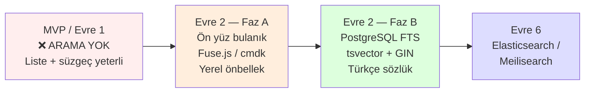
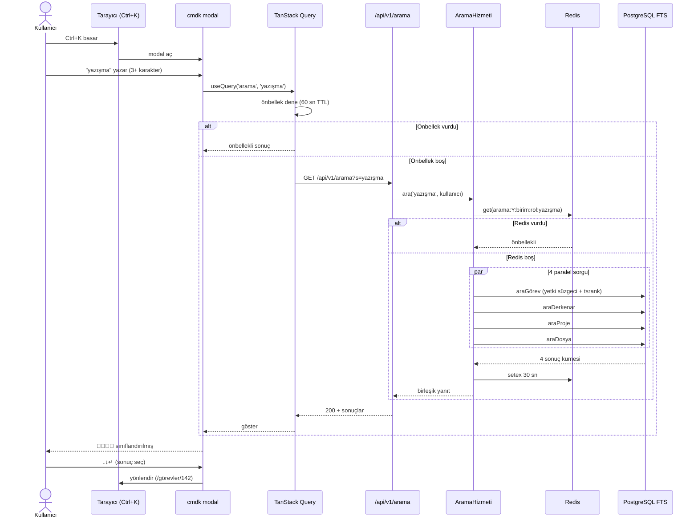

# B-Ç17 — Genel Arama Tasarımı (Evre 2)

> **Çıktı No:** B-Ç17
> **Sahip:** Mimar + Veritabanı Uzmanı
> **Öncelik:** YÜKSEK (Evre 2 başlangıcında)
> **Bağlı Belgeler:** Ana ÜGB §20, B-Ç1 §4.4, B-Ç2 §6.4, B-Ç9 §4.9, B-Ç12 §3.9, B-Ç3-Ç8 §B-Ç5
> **Bağlı Kararlar:** K-017 (Sınıflandırılmış Arama), K-018 (Aşamalı geçiş), B-5 (Başarım), C-Q3 (Tekman pilot)
> **Tarih:** 2026-05-01
> **Evre:** **2** (MVP'de yok, Evre 2'de yapılır)

---

## 1. AMACI

Genel Arama (`Ctrl+K`) modülünün **uçtan uca tasarımını** tek belgede toplamak. Önceden 7 farklı belgeye dağılmış olan bilgileri konsolide eder + 9 eksiği kapatır:

1. Evre 2 sprint zamanlaması
2. PostgreSQL FTS Türkçe dil yapılandırması
3. İndeksleme stratejisi
4. Yetki süzgeci ayrıntı (örnek SQL)
5. Başarım hedefi + yük doğrulama
6. Sıralama (ranking) ağırlıkları
7. Önbellek stratejisi
8. Türkçe karakter normalizasyonu
9. Sayısal/ID arama (`#142`)

---

## 2. ÜRÜN GEREKSİNİMLERİ ÖZETİ

> Bkz. Ana ÜGB §20

| Gereksinim | Karşılık |
|---|---|
| Çekirdek düzey arama (görev başlık, açıklama, yorum, derkenar, dosya, kayıt) | ✓ Tasarımda |
| Sınıflandırılmış sonuç (📁 ✅ 📝 📄) | ✓ B-Ç9 §4.9, B-Ç3-Ç8 §B-Ç5 |
| Ctrl+K kısayolu | ✓ B-Ç3-Ç8 §B-Ç5 |
| Yetki sınırı dahilinde | ✓ Bkz. §6 yetki süzgeci |
| Milisaniyelik yanıt | ✓ < 800 ms hedef (Ana ÜGB §20.5) |
| Soyutlanmış mimari (Evre 6 Elasticsearch geçişi) | ✓ Bkz. §11 |

---

## 3. AŞAMALI YAKLAŞIM (Tek Bakışta)



**Karar:** Evre 2'de **A → B** ardışık yapılır. Faz A'nın amacı kullanıcıya hızlı arama hissi vermek (yerel önbellekte gezinme); Faz B sunucuda gerçek arama yapar.

---

## 4. EVRE 2 SPRINT ZAMANLAMASI

### 4.1. Önerilen Sprint Dağılımı (2 Geliştirici Senaryosu)

Evre 2 toplam ~6-8 hafta. Genel arama bunun **2 sprint'ini** alır:

| Sprint | İş | SP |
|---|---|---|
| **Evre 2 — Sprint 1** | Vekâlet, Üst Makama Taşıma, Hizmet Süresi | (ayrı epik) |
| **Evre 2 — Sprint 2** | **Faz A: Ön yüz arama (cmdk + yerel arama)** | 21 SP |
| **Evre 2 — Sprint 3** | **Faz B: PostgreSQL FTS arka uç** | 34 SP |
| **Evre 2 — Sprint 4** | Görünürlük (ÖZEL/BİRİM) + Bağlılık + Bildirim Inbox | (ayrı epik) |

> Faz A önce yapılır çünkü kullanıcı geri bildirimini erkenden alır; Faz B (DB FTS) bunun üzerine inşa edilir.

### 4.2. Kullanıcı Öyküleri (Yeni Epik 13 — Genel Arama)

#### EPİK 13 — GENEL ARAMA

**Faz A — Ön Yüz (cmdk)**

| # | Öykü | SP |
|---|---|---|
| **KÖ-13.1** | Shadcn `Command` (cmdk) komut menüsü kurulumu + Ctrl+K klavye kısayolu | 3 |
| **KÖ-13.2** | TanStack Query ile son N projenin/görevin önbelleğe çekilmesi | 3 |
| **KÖ-13.3** | Yerel bulanık arama (Fuse.js veya cmdk dahili) — başlık+açıklama üzerinde | 5 |
| **KÖ-13.4** | Sınıflandırılmış sonuç UI (📁/✅/📝/📄, en çok 5+5+5+5 sonuç) | 3 |
| **KÖ-13.5** | "Tüm sonuçları gör" → arka uç araması (Faz B'ye köprü) | 2 |
| **KÖ-13.6** | Sayısal hızlı erişim (örn. "#142" → görev #142'ye git) | 3 |
| **KÖ-13.7** | Klavye dolaşım (↑↓ ↵ Tab Esc) + erişilebilirlik | 2 |
| **FAZ A TOPLAM** | | **21 SP** |

**Faz B — Arka Uç (PostgreSQL FTS)**

| # | Öykü | SP |
|---|---|---|
| **KÖ-13.8** | PostgreSQL `turkish` dil yapılandırması + sözlük denetimi | 3 |
| **KÖ-13.9** | Türkçe karakter normalizasyonu (unaccent eklentisi) | 3 |
| **KÖ-13.10** | `tsvector` üretimi: Görev (başlık + açıklama) — generated column | 5 |
| **KÖ-13.11** | `tsvector` üretimi: GörevDerkenarı (başlık + içerik) | 3 |
| **KÖ-13.12** | `tsvector` üretimi: Yorum, Proje, DosyaEki | 3 |
| **KÖ-13.13** | GIN dizinleri (5 tablo) + sorgu performansı denetimi | 3 |
| **KÖ-13.14** | `AramaHizmeti` — etki alanı odaklı arama servisi | 5 |
| **KÖ-13.15** | Yetki süzgeci (CTE veya JOIN ile) — kullanıcının erişebildiği veriler | 5 |
| **KÖ-13.16** | Sıralama (ranking) — `ts_rank` + alan ağırlıkları (başlık 2x) | 3 |
| **KÖ-13.17** | `GET /api/v1/arama` uç noktası (B-Ç9 §4.9 sözleşmesi) | 3 |
| **KÖ-13.18** | Redis önbellek (sık sorgular için, 60 sn) | 3 |
| **KÖ-13.19** | Yük sınaması (k6 / Artillery, 50 eşzamanlı sorgu, p95 < 800 ms) | 5 |
| **KÖ-13.20** | Yetki sızdırma sınamaları (ÖZEL görev, dış birim) | 3 |
| **FAZ B TOPLAM** | | **47 SP** |

> **Düzeltme:** Yukarıdaki sprint dağılımında 34 SP yazmıştım, **gerçek tahmin Faz A 21 + Faz B 47 = 68 SP**. 2 sprint'e (Evre 2 — Sprint 2 + Sprint 3) yayılır, bu sprintlerin diğer kapsamı küçültülür.

---

## 5. POSTGRESQL FTS — TÜRKÇE DİL YAPILANDIRMASI

### 5.1. Türkçe Sözlük

PostgreSQL'in dahili `turkish` text search yapılandırması mevcuttur:

```sql
SELECT * FROM pg_ts_config WHERE cfgname = 'turkish';
-- cfgnamespace | cfgname  | cfgowner | cfgparser
-- pg_catalog   | turkish  | 10       | default
```

`turkish` yapılandırması:
- **Snowball stemmer** (Türkçe kök bulma)
- Stop words listesi (örn. "ve", "ile", "bu", "şu")

### 5.2. Diakritik Normalizasyon (`unaccent`)

Türkçe arama için kritik: Kullanıcı "ozel" yazarsa "özel" sonuçlarını da bulmalı.

```sql
-- 1. Eklentiyi etkinleştir
CREATE EXTENSION IF NOT EXISTS unaccent;

-- 2. Türkçeye özel sözlük yapılandırması
CREATE TEXT SEARCH CONFIGURATION turkish_unaccent (COPY = turkish);

ALTER TEXT SEARCH CONFIGURATION turkish_unaccent
  ALTER MAPPING FOR hword, hword_part, word
  WITH unaccent, turkish_stem;
```

**Sonuç:**

```sql
SELECT to_tsvector('turkish_unaccent', 'Özel görev açıklaması');
-- 'aciklamasi':3 'gorev':2 'ozel':1
```

> **Not:** Türk-i (İ → i, ı → I) küçük/büyük harf dönüşümü PostgreSQL'in varsayılan `lower()` fonksiyonunda **yanlış** çalışır:
> - `lower('İ')` → `'i̇'` (i + birleşik nokta) ❌
> - `lower('I')` → `'i'` ✅
>
> **Çözüm:** `unaccent` öncelikli, sonra `lower`. Veya `tr_TR.UTF-8` collation + manuel düzelti.

### 5.3. Sözlük Genişletme (Opsiyonel)

Kamu yönetimi terminolojisi için özel sözlük dosyası hazırlanabilir:

```sql
-- /usr/share/postgresql/16/tsearch_data/turkish_kamu.syn
-- "kaymakam kaymakamlik"
-- "memur personel calisan"
-- "havale gondermek atamak"
```

Yapılandırma:

```sql
CREATE TEXT SEARCH DICTIONARY kamu_eslamı (
  TEMPLATE = synonym,
  SYNONYMS = turkish_kamu
);

ALTER TEXT SEARCH CONFIGURATION turkish_unaccent
  ALTER MAPPING FOR word
  WITH unaccent, kamu_eslamı, turkish_stem;
```

> İlk evrede gerekmez; pilot sonrası kullanıcı geri bildirimine göre eklenir.

---

## 6. İNDEKSLEME STRATEJİSİ

### 6.1. Karar: **Generated Column + GIN Dizin** (Materialized View değil)

**Karşılaştırma:**

| Yaklaşım | Avantaj | Dezavantaj |
|---|---|---|
| **Generated column + GIN** ✅ | Yazma anında otomatik güncel, sorgu hızlı | Yazma azıcık yavaşlar |
| Tetikleyici | Esnek | Bakım zor, hataya açık |
| Materialized view | Çok hızlı sorgu | Periyodik yenileme gerekli, gerçek zamanlı değil |
| Uygulama tarafı dolduran | Esnek | Tutarsızlık riski |

### 6.2. Şema Eklemeleri

```sql
-- Görev için
ALTER TABLE görev
  ADD COLUMN arama_vec tsvector
  GENERATED ALWAYS AS (
    setweight(to_tsvector('turkish_unaccent', coalesce(başlık, '')), 'A') ||
    setweight(to_tsvector('turkish_unaccent', coalesce(açıklama, '')), 'B')
  ) STORED;

CREATE INDEX gorev_arama_vec_gin ON görev USING GIN (arama_vec);

-- GörevDerkenarı için
ALTER TABLE görev_derkenarı
  ADD COLUMN arama_vec tsvector
  GENERATED ALWAYS AS (
    setweight(to_tsvector('turkish_unaccent', coalesce(başlık, '')), 'A') ||
    setweight(to_tsvector('turkish_unaccent', coalesce(içerik, '')), 'B')
  ) STORED;

CREATE INDEX gorev_derkenari_arama_vec_gin ON görev_derkenarı USING GIN (arama_vec);

-- Yorum için (sadece içerik)
ALTER TABLE yorum
  ADD COLUMN arama_vec tsvector
  GENERATED ALWAYS AS (
    to_tsvector('turkish_unaccent', coalesce(içerik, ''))
  ) STORED;

CREATE INDEX yorum_arama_vec_gin ON yorum USING GIN (arama_vec);

-- Proje için
ALTER TABLE proje
  ADD COLUMN arama_vec tsvector
  GENERATED ALWAYS AS (
    setweight(to_tsvector('turkish_unaccent', coalesce(ad, '')), 'A') ||
    setweight(to_tsvector('turkish_unaccent', coalesce(açıklama, '')), 'B')
  ) STORED;

CREATE INDEX proje_arama_vec_gin ON proje USING GIN (arama_vec);

-- DosyaEki için (yalnızca dosya adı)
ALTER TABLE dosya_eki
  ADD COLUMN arama_vec tsvector
  GENERATED ALWAYS AS (
    to_tsvector('turkish_unaccent', coalesce(dosya_adı, ''))
  ) STORED;

CREATE INDEX dosya_eki_arama_vec_gin ON dosya_eki USING GIN (arama_vec);
```

### 6.3. Ağırlıklar

`setweight` PostgreSQL'in 4 ağırlık seviyesi: A (en yüksek) → D (en düşük).

| Veri | Ağırlık | Kat |
|---|---|---|
| Görev başlık | A | 1.0 |
| Görev açıklama | B | 0.4 |
| Derkenar başlık | A | 1.0 |
| Derkenar içerik | B | 0.4 |
| Proje ad | A | 1.0 |
| Proje açıklama | B | 0.4 |
| Yorum içerik | (varsayılan) | 0.1 |

> Sonuç: kullanıcı "yazışma" ararsa **başlığında** geçen sonuçlar üstte, **açıklamasında** geçenler altta sıralanır.

---

## 7. YETKİ SÜZGECİ — UÇTAN UCA SQL

### 7.1. Sorun

Arama dizininde **tüm** veri var ama kullanıcı **erişebildiklerini** görmeli:
- ÖZEL görev → yalnızca oluşturan + atanan
- BİRİM görev → birim üyeleri ve müdürü
- PROJEYE_ÖZEL proje → yalnızca üyeleri (S2 kararı)
- Vekâlet aktifse genişletilmiş kapsam

### 7.2. Yaklaşım

**Sorgu öncesi** kullanıcının erişebildiği `görev_kimliği` kümesini hesapla, sonra arama bunu süzgeç olarak kullansın.

```sql
-- Kullanıcı bağlamı (uygulama her bağlantıda set eder)
-- SET LOCAL pusula.kullanıcı_kimliği = 'ck...';
-- SET LOCAL pusula.birim_kimliği = 'ck...';
-- SET LOCAL pusula.rol = 'BİRİM_MÜDÜRÜ';

WITH erişilebilir_görevler AS (
  SELECT g.kimlik
  FROM görev g
  WHERE g.silinme_tarihi IS NULL
    AND (
      -- ÖZEL: oluşturan veya atanan
      (g.görünürlük = 'ÖZEL' AND
       (g.oluşturan_kimliği = current_setting('pusula.kullanıcı_kimliği')
        OR g.atanan_kimliği = current_setting('pusula.kullanıcı_kimliği')))
      OR
      -- BİRİM: kullanıcı görev biriminin üyesi (veya YÖNETİCİ)
      (g.görünürlük = 'BİRİM' AND
       (g.birim_kimliği = current_setting('pusula.birim_kimliği')
        OR current_setting('pusula.rol') = 'YÖNETİCİ'))
    )
),
arama_görev AS (
  SELECT g.kimlik, g.başlık, g.durum, g.bitim_tarihi,
         ts_rank(g.arama_vec, sorgu) AS skor
  FROM görev g
  JOIN erişilebilir_görevler eg ON eg.kimlik = g.kimlik
  CROSS JOIN to_tsquery('turkish_unaccent', $1) AS sorgu
  WHERE g.arama_vec @@ sorgu
  ORDER BY skor DESC
  LIMIT 20
),
arama_derkenar AS (
  SELECT d.kimlik, d.başlık, d.tip, d.görev_kimliği,
         ts_rank(d.arama_vec, sorgu) AS skor
  FROM görev_derkenarı d
  JOIN erişilebilir_görevler eg ON eg.kimlik = d.görev_kimliği
  CROSS JOIN to_tsquery('turkish_unaccent', $1) AS sorgu
  WHERE d.arama_vec @@ sorgu
  ORDER BY skor DESC
  LIMIT 20
),
arama_proje AS (
  SELECT p.kimlik, p.ad,
         ts_rank(p.arama_vec, sorgu) AS skor
  FROM proje p
  CROSS JOIN to_tsquery('turkish_unaccent', $1) AS sorgu
  WHERE p.arama_vec @@ sorgu
    AND p.silinme_tarihi IS NULL
    AND (
      p.görünürlük = 'BİRİMLERE_AÇIK'
      OR EXISTS (
        SELECT 1 FROM proje_üyesi pü
        WHERE pü.proje_kimliği = p.kimlik
          AND pü.kullanıcı_kimliği = current_setting('pusula.kullanıcı_kimliği')
      )
      OR current_setting('pusula.rol') = 'YÖNETİCİ'
    )
  ORDER BY skor DESC
  LIMIT 20
),
arama_dosya AS (
  SELECT d.kimlik, d.dosya_adı, d.görev_kimliği, d.proje_kimliği,
         ts_rank(d.arama_vec, sorgu) AS skor
  FROM dosya_eki d
  CROSS JOIN to_tsquery('turkish_unaccent', $1) AS sorgu
  WHERE d.arama_vec @@ sorgu
    AND d.silinme_tarihi IS NULL
    AND (
      (d.görev_kimliği IS NOT NULL AND d.görev_kimliği IN (SELECT kimlik FROM erişilebilir_görevler))
      OR
      (d.proje_kimliği IS NOT NULL AND d.proje_kimliği IN (SELECT kimlik FROM arama_proje))
    )
  ORDER BY skor DESC
  LIMIT 20
)
SELECT 'görev' as sınıf, kimlik, başlık as etiket, skor FROM arama_görev
UNION ALL
SELECT 'derkenar', kimlik, başlık, skor FROM arama_derkenar
UNION ALL
SELECT 'proje', kimlik, ad, skor FROM arama_proje
UNION ALL
SELECT 'dosya', kimlik, dosya_adı, skor FROM arama_dosya;
```

### 7.3. Vekâlet Genişletmesi

Etkili kullanıcı kimliği vekâletle genişler. CTE'de hem `kullanıcı_kimliği` hem vekâleten alınan kimlikler birlikte kontrol edilir:

```sql
-- vekâleten erişilebilen birimler
etkili_birimler AS (
  SELECT current_setting('pusula.birim_kimliği') AS birim_kimliği
  UNION
  SELECT u.birim_kimliği
  FROM vekâlet v
  JOIN kullanıcı u ON u.kimlik = v.devreden_kimliği
  WHERE v.alan_kimliği = current_setting('pusula.kullanıcı_kimliği')
    AND v.durum = 'ETKİN'
    AND now() BETWEEN v.başlangıç_tarihi AND v.bitiş_tarihi
)
```

Sonra `erişilebilir_görevler` bu CTE'yi kullanır.

### 7.4. Performans Notu

Yukarıdaki sorgu **karmaşık**. Tek sorgu yerine **paralel 4 sorgu** (her sınıf için ayrı) Promise.all ile çalıştırılabilir:

```typescript
// AramaHizmeti.ara(sorgu, kullanıcı)
const [görevler, derkenarlar, projeler, dosyalar] = await Promise.all([
  araGörev(sorgu, kullanıcı, 20),
  araDerkenar(sorgu, kullanıcı, 20),
  araProje(sorgu, kullanıcı, 20),
  araDosya(sorgu, kullanıcı, 20),
])
```

Bağlantı havuzunda 4 paralel sorgu sıkıntı yaratmaz; tek karmaşık sorgudan daha hızlı.

---

## 8. SIRALAMA (Ranking)

### 8.1. ts_rank Bağıntısı

```sql
ts_rank(arama_vec, sorgu)
```

PostgreSQL hesaplama:
- Eşleşen sözcük sayısı
- Ağırlıkları (A=1.0, B=0.4, C=0.2, D=0.1)
- Belge uzunluğu (uzun belge → düşük skor)
- Sözcük yakınlığı (komşu eşleşme bonus)

### 8.2. Özelleştirilmiş Sıralama

`ts_rank_cd` (cover density) bazen daha iyi:

```sql
ts_rank_cd(arama_vec, sorgu, 32)  -- normalizasyon: 32 = log uzunluğa böl
```

### 8.3. Ek Sıralama Faktörleri

Sadece tsrank yetmez. Tarih + öncelik + risk de hesaba katılır:

```sql
SELECT g.*,
  ts_rank(g.arama_vec, sorgu) * 1.0
  + CASE g.öncelik
      WHEN 'KRİTİK' THEN 0.3
      WHEN 'YÜKSEK' THEN 0.2
      ELSE 0
    END
  + CASE g.risk_düzeyi
      WHEN 'GECİKTİ' THEN 0.2
      WHEN 'RİSKLİ' THEN 0.1
      ELSE 0
    END
  + CASE
      WHEN g.atanan_kimliği = current_setting('pusula.kullanıcı_kimliği')
      THEN 0.4  -- "bana atanan" bonus
      ELSE 0
    END
  AS toplam_skor
FROM görev g, to_tsquery('turkish_unaccent', $1) AS sorgu
WHERE g.arama_vec @@ sorgu
ORDER BY toplam_skor DESC;
```

> Tekman pilotunda kullanıcı geri bildirimine göre ağırlıklar ayarlanır.

---

## 9. ÖNBELLEK STRATEJİSİ

### 9.1. Üç Katman Önbellek

```
İstemci (TanStack Query)        →  60 sn (sık sorgular için)
        ↓
Sunucu (Redis)                   →  30 sn (popüler sorgular)
        ↓
Veritabanı (PostgreSQL FTS)      → tam sorgu
```

### 9.2. İstemci Tarafı (TanStack Query)

```typescript
useQuery({
  queryKey: ['arama', sorgu, sınıf],
  queryFn: () => fetcher(`/api/v1/arama?s=${sorgu}&sınıf=${sınıf}`),
  staleTime: 60_000,  // 60 sn taze say
  enabled: sorgu.length >= 3,  // 3+ karakter olmadan tetikleme
})
```

### 9.3. Sunucu Tarafı (Redis)

```typescript
async function ara(sorgu: string, kullanıcı: Kullanıcı) {
  // Anahtar: kullanıcı bağlamı + sorgu (yetki süzgeci farklı kullanıcıda farklı)
  const anahtar = `arama:${kullanıcı.kimlik}:${kullanıcı.birimKimliği}:${kullanıcı.rol}:${sorgu}`

  const önbellekli = await redis.get(anahtar)
  if (önbellekli) return JSON.parse(önbellekli)

  const sonuç = await aramaHizmeti.araDB(sorgu, kullanıcı)
  await redis.setex(anahtar, 30, JSON.stringify(sonuç))  // 30 sn TTL
  return sonuç
}
```

### 9.4. Önbellek Geçersizleştirme

| Olay | Geçersizleştirilen anahtarlar |
|---|---|
| Görev oluştur/güncelle/sil | Tüm `arama:*` (basitlik) — Redis FLUSHDB değil, pattern bazlı silme |
| Daha hassas | Görev birimine ait `arama:*birim={birimKimliği}*` |

> Asgari uygulamada **30 sn TTL'in yetmesi** beklenir; geçersizleştirme karmaşık. Pilot başında basit TTL bırak, gerekirse sonra ekle.

### 9.5. Önbellek Atlama (Boş Sorgu)

`/arama` boş `s=` ile çağrılırsa: önbellek yok, direkt boş yanıt.

---

## 10. SAYISAL / ID ARAMA (`#142`)

### 10.1. Kullanıcı Beklentisi

Kullanıcı `#142` veya `142` yazarsa **doğrudan** o görev #142'ye gitmeli (sıralı liste değil).

### 10.2. Algoritma

```typescript
function aramaTipiAyır(sorgu: string): 'doğrudan' | 'fts' {
  const eşleşme = sorgu.match(/^#?(\d+)$/)
  if (eşleşme) return 'doğrudan'
  return 'fts'
}

if (aramaTipiAyır(sorgu) === 'doğrudan') {
  const sayısalKimlik = sorgu.replace('#', '')
  // Görev kısa kimliği veya sıra numarası ile ara
  const görev = await prisma.görev.findFirst({
    where: { sıraKimliği: parseInt(sayısalKimlik) },
  })
  if (görev) return { tip: 'doğrudan', görev }
}
```

### 10.3. Şema Eklemesi

Her görevin `cuid()` kimliğine **ek olarak** kullanıcı dostu **sıra kimliği** olmalı:

```prisma
model Görev {
  kimlik       Metin     @id @default(cuid())
  sıraKimliği  TamSayı   @default(autoincrement())  // 1, 2, 3, ...
  ...
}
```

UI'da `#142` gösterilir; arka uçta `cuid` kullanılır.

> **Not:** Asgari uygulanabilir üründe (Sprint 4-5) `sıraKimliği` ekleme. Çünkü genel arama Evre 2'de gelecek.

---

## 11. ELASTICSEARCH'E GEÇİŞ HAZIRLIĞI (Evre 6)

### 11.1. Soyutlama

`AramaHizmeti` arayüzü:

```typescript
arayüz IAramaHizmeti {
  ara(sorgu: Metin, kullanıcı: Kullanıcı, sınıflar?: AramaSınıfı[]): Söz<AramaSonucu>
  yenidenİndeksle(model: Metin, kimlik: Metin): Söz<boş>
}

sınıf PostgresAramaHizmeti uygular IAramaHizmeti { ... }
sınıf ElasticsearchAramaHizmeti uygular IAramaHizmeti { ... }
```

Uygulama kodu hangisini kullandığını **bilmez**.

### 11.2. Geçiş Tetikleyicileri

Şu durumlarda Elasticsearch'e geç:
- 1 milyon+ görev
- Tipo toleransı (fuzzy) gerekiyor
- Çok dilli arama gerekiyor (Türkçe + İngilizce + Arapça)
- Yapısal arama (Faceted search)
- Otomatik tamamlama (autocomplete) gerçek zamanlı önemli

### 11.3. Veri Eşitleme

PostgreSQL → Elasticsearch eşitleme yaklaşımları:
- **Olay tabanlı** (B-Ç10 olay yolu) — `GÖREV_OLUŞTURULDU` → Elasticsearch'e indeksle
- **Debezium / CDC** (Change Data Capture) — gelişmiş ama karmaşık
- **Periyodik tam yeniden indeksleme** — basit ama gecikmeli

> Evre 6'da karar verilir; bugün için karar değil.

---

## 12. BAŞARIM HEDEFİ + YÜK SINAMASI

### 12.1. Hedefler

| Ölçüt | Hedef |
|---|---|
| Yüzde 50 yanıt süresi | < 200 ms |
| Yüzde 95 yanıt süresi | **< 800 ms** |
| Yüzde 99 yanıt süresi | < 2 sn |
| Eşzamanlı arama | 50 sorgu/sn |
| Tek sorgu boyutu | 4 sınıf × 20 sonuç = 80 satır |

### 12.2. k6 Sınama Betiği

```javascript
// betikler/arama-yük.js
import http from 'k6/http'
import { check, sleep } from 'k6'

export const options = {
  stages: [
    { duration: '30s', target: 10 },   // ısıtma
    { duration: '1m', target: 50 },    // yük
    { duration: '30s', target: 0 },    // soğuma
  ],
  thresholds: {
    http_req_duration: ['p(95)<800', 'p(99)<2000'],
  },
}

const sorgular = [
  'yazışma',
  'bayram',
  'denetim',
  'köy',
  'rapor',
  'şikayet',
  'müracaat',
  'belediye',
]

export default function () {
  const sorgu = sorgular[Math.floor(Math.random() * sorgular.length)]
  const yanıt = http.get(`https://staging.pusulaportal.com/api/v1/arama?s=${sorgu}`, {
    cookies: { oturum: __ENV.OTURUM_ÇEREZ },
  })
  check(yanıt, {
    'durum 200': (r) => r.status === 200,
    'sonuç var': (r) => r.json('veri.görevler')?.length > 0,
  })
  sleep(1)
}
```

Çalıştırma:

```bash
k6 run -e OTURUM_ÇEREZ=... betikler/arama-yük.js
```

### 12.3. Profil Çıkarma

Yavaş sorgular için:

```sql
EXPLAIN (ANALYZE, BUFFERS)
SELECT ... FROM görev WHERE arama_vec @@ to_tsquery('turkish_unaccent', 'yazışma');
```

Beklenen plan:
- `Bitmap Heap Scan on görev`
- `Recheck Cond: (arama_vec @@ ...)`
- `-> Bitmap Index Scan on gorev_arama_vec_gin`

**GIN index kullanılmıyorsa** sorun var (yapılandırma hatası, sıralama anlaşmazlığı vs.).

---

## 13. UÇTAN UCA AKIŞ



---

## 14. GÜVENLİK SINAMA SENARYOLARI

### 14.1. ÖZEL Görev Sızdırma

```
GIVEN: Personel A ÖZEL görev #500 oluşturmuş
GIVEN: Personel B aynı birimden ama atanmamış
WHEN: B "gizli proje" aratır
THEN: #500 sonuçlarda GÖZÜKMEZ
AND: Ayrıca: B doğrudan /api/v1/arama?s=gizli sorgar
THEN: Yine sonuçlarda yok (yetki süzgeci uygulandı)
```

### 14.2. Birim Aşan Sızdırma

```
GIVEN: Yazı İşleri görev #200 (BİRİM görünürlük)
GIVEN: Mal Müdürlüğü personeli C
WHEN: C #200'ün başlığında geçen kelime aratır
THEN: #200 GÖZÜKMEZ (farklı birim)
EXCEPT: C YÖNETİCİ ise GÖZÜKÜR
```

### 14.3. Vekâlet Genişlemesi

```
GIVEN: Müdür M1, M2'ye vekâlet vermiş (kapsam tüm)
GIVEN: M2 normalde M1 birimine erişemiyor
WHEN: M2 arama yapar (vekâlet etkin)
THEN: M1 biriminin görevleri DE GÖRÜNÜR
AND: Vekâlet bittiğinde sonuçlar daralır
```

### 14.4. Silinen Veri

```
GIVEN: Görev #300 yumuşak silindi (silinme_tarihi NOT NULL)
WHEN: Kullanıcı arar
THEN: #300 sonuçlarda YOK
```

Her senaryo Playwright + birim sınamasıyla doğrulanır (KÖ-13.20).

---

## 15. MOBİL UX

`Ctrl+K` mobilde olmaz (klavye yok). Alternatif:

- **Üst çubukta arama simgesi** 🔍 sürekli görünür
- Tıklayınca aynı `cmdk` modal açılır (tam ekran)
- Klavye dolaşımı yerine dokunmatik liste
- Voice input desteği opsiyonel (`<input>` HTML5 voice)

---

## 16. ERİŞİLEBİLİRLİK

| Özellik | Uygulama |
|---|---|
| Klavye | Tüm dolaşım klavye ile (cmdk dahili) |
| Ekran okuyucu | Sonuç sayısı + sınıf adı duyurulur (`aria-live="polite"`) |
| Odak yönetimi | Modal açıldığında ilk input'a odak; kapanınca tetikleyene |
| Renk | Sınıf renkleri yalnız değil, simge + metin de var |
| Türkçe ekran okuyucu | NVDA Türkçe sözlük + Inter yazı tipi uyumlu |

---

## 17. AÇIK SORULAR

| # | Soru | Önerim |
|---|---|---|
| **A-Q1** | Yorum sonuçları ayrı sınıf mı, yoksa görev altında mı? | İlk evrede **görev altında** (taşkın yapma) |
| **A-Q2** | Kayıt (audit) sonuçları aramada olsun mu? | **Hayır** — yalnızca yönetici denetim sayfasında |
| **A-Q3** | Otomatik tamamlama (autocomplete) gelecek mi? | Evre 6 (Elasticsearch ile birlikte) |
| **A-Q4** | Filtreleme (örn. "tip:KARAR") sözdizimi olacak mı? | İlk evrede yok, kullanıcı geri bildirime göre |
| **A-Q5** | Arama geçmişi saklanacak mı (kişisel)? | Evet, lokal storage'da son 5 sorgu |

---

## 18. KAYNAKLAR & BAĞLANTILAR

- Ana ÜGB §20 — Genel arama vizyonu
- B-Ç1 §4.4, §8 — Mimari konum
- B-Ç2 §6.4 — DB dizinleri
- B-Ç9 §3.9, §4.9 — API sözleşmesi
- B-Ç12 §3.9 — `arama.kullan` izni
- B-Ç3-Ç8 §B-Ç5 — UI çizimi
- [PostgreSQL FTS Belgesi](https://www.postgresql.org/docs/current/textsearch.html)
- [unaccent Eklentisi](https://www.postgresql.org/docs/current/unaccent.html)
- [cmdk Kütüphanesi](https://cmdk.paco.me/)

---

## 19. SONUÇ

**Genel Arama** modülü artık **uçtan uca tasarımla belgeli**:

- ✅ Evre 2 sprint zamanlaması (Faz A 21 SP + Faz B 47 SP = **68 SP**)
- ✅ Türkçe FTS yapılandırması (`turkish_unaccent`)
- ✅ İndeksleme stratejisi (generated column + GIN)
- ✅ Yetki süzgeci uçtan uca SQL
- ✅ Sıralama ağırlıkları + ek faktörler
- ✅ 3 katmanlı önbellek
- ✅ Türkçe karakter normalizasyonu
- ✅ Sayısal/ID arama (`#142`)
- ✅ Başarım hedefi + k6 yük sınaması
- ✅ Güvenlik sınaması senaryoları
- ✅ Elasticsearch geçiş hazırlığı

**Kod yazımı için hazır.** Asgari uygulanabilir ürün sırasında **`sıraKimliği`** alanı `Görev` modeline eklenmeli (Evre 2'de hızlı erişim için).
