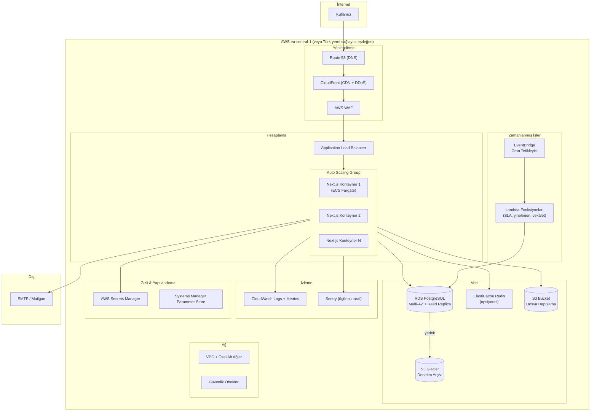
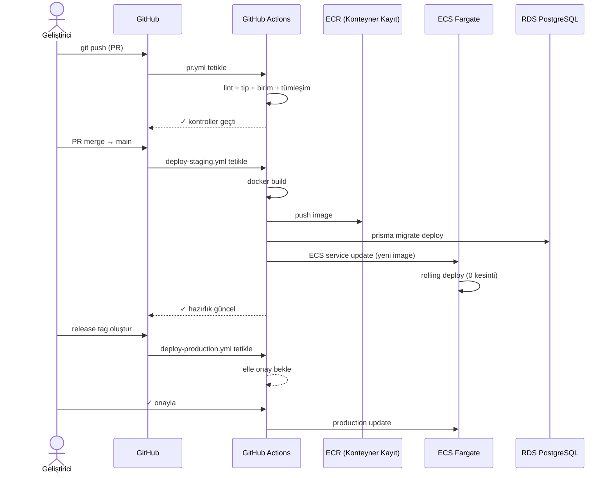
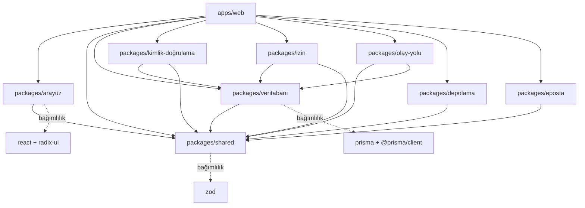

# B-Ç11 / B-Ç13 / B-Ç14 / B-Ç15 / B-Ç16 — Tasarım İmleri, Bulut Altyapı, CI/CD, Tek Depo, Tehdit Modeli

> **Çıktı No:** B-Ç11, B-Ç13, B-Ç14, B-Ç15, B-Ç16
> **Sahip:** Tasarımcı, Bulut Uzmanı, DevOps, Mimar, Güvenlik
> **Öncelik:** ORTA / YÜKSEK
> **Bağlı Kararlar:** B-1 (Bulut), B-8 (GitHub Actions), B-9 (Tek Depo), B-2 (e-Devlet yok), S9 (Karanlık tema), S10 (Public API yok)
> **Tarih:** 2026-05-01

---

# B-Ç11 — TASARIM İMLERİ (Design Tokens)

## 1. RENK PALETİ

### 1.1. Marka Rengi

| Token | Aydınlık | Karanlık | Kullanım |
|---|---|---|---|
| `marka-temel` | `#1E40AF` (Lacivert) | `#3B82F6` (Mavi) | Logo, ana CTA, vurgu |
| `marka-koyu` | `#1E3A8A` | `#1E40AF` | Hover, vurgu |
| `marka-açık` | `#DBEAFE` | `#1E3A8A/30` | Arka plan vurgu |

### 1.2. Yansız Renkler

| Token | Aydınlık | Karanlık |
|---|---|---|
| `yüzey-1` (sayfa) | `#FFFFFF` | `#0A0A0A` |
| `yüzey-2` (kart) | `#FAFAFA` | `#171717` |
| `yüzey-3` (vurgu) | `#F5F5F5` | `#262626` |
| `kenar` | `#E5E5E5` | `#404040` |
| `metin-birincil` | `#1A1A1A` | `#FAFAFA` |
| `metin-ikincil` | `#525252` | `#A3A3A3` |
| `metin-pasif` | `#A3A3A3` | `#737373` |

### 1.3. Anlamsal Renkler (SLA + Durum)

| Token | Aydınlık | Karanlık | Anlam |
|---|---|---|---|
| `sla-yeşil` | `#059669` | `#10B981` | OLAĞAN (🟢) |
| `sla-sarı` | `#D97706` | `#F59E0B` | RİSKLİ (🟡) |
| `sla-kırmızı` | `#DC2626` | `#EF4444` | GECİKTİ (🔴) |
| `başarı` | `#10B981` | `#10B981` | Onay, başarılı toast |
| `uyarı` | `#F59E0B` | `#F59E0B` | Uyarı toast |
| `hata` | `#EF4444` | `#EF4444` | Hata, validation |
| `bilgi` | `#3B82F6` | `#60A5FA` | Bilgilendirme |

### 1.4. Derkenar Tipi Renkleri

| Tip | Vurgu Rengi | Arka Plan |
|---|---|---|
| KARAR | `#1E40AF` (mavi) | `#DBEAFE` |
| UYARI | `#D97706` (turuncu) | `#FEF3C7` |
| ENGEL | `#DC2626` (kırmızı) | `#FEE2E2` |
| BİLGİ | `#059669` (yeşil) | `#D1FAE5` |
| NOT | `#525252` (gri) | `#F5F5F5` |

## 2. TİPOGRAFİ

### 2.1. Yazı Tipi Aileleri

```css
--font-sans: "Inter", system-ui, -apple-system, "Segoe UI", sans-serif;
--font-mono: "JetBrains Mono", "Cascadia Code", monospace;
```

> Türkçe diakritikler için `Inter` doğru hâlde sunulur. Yerel dosya barındırma (`/fonts/`) önerilir.

### 2.2. Boyut Ölçeği

| Token | Boyut | Satır Yüksekliği | Kullanım |
|---|---|---|---|
| `metin-xs` | 12 px | 16 px | Yardımcı metin, etiket |
| `metin-sm` | 14 px | 20 px | Tablo hücresi, küçük etiket |
| `metin-temel` | 16 px | 24 px | Gövde |
| `metin-lg` | 18 px | 28 px | Vurgu paragraf |
| `metin-xl` | 20 px | 28 px | Küçük başlık |
| `metin-2xl` | 24 px | 32 px | Bölüm başlığı |
| `metin-3xl` | 30 px | 36 px | Sayfa başlığı |
| `metin-4xl` | 36 px | 40 px | Gösterge paneli ana sayı |

### 2.3. Ağırlıklar

| Token | Değer |
|---|---|
| `ağırlık-normal` | 400 |
| `ağırlık-orta` | 500 |
| `ağırlık-yarı-koyu` | 600 |
| `ağırlık-koyu` | 700 |

## 3. ARALIK ÖLÇEĞİ

| Token | Değer |
|---|---|
| `aralık-1` | 4 px |
| `aralık-2` | 8 px |
| `aralık-3` | 12 px |
| `aralık-4` | 16 px |
| `aralık-5` | 20 px |
| `aralık-6` | 24 px |
| `aralık-8` | 32 px |
| `aralık-10` | 40 px |
| `aralık-12` | 48 px |
| `aralık-16` | 64 px |

## 4. KÖŞE YUVARLATMA

| Token | Değer |
|---|---|
| `radius-sm` | 4 px |
| `radius-md` | 6 px (Shadcn varsayılan) |
| `radius-lg` | 8 px |
| `radius-xl` | 12 px |
| `radius-tam` | 9999 px (yuvarlak rozet) |

## 5. GÖLGE

| Token | Değer (Aydınlık) |
|---|---|
| `gölge-sm` | `0 1px 2px rgba(0,0,0,0.05)` |
| `gölge-md` | `0 4px 6px rgba(0,0,0,0.07)` |
| `gölge-lg` | `0 10px 15px rgba(0,0,0,0.1)` |
| `gölge-xl` | `0 20px 25px rgba(0,0,0,0.15)` |

Karanlık modda gölgeler daha güçlü (`rgba(0,0,0,0.4)`).

## 6. DEVİNİM

| Token | Süre | Easing |
|---|---|---|
| `devinim-hızlı` | 150 ms | `ease-out` |
| `devinim-orta` | 250 ms | `ease-in-out` |
| `devinim-yavaş` | 400 ms | `ease-in-out` |

Sağ Çekmece açılma: `devinim-orta`. Bildirim toast giriş: `devinim-hızlı`.

## 7. Z-DİZİNİ

| Katman | Değer |
|---|---|
| Temel | 0 |
| Açılır menü | 10 |
| Sabit üst çubuk | 30 |
| Sağ çekmece | 40 |
| Modal arka plan | 50 |
| Modal | 51 |
| Toast | 60 |

## 8. TAILWIND YAPILANDIRMA ÖRNEĞİ

```js
// tailwind.config.js (özet)
module.exports = {
  darkMode: 'class',
  theme: {
    extend: {
      colors: {
        marka: {
          temel: 'hsl(var(--marka-temel))',
          koyu: 'hsl(var(--marka-koyu))',
          açık: 'hsl(var(--marka-açık))',
        },
        sla: {
          yeşil: 'hsl(var(--sla-yeşil))',
          sarı: 'hsl(var(--sla-sarı))',
          kırmızı: 'hsl(var(--sla-kırmızı))',
        },
        // ... ResmiTatil renk paleti benzer
      },
      fontFamily: {
        sans: ['Inter', 'system-ui', 'sans-serif'],
      },
    },
  },
  plugins: [require('tailwindcss-animate')],
}
```

```css
/* globals.css */
:root {
  --marka-temel: 217 91% 35%;
  --sla-yeşil: 158 91% 30%;
  --sla-sarı: 32 91% 44%;
  --sla-kırmızı: 0 73% 51%;
  /* ... */
}
.dark {
  --marka-temel: 217 91% 60%;
  --sla-yeşil: 158 64% 40%;
  /* ... */
}
```

---

# B-Ç13 — BULUT ALTYAPI ÇİZGESİ (B-1 BULUT KARARI)

## 1. SAĞLAYICI SEÇİMİ ÖNERİSİ

| Sağlayıcı | Avantaj | Dezavantaj |
|---|---|---|
| **AWS** | Olgun, ekosistem geniş | Daha yüksek maliyet, karmaşık |
| **DigitalOcean** | Sade arayüz, fiyat öngörülebilir | Bölgesel sınırlı, daha az hizmet |
| **Cloudflare (Workers + R2)** | Kenar dağıtım, hızlı | Next.js tam destek sınırlı |
| **Hetzner** | Çok ucuz, AB konumlu | Yönetilen hizmet sınırlı |
| **Yerel bulut sağlayıcı (Türkiye)** | Veri ülke içi, KVKK uyumlu | Hizmet seti dar |

> **Öneri:** **AWS (eu-central-1 / Frankfurt)** veya **bir Türkiye yerel sağlayıcı** (TRTNet / Vargonen / Türk Telekom Bulut). Kamu sektörü → veri yerel kalsın. Ancak başlangıçta esnek olmak için AWS önerilir; ileride göç edilebilir (depolama soyutlaması bunu kolaylaştırır).

## 2. BİLEŞENLER (AWS ÖZELİNDE ÖRNEK)



## 3. BİLEŞEN KATALOĞU & MALİYET TAHMİNİ

| Bileşen | Tip | Aylık Tahmini (Asgari) | Notlar |
|---|---|---|---|
| **Route 53** | DNS | $1 | 1 zone |
| **CloudFront** | CDN | $20-50 | 200 GB transfer |
| **WAF** | Güvenlik | $10 | Temel kural seti |
| **ALB** | Yük Dengeleme | $25 | 1 ALB |
| **ECS Fargate** | Konteyner | $80-150 | 2 vCPU, 4 GB × 2 örnek |
| **RDS PostgreSQL** | Veritabanı | $80-200 | db.t3.medium Multi-AZ |
| **ElastiCache Redis** | Önbellek | $15-30 | cache.t3.micro |
| **S3** | Depolama | $10 | 100 GB + istek |
| **S3 Glacier** | Arşiv | $1 | 50 GB |
| **EventBridge + Lambda** | Zamanlayıcı | $5 | Düşük çağrı |
| **CloudWatch** | İzleme | $20 | Loglar + ölçütler |
| **Sentry** | Hata İzleme | $26 | Team plan |
| **SMTP/Mailgun** | Eposta | $35 | Foundation 50k mail |
| **Secrets Manager** | Gizli | $1 | Birkaç gizli |
| **Toplam** | | **~$330-560/ay** | Tek bölge, 200 kullanıcı |

> Kullanıcı sayısı arttıkça ECS örnek sayısı + RDS sınıfı büyür. 1000 kullanıcı için ~$800-1200/ay tahmini.

## 4. AĞ MİMARİSİ

```
VPC: 10.0.0.0/16
├── Açık Alt Ağ A (10.0.1.0/24) — eu-central-1a — ALB, NAT Gateway
├── Açık Alt Ağ B (10.0.2.0/24) — eu-central-1b — ALB
├── Özel Alt Ağ A (10.0.10.0/24) — eu-central-1a — ECS, Lambda
├── Özel Alt Ağ B (10.0.11.0/24) — eu-central-1b — ECS, Lambda
├── Veri Alt Ağ A (10.0.20.0/24) — eu-central-1a — RDS, Redis
└── Veri Alt Ağ B (10.0.21.0/24) — eu-central-1b — RDS yedek
```

**Güvenlik öbekleri:**
- `sg-alb`: 80, 443 İnternet'ten.
- `sg-ecs`: 3000 (Next.js) yalnızca `sg-alb`'den.
- `sg-rds`: 5432 yalnızca `sg-ecs`'den.
- `sg-redis`: 6379 yalnızca `sg-ecs`'den.

## 5. DAĞITIM AKIŞI (B-8 GitHub Actions ile)



## 6. TERRAFORM PROJE YAPISI

```
altyapı/bulut/terraform/
├── modüller/
│   ├── ağ/         # VPC, subnet, NAT, IGW
│   ├── kompüt/     # ECS, ALB, ASG
│   ├── veri/       # RDS, ElastiCache, S3
│   ├── izleme/     # CloudWatch, Sentry
│   └── güvenlik/   # WAF, IAM, Secrets Manager
├── ortamlar/
│   ├── hazırlık/
│   │   ├── main.tf
│   │   ├── values.tfvars
│   └── üretim/
│       ├── main.tf
│       ├── values.tfvars
└── ölçünler.tf  # paylaşılan değişkenler
```

---

# B-Ç14 — GITHUB ACTIONS İŞ AKIŞ KATALOĞU (B-8)

## 1. İŞ AKIŞ DOSYALARI

```
.github/workflows/
├── pr.yml                        # Her PR — hızlı kontroller
├── e2e.yml                       # Her PR — kritik uçtan uca
├── deploy-staging.yml            # main → hazırlık
├── deploy-production.yml         # release tag → üretim (elle onay)
├── nightly.yml                   # Her gece — Lighthouse, OWASP, tam uçtan uca
├── dependency-update.yml         # Renovate haftalık
├── audit-log-archive.yml         # Aylık denetim arşivi (S5: 10 yıl saklama)
└── security-scan.yml             # Aylık + yeni CVE'lerde
```

## 2. pr.yml ÖZET

```yaml
ad: PR Kontrolleri
on:
  pull_request:
    branches: [main]

jobs:
  lint:
    runs-on: ubuntu-latest
    steps:
      - uses: actions/checkout@v4
      - uses: pnpm/action-setup@v3
      - run: pnpm install --frozen-lockfile
      - run: pnpm lint
      - run: pnpm format:check

  tip-denetim:
    runs-on: ubuntu-latest
    steps:
      - uses: actions/checkout@v4
      - uses: pnpm/action-setup@v3
      - run: pnpm install --frozen-lockfile
      - run: pnpm typecheck

  birim-sınama:
    runs-on: ubuntu-latest
    steps:
      - uses: actions/checkout@v4
      - uses: pnpm/action-setup@v3
      - run: pnpm install --frozen-lockfile
      - run: pnpm test:unit -- --coverage
      - uses: codecov/codecov-action@v4

  tümleşim-sınama:
    runs-on: ubuntu-latest
    services:
      postgres:
        image: postgres:16
        env:
          POSTGRES_PASSWORD: pusula
        options: >-
          --health-cmd "pg_isready"
    steps:
      - uses: actions/checkout@v4
      - uses: pnpm/action-setup@v3
      - run: pnpm install --frozen-lockfile
      - run: pnpm prisma migrate deploy
      - run: pnpm test:integration

  derleme:
    runs-on: ubuntu-latest
    needs: [lint, tip-denetim, birim-sınama, tümleşim-sınama]
    steps:
      - uses: actions/checkout@v4
      - run: pnpm install --frozen-lockfile
      - run: pnpm build
```

## 3. e2e.yml ÖZET

```yaml
ad: Uçtan Uca Sınama
on:
  pull_request:
    branches: [main]

jobs:
  e2e-kritik:
    runs-on: ubuntu-latest
    services:
      postgres:
        image: postgres:16
    steps:
      - uses: actions/checkout@v4
      - run: pnpm install --frozen-lockfile
      - run: pnpm exec playwright install --with-deps
      - run: pnpm prisma migrate deploy
      - run: pnpm seed:e2e
      - run: pnpm e2e --grep @kritik
      - uses: actions/upload-artifact@v4
        if: failure()
        with:
          name: playwright-report
          path: playwright-report/
```

## 4. nightly.yml ÖZET

```yaml
ad: Gece Kontrolleri
on:
  schedule:
    - cron: '0 2 * * *'  # her gece 02:00 UTC

jobs:
  e2e-tümü:
    # ... pnpm e2e (etiketsiz, tüm uçtan uca)
  lighthouse:
    # @lhci/cli ile başarım ölçütleri
  owasp-zap:
    # OWASP ZAP baseline scan
  bağımlılık-denetimi:
    # pnpm audit + npm audit + osv-scanner
```

## 5. deploy-staging.yml ÖZET

```yaml
ad: Hazırlığa Dağıt
on:
  push:
    branches: [main]

jobs:
  dağıt:
    runs-on: ubuntu-latest
    environment: hazırlık
    steps:
      - uses: actions/checkout@v4
      - uses: aws-actions/configure-aws-credentials@v4
        with:
          role-to-assume: ${{ secrets.AWS_ROL_ARN }}
          aws-region: eu-central-1
      - run: docker build -t pusula .
      - run: docker push ${{ steps.ecr.outputs.kayıt }}/pusula:${{ github.sha }}
      - run: pnpm prisma migrate deploy
        env:
          VERİTABANI_URL: ${{ secrets.HAZIRLIK_VERİTABANI_URL }}
      - run: aws ecs update-service --cluster pusula-hazırlık --service web --force-new-deployment
```

## 6. deploy-production.yml ÖZET

```yaml
ad: Üretime Dağıt
on:
  push:
    tags: ['v*']

jobs:
  dağıt:
    runs-on: ubuntu-latest
    environment:
      name: üretim
      url: https://pusula.gov.tr
    # GitHub Environment koruması ile ELLE ONAY zorunlu
    steps:
      # ... benzer adımlar, üretim hedefli
```

## 7. audit-log-archive.yml (S5)

```yaml
ad: Denetim Günlüğü Arşivi
on:
  schedule:
    - cron: '0 3 1 * *'  # her ay 1. günü 03:00 UTC

jobs:
  arşivle:
    runs-on: ubuntu-latest
    steps:
      - uses: actions/checkout@v4
      - run: pnpm tsx betikler/denetim-arşivle.ts
        env:
          KESİM_TARİHİ: 1 yıl önce
          HEDEF: s3://pusula-arşiv/denetim/
```

## 8. ENVIRONMENT KORUMASI

| Environment | Reviewer | Wait Timer |
|---|---|---|
| `hazırlık` | Yok | 0 |
| `üretim` | Yönetici (en az 1 kişi) | 5 dk |

---

# B-Ç15 — TEK DEPO (MONOREPO) YAPISI VE BAĞIMLILIK ÇİZGESİ

## 1. KLASÖR YAPISI

```
pusula/
├── apps/
│   ├── web/                       # Next.js (App Router)
│   │   ├── app/
│   │   │   ├── (kimlik)/          # giriş, kayıt
│   │   │   ├── (uygulama)/        # ana app yolları
│   │   │   │   ├── ana-sayfa/
│   │   │   │   ├── projeler/
│   │   │   │   ├── görevler/
│   │   │   │   └── ayarlar/
│   │   │   ├── api/               # Yol İşleyicileri
│   │   │   │   └── v1/
│   │   │   │       ├── görevler/
│   │   │   │       ├── projeler/
│   │   │   │       └── ...
│   │   │   ├── layout.tsx
│   │   │   └── page.tsx
│   │   ├── bileşenler/            # uygulama özel bileşenler
│   │   ├── kancalar/              # özel React kancaları
│   │   ├── lib/
│   │   ├── public/
│   │   ├── next.config.js
│   │   ├── tailwind.config.js
│   │   └── package.json
│   └── (gelecekte) api/           # ayrı backend gerekirse
├── packages/
│   ├── arayüz/                    # Shadcn UI bileşen kütüphanesi
│   │   ├── bileşenler/
│   │   │   ├── düğme.tsx
│   │   │   ├── kart.tsx
│   │   │   ├── ilerleme-çubuğu.tsx
│   │   │   ├── sla-rozet.tsx
│   │   │   └── ...
│   │   └── package.json
│   ├── shared/                    # paylaşılan TS tipleri
│   │   ├── tipler/
│   │   │   ├── varlıklar.ts       # Görev, Proje, vb. tipler
│   │   │   ├── enumlar.ts
│   │   │   └── api.ts
│   │   ├── şemalar/               # Zod şemaları
│   │   │   ├── görev.ts
│   │   │   ├── proje.ts
│   │   │   ├── derkenar.ts
│   │   │   ├── vekâlet.ts
│   │   │   └── olaylar.ts          # B-Ç10 olay sözlüğü
│   │   ├── yardımcılar/
│   │   │   ├── tarih.ts            # iş günü, tatil hesabı
│   │   │   ├── süre.ts             # SLA, %25 hesabı
│   │   │   └── biçim.ts
│   │   └── package.json
│   ├── veritabanı/                # Prisma şeması + istemci
│   │   ├── prisma/
│   │   │   ├── schema.prisma       # B-Ç2 modelleri
│   │   │   ├── geçişler/
│   │   │   └── tohum.ts            # ilk veri
│   │   ├── istemci.ts              # singleton Prisma istemci
│   │   ├── ara-katman/
│   │   │   ├── yumuşak-silme.ts
│   │   │   └── denetim.ts          # K-011
│   │   └── package.json
│   ├── kimlik-doğrulama/          # better-auth yapılandırması
│   │   ├── yapılandırma.ts
│   │   ├── ara-katman.ts
│   │   └── package.json
│   ├── izin/                       # B-Ç12 izin denetleyici
│   │   ├── matris.ts
│   │   ├── denetleyici.ts
│   │   ├── vekâlet-çözücü.ts
│   │   └── package.json
│   ├── olay-yolu/                 # B-Ç10 olay yolu
│   │   ├── yol.ts
│   │   ├── dinleyiciler/
│   │   │   ├── denetim-yazıcı.ts
│   │   │   ├── bildirim.ts
│   │   │   ├── ilerleme-yenidenhesaplayıcı.ts
│   │   │   └── ...
│   │   └── package.json
│   ├── depolama/                  # B-Ç1 depolama soyutlaması
│   │   ├── arayüz.ts
│   │   ├── sağlayıcılar/
│   │   │   ├── yerel.ts
│   │   │   ├── minio.ts
│   │   │   └── s3.ts
│   │   └── package.json
│   ├── eposta/                     # SMTP/Mailgun/SES soyutlaması
│   │   ├── arayüz.ts
│   │   ├── sağlayıcılar/
│   │   ├── kalıplar/               # eposta şablonları
│   │   └── package.json
│   └── yapılandırma/               # ESLint, TS, Prettier
│       ├── eslint-yapılandırma.js
│       ├── tsconfig.temel.json
│       └── package.json
├── altyapı/
│   ├── bulut/terraform/            # B-Ç13
│   └── docker/
│       ├── Dockerfile.web
│       └── docker-compose.yml      # geliştirme
├── docs/
│   ├── ana-ügb/                    # Ana ÜGB (PUSULA-Ana-ÜGB.md)
│   ├── mimari/                     # B-Ç1
│   ├── varlık-ilişki/              # B-Ç2
│   ├── yetki/                      # B-Ç12
│   ├── açık-uç-nokta/              # B-Ç9
│   ├── olay/                       # B-Ç10
│   ├── yerleşim/                   # B-Ç3..B-Ç8
│   ├── bulut/                      # B-Ç11, Ç13, Ç14, Ç15, Ç16 (bu dosya)
│   ├── iş-akışları/                # B-Ç14
│   └── güvenlik/                   # B-Ç16
├── betikler/                       # bakım betikleri
│   ├── denetim-arşivle.ts
│   ├── tohumla.ts
│   └── ...
├── .github/
│   └── workflows/                  # B-Ç14 iş akışları
├── .env.example
├── .gitignore
├── package.json                    # workspace kökü
├── pnpm-workspace.yaml
├── turbo.json
└── README.md
```

## 2. PNPM-WORKSPACE.YAML

```yaml
packages:
  - 'apps/*'
  - 'packages/*'
```

## 3. TURBO.JSON

```json
{
  "$schema": "https://turbo.build/schema.json",
  "globalDependencies": ["**/.env"],
  "pipeline": {
    "build": {
      "dependsOn": ["^build"],
      "outputs": [".next/**", "dist/**"]
    },
    "lint": {},
    "typecheck": {},
    "test:unit": {
      "outputs": ["coverage/**"]
    },
    "test:integration": {
      "dependsOn": ["^build"]
    },
    "dev": {
      "cache": false,
      "persistent": true
    }
  }
}
```

## 4. PAKET BAĞIMLILIK ÇİZGESİ



**Kurallar:**
- `shared` en alt katman; başka pakete bağımlı değildir.
- `arayüz` yalnızca `shared`'e bağlı (görsel kütüphane).
- `veritabanı` yalnızca `shared`'e bağlı.
- Diğer hizmet paketleri (`kimlik-doğrulama`, `izin`, `olay-yolu`, `depolama`, `eposta`) kendi alanlarında ihtiyaca göre `veritabanı` ve `shared`'e bağlı.
- `apps/web` her şeyi tüketir.

## 5. PAKET SÜRÜMLEME

- Tek depo, **dahili paketler `1.0.0` sabit**, dış sürüm yok.
- Sürümleme yalnızca uygulama (`apps/web`) için (`v1.0.0`, `v1.1.0`, ...).

## 6. SCRIPT KOMUTLARI (kök package.json)

```json
{
  "scripts": {
    "dev": "turbo run dev",
    "build": "turbo run build",
    "lint": "turbo run lint",
    "typecheck": "turbo run typecheck",
    "test:unit": "turbo run test:unit",
    "test:integration": "turbo run test:integration",
    "e2e": "pnpm --filter web e2e",
    "format": "prettier --write \"**/*.{ts,tsx,md,json}\"",
    "format:check": "prettier --check \"**/*.{ts,tsx,md,json}\"",
    "db:migrate": "pnpm --filter veritabanı prisma migrate dev",
    "db:generate": "pnpm --filter veritabanı prisma generate",
    "db:tohum": "pnpm --filter veritabanı tsx prisma/tohum.ts"
  }
}
```

---

# B-Ç16 — TEHDİT MODELİ (B-2 e-DEVLET YOK SONUCUNDA)

## 1. TEHDİT MODELLEME ÇERÇEVESİ

**STRIDE çatısı kullanılır:**

| Harf | Açılım | Anlam |
|---|---|---|
| S | Spoofing | Kimlik taklidi |
| T | Tampering | Veri değiştirme |
| R | Repudiation | İnkar |
| I | Information Disclosure | Bilgi sızdırma |
| D | Denial of Service | Hizmet engelleme |
| E | Elevation of Privilege | Yetki yükseltme |

## 2. ANA TEHDİT KATEGORİLERİ

### 2.1. Kimlik Doğrulama Tehditleri (B-2 SONUCU)

> **B-2 kararı:** e-Devlet tümleşimi yok. Yalnızca eposta + parola (better-auth).

| Tehdit | STRIDE | Risk | Önlem |
|---|---|---|---|
| **Parola sızdırma** (yığın saldırı) | S | YÜKSEK | bcrypt/argon2 hash, parola politikası (min 12 karakter, karmaşıklık), giriş sınırlama (5 deneme/15 dk). |
| **Phishing / Sahte giriş sayfası** | S | YÜKSEK | DKIM/SPF/DMARC, kullanıcı eğitimi, çift onay (zorunlu önerilir). |
| **Brute force giriş** | S | ORTA | Hız sınırlama, hesap kilitleme (5 hatalı), CAPTCHA (Cloudflare Turnstile) opsiyonel. |
| **Oturum çalma (XSS / CSRF)** | S | YÜKSEK | HttpOnly + Secure + SameSite=Strict çerez, CSRF jeton, Content-Security-Policy. |
| **Çift onay yokluğu** | S | YÜKSEK | **Zorunlu öneri:** TOTP tabanlı 2FA tüm rollere etkin (better-auth eklentisi). |
| **Parola sıfırlama saldırısı** | S | ORTA | Tek kullanımlık jeton, kısa son geçerlilik (15 dk), eposta üzerinden. |

> **Kritik öneri:** B-2 (e-Devlet yok) kararı sebebiyle ek güvenlik katmanı olarak **TOTP 2FA en az YÖNETİCİ ve BİRİM_MÜDÜRÜ rolleri için zorunlu** olmalıdır. Bu, açık soru olarak ürün sahibine yönlendirilmelidir.

### 2.2. Yetkilendirme Tehditleri

| Tehdit | STRIDE | Risk | Önlem |
|---|---|---|---|
| **Yetki yükseltme (privilege escalation)** | E | YÜKSEK | İzin denetleyici (B-Ç12), opsiyonel RLS, denetim günlüğü. |
| **ÖZEL görev sızıntısı** | I | YÜKSEK | Hizmet katmanı + RLS + arama süzgeci + denetim. |
| **Vekâlet kötüye kullanım** | E | ORTA | Kapsam kısıtla (zorunlu öneri), maks 90 gün, alt-vekâlet yasak. |
| **Maker-Checker bypass** | E | YÜKSEK | Sunucu zorunlu denetim, ön yüz UI'sı yetersiz. |
| **Birim aşan veri sızıntısı** | I | ORTA | Birim filtresi her sorguda zorunlu. |

### 2.3. Veri Bütünlüğü Tehditleri

| Tehdit | STRIDE | Risk | Önlem |
|---|---|---|---|
| **Denetim günlüğü değiştirme** | T, R | YÜKSEK | Yalnızca ekleme yetkisi (DB user), ayrı yedekleme, opsiyonel WORM depolama. |
| **Kayıt silme inkâr** | R | YÜKSEK | Yumuşak silme + denetim. |
| **Vekâlet sahteciliği** | T, R | YÜKSEK | Devreden imzalı eylemi, denetim çift kayıt. |
| **Derkenar geçmişi silme** | T | ORTA | Snapshot değiştirilemez. |
| **SQL Enjeksiyon** | T | YÜKSEK | Prisma parametrize sorgular, raw SQL yasak (zorunlu kural). |

### 2.4. Bilgi Sızdırma Tehditleri

| Tehdit | STRIDE | Risk | Önlem |
|---|---|---|---|
| **Hata mesajı bilgi sızdırma** | I | ORTA | Üretimde stack trace gizli, kullanıcıya genel ileti. |
| **Loglarda kişisel veri** | I | ORTA | Log temizleme (eposta, TC kimlik, parola maskeleme). |
| **Genel arama yetki bypass** | I | YÜKSEK | Yetki süzgeci sonradan, ama dizinde olabilir; sızdırmama testi. |
| **Dosya doğrudan erişim** | I | YÜKSEK | İmzalı bağlantı (kısa son geçerlilik), bucket public değil. |
| **Yedekleme sızdırma** | I | YÜKSEK | Yedek dosyaları şifreli (AES-256 at rest), erişim sınırlı. |
| **CSRF üçüncü taraf saldırı** | T | ORTA | SameSite=Strict + CSRF jeton. |

### 2.5. Hizmet Engelleme Tehditleri

| Tehdit | STRIDE | Risk | Önlem |
|---|---|---|---|
| **DDoS** | D | ORTA | CloudFront / Cloudflare DDoS koruması, AWS WAF. |
| **Hız sınırı saldırısı** | D | ORTA | Hız sınırlama (uç nokta bazlı). |
| **Büyük dosya yükleme** | D | ORTA | 50 MB sınırı, içerik tipi denetimi. |
| **Pahalı sorgular** | D | ORTA | Sayfalama zorunlu, sorgu sınırı. |
| **Olay yolu seli** | D | DÜŞÜK | İleride kuyruk + hız sınırı. |

### 2.6. Sistem & Tedarik Zinciri Tehditleri

| Tehdit | STRIDE | Risk | Önlem |
|---|---|---|---|
| **Bağımlılık zafiyeti** | T | ORTA | Renovate haftalık, `pnpm audit`, OSV-scanner. |
| **Tedarik zinciri saldırısı** | T | ORTA | Lockfile commit, npm install scripts denetimi. |
| **Gizli sızdırma** | I | YÜKSEK | `.env` git'te yok; AWS Secrets Manager / Parameter Store. **B-10 .env basitliğinde gizli rotasyonu manuel.** |
| **Konteyner zafiyeti** | T | ORTA | Trivy ile docker image taraması, base image güncel. |

### 2.7. Kullanıcı Deneyimi & Sosyal Mühendislik

| Tehdit | Risk | Önlem |
|---|---|---|
| **Kullanıcı eğitim eksikliği (phishing)** | YÜKSEK | Periyodik eğitim, sahte giriş simülasyonu, güvenli e-posta filtresi. |
| **Yanlış vekâlet kapsamı** | ORTA | Sihirbaz adımında özet ekran (B-Ç8). |
| **Onay tıklatma alışkanlığı** | ORTA | Onay modal'ları kritik bilgi gösterir + ikinci tıklama. |

## 3. RİSKLER ÖNCELİK DEĞERLENDİRMESİ

| Risk | Kapsam | Olasılık | Etki | Önem |
|---|---|---|---|---|
| Parola sızdırma + 2FA yokluğu | Tüm kullanıcılar | YÜKSEK | YÜKSEK | **🔴 KRİTİK** |
| Denetim günlüğü değiştirme | Yöneticiler | DÜŞÜK | YÜKSEK | **🔴 KRİTİK** |
| Maker-Checker bypass | İş akışı | ORTA | YÜKSEK | **🔴 KRİTİK** |
| ÖZEL görev sızıntısı | Hassas görevler | DÜŞÜK | YÜKSEK | **🟧 YÜKSEK** |
| DDoS | Hizmet kullanılabilirliği | ORTA | ORTA | **🟧 YÜKSEK** |
| Vekâlet kötüye kullanım | Kurumsal güven | ORTA | ORTA | **🟨 ORTA** |
| Bağımlılık zafiyeti | Tüm sistem | ORTA | ORTA | **🟨 ORTA** |

## 4. ZORUNLU ÖNLEM SETİ (Asgari Uygulanabilir Üründe)

| # | Önlem | Sahip |
|---|---|---|
| 1 | bcrypt/argon2 parola hash | Arka uç |
| 2 | Güçlü parola politikası (min 12, karmaşıklık) | Ön yüz + Arka uç |
| 3 | Giriş hız sınırlama (5/15 dk) | Ara katman |
| 4 | HttpOnly + Secure + SameSite=Strict çerez | better-auth yapılandırma |
| 5 | CSRF jeton (POST/PATCH/DELETE) | Ara katman |
| 6 | Content-Security-Policy üst başlığı | Next.js |
| 7 | TLS 1.3 her bağlantı | Bulut + ALB |
| 8 | Dosya 50 MB + içerik tipi süzgeci | Hizmet |
| 9 | Prisma parametrize sorgular zorunlu | Kod denetimi |
| 10 | Denetim günlüğü yalnızca ekleme (DB seviyesi) | Veritabanı |
| 11 | Yedekleme şifreli (AES-256) | Bulut |
| 12 | Sentry üzerinde kişisel veri maskeleme | Sentry yapılandırma |
| 13 | Renovate + `pnpm audit` haftalık | CI |
| 14 | Periyodik penetrasyon sınaması | Yıllık |

## 5. ÖNERİLEN İLERİ ÖNLEMLER (Evre 4+)

| # | Önlem |
|---|---|
| 1 | TOTP 2FA (en az müdür+) |
| 2 | Satır Düzeyi Güvenliği (RLS) — özellikle ÖZEL görev |
| 3 | Web Uygulama Güvenlik Duvarı (WAF) gelişmiş kural seti |
| 4 | OWASP ZAP haftalık tarama |
| 5 | Bağlantı izolasyon — birim bazlı şifreleme anahtarları |
| 6 | KVKK uyum belgesi + DPIA |
| 7 | Pen test (yıllık 3. taraf) |

---

# 6. SON ÖZET

**B Evresi tamamlandı.** Üretilen 16 çıktı:

| # | Çıktı | Konum | Durum |
|---|---|---|---|
| B-Ç1 | Üst düzey mimari | docs/mimari/ | ✅ |
| B-Ç2 | Varlık-ilişki çizgesi | docs/varlık-ilişki/ | ✅ |
| B-Ç12 | Yetki/izin matrisi | docs/yetki/ | ✅ |
| B-Ç9 | Açık uç nokta sözleşmesi | docs/açık-uç-nokta/ | ✅ |
| B-Ç10 | Olay sözlüğü | docs/olay/ | ✅ |
| B-Ç3 | Gösterge paneli yerleşim | docs/yerleşim/ | ✅ |
| B-Ç4 | Görev listesi + sağ çekmece | docs/yerleşim/ | ✅ |
| B-Ç5 | Genel arama (Ctrl+K) | docs/yerleşim/ | ✅ |
| B-Ç6 | Derkenar düzenleyici | docs/yerleşim/ | ✅ |
| B-Ç7 | Onay akışı | docs/yerleşim/ | ✅ |
| B-Ç8 | Vekâlet sihirbazı | docs/yerleşim/ | ✅ |
| B-Ç11 | Tasarım imleri | docs/bulut/ (bu) | ✅ |
| B-Ç13 | Bulut altyapı | docs/bulut/ (bu) | ✅ |
| B-Ç14 | GitHub Actions | docs/bulut/ (bu) | ✅ |
| B-Ç15 | Tek depo yapısı | docs/bulut/ (bu) | ✅ |
| B-Ç16 | Tehdit modeli | docs/bulut/ (bu) | ✅ |

## SIRADA: C EVRESİ

**C Evresi — Asgari Uygulanabilir Ürün (MVP) Ayrıntı Plan**

Çıktıları:
- Kullanıcı öyküleri (User Stories)
- Kabul ölçütleri (Acceptance Criteria)
- Sprint dağılımı
- Görev kırılımı (WBS)
- Tahminler (story points)

C evresine başlayalım mı?
