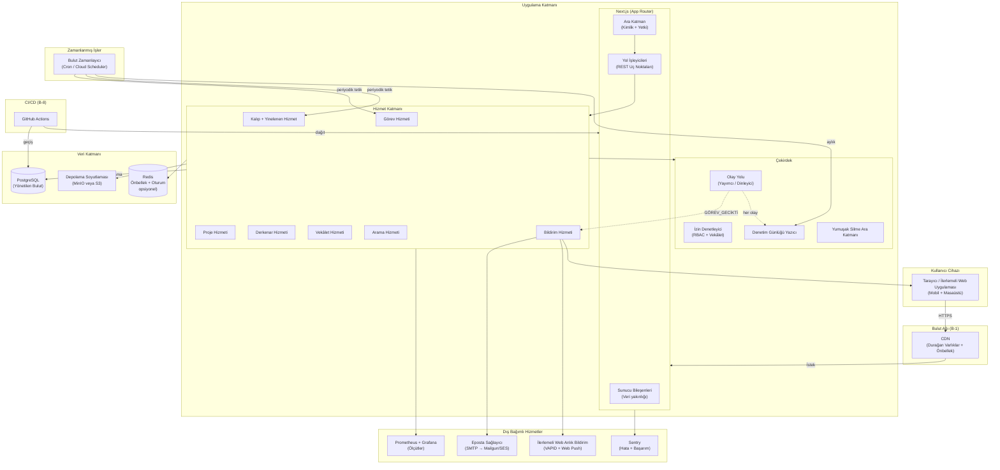
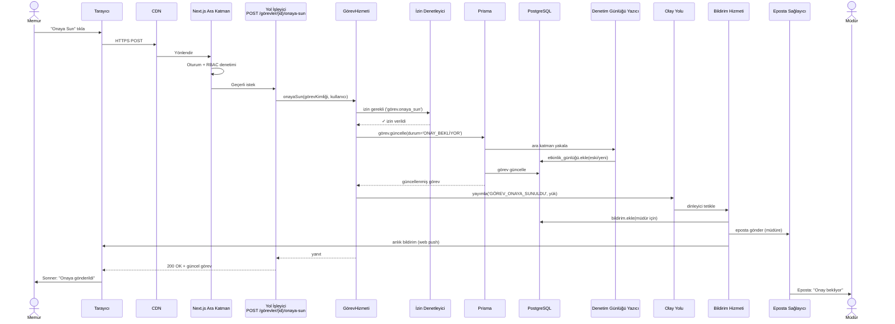
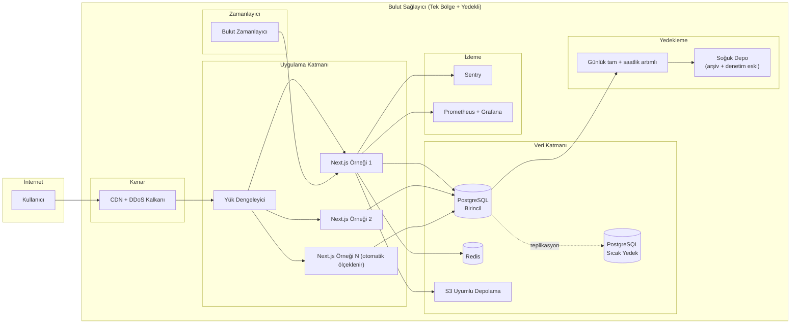
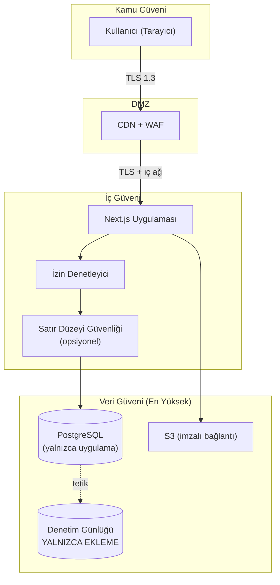

# B-Ç1 — Üst Düzey Mimari Çizgesi

> **Çıktı No:** B-Ç1
> **Sahip:** Mimar
> **Öncelik:** YÜKSEK
> **Bağlı Kararlar:** B-1 (Bulut), B-9 (Tek Depo), K-010 (Önce Arayüz + Olay Güdümlü), K-011 (Değiştirilemez Denetim), K-012 (Yumuşak Silme)
> **Tarih:** 2026-05-01

---

## 1. AMACI

Bu belge PUSULA'nın **üst düzey mimarisini** görsel ve yazılı olarak ortaya koyar. Sonraki çıktılar (varlık-ilişki, açık uç nokta sözleşmesi, olay sözlüğü, bulut altyapı, vb.) bu mimariyi temel alır.

## 2. MİMARİ ÖZET

PUSULA, **tek depo (monorepo)** üzerine kurulu, **Next.js tabanlı tam yığın** bir uygulamadır. Mimarinin sırt omurları:

- **Önce Arayüz:** Tüm yetenekler REST uç noktası ile başlar.
- **Olay Güdümlü Çekirdek:** İç olaylar yayımlanır; bildirim, kayıt, gösterge paneli yenileme bunları dinler.
- **Değiştirilemez Denetim:** Her hareket kayıt altında, silinemez.
- **Yumuşak Silme:** Hiçbir kullanıcı verisi fiziksel silinmez.
- **Soyutlanmış Bağımlı Hizmetler:** Depolama, eposta gibi dış bağımlılıklar arayüz ile soyutlanır; bulut sağlayıcı değişebilir.

---

## 3. ÜST DÜZEY MİMARİ ÇİZGESİ (Mermaid)



---

## 4. KATMANLAR VE SORUMLULUKLARI

### 4.1. İstemci Katmanı

| Bileşen | Sorumluluk |
|---|---|
| **Tarayıcı / İlerlemeli Web Uygulaması** | Arayüz çizimi, kullanıcı etkileşimi, çevrimdışı önbellek, anlık bildirim alıcısı. |
| **Hizmet Çalışanı** | Önce ağ stratejisi, durağan varlık önbelleği, anlık bildirim dinleme. |
| **TanStack Query Önbelleği** | Sunucu durumu önbelleği, iyimser güncellemeler, geçersizleştirme. |

### 4.2. Kenar Katmanı (CDN)

| Bileşen | Sorumluluk |
|---|---|
| **CDN** | Durağan varlıklar (JS, CSS, görsel), kenar önbellekleme, DDoS koruması. |
| Önerilen sağlayıcı | Cloudflare / CloudFront / Vercel Edge. |

### 4.3. Uygulama Katmanı (Next.js)

| Alt Katman | Sorumluluk |
|---|---|
| **Ara Katman** | Kimlik doğrulama (better-auth oturumu okuma), yol koruma, IP/sınırlama, dil tespiti. |
| **Sunucu Bileşenleri** | Veri yakınlığı (RSC içinde Prisma çağrısı), sıvılaştırma maliyeti azaltma. |
| **Yol İşleyicileri** | REST uç noktaları (`POST /görevler/{id}/onaya-sun` gibi etki alanı odaklı). |
| **Ön Yüz Bileşenleri** | React + Shadcn UI + TanStack Table. |

### 4.4. Hizmet Katmanı

Her hizmet **etki alanı tabanlıdır** (görev, proje, derkenar, vekâlet, arama, bildirim, kalıp). Hizmetler:

- Çağrılan iş kuralını yürütür.
- İzin denetleyiciye danışır.
- Veritabanına Prisma ile yazar.
- Olay yoluna olay yayımlar.
- Yanıt döndürür.

```typescript
// Örnek hizmet imzası (kavramsal)
sınıf GörevHizmeti {
  async onayaSun(görevKimliği, kullanıcı) {
    izinDenetleyici.gerekli(kullanıcı, 'görev.onaya_sun', { görevKimliği })
    görev = prisma.görev.güncelle({ durum: 'ONAY_BEKLİYOR', ... })
    olayYolu.yayımla('GÖREV_ONAYA_SUNULDU', { görevKimliği, kullanıcıKimliği })
    dön görev
  }
}
```

### 4.5. Çekirdek Katman

| Bileşen | Sorumluluk |
|---|---|
| **Olay Yolu** | İç olay yayımlama/dinleme. Asgari uygulanabilir üründe **süreç içi** yol; ileride mesaj kuyruğu (BullMQ + Redis) önerilir. |
| **İzin Denetleyici** | Kullanıcının istenen eylemi yapma yetkisini denetler. Vekâlet etkin ise efektif yetki = kendi ∪ devredilen. |
| **Denetim Günlüğü Yazıcı** | Her veritabanı yazımını yakalar (Prisma ara katmanı), `etkinlik_günlüğü` çizelgesine yazar. **Yalnızca ekleme.** |
| **Yumuşak Silme Ara Katmanı** | `findMany`/`findUnique` çağrılarında `silinme_tarihi NULL` süzgecini kendiliğinden ekler. |

### 4.6. Veri Katmanı

| Bileşen | Sorumluluk |
|---|---|
| **PostgreSQL (Yönetilen Bulut)** | Birincil veri deposu. Yönetilen sağlayıcı (RDS / Cloud SQL / Neon / Supabase). Tam metin arama (tsvector). |
| **Redis (Opsiyonel)** | Oturum saklama (better-auth), TanStack Query sunucu önbelleği, BullMQ kuyruğu (gelecek). |
| **Depolama Soyutlaması** | `IDepolamaSağlayıcı` arayüzü → bulutta MinIO veya S3 uygulaması. Yerel sağlayıcı yalnızca geliştirme. |

### 4.7. Dış Bağımlı Hizmetler

| Bileşen | Sorumluluk |
|---|---|
| **Eposta Sağlayıcı** | Kritik üst makama taşıma, vekâlet, onay/red bildirimleri. SMTP başla → Mailgun/SES geçiş. |
| **İlerlemeli Web Anlık Bildirim** | VAPID + Web Push API ile tarayıcıya anlık bildirim. |
| **Sentry** | Çekirdek Hata Gözlemcisi'nin dış uzantısı. Üretim hatalarını izleme. |
| **Prometheus + Grafana** | Hizmet ölçütleri, gösterge panelleri, uyarılar. |

### 4.8. Zamanlanmış İşler

| İş | Sıklık | Tetiklediği |
|---|---|---|
| **Hizmet süresi denetimi** | Her dakika | `bitim_tarihi < şimdi` görevler için `GÖREV_GECİKTİ`. |
| **Erken uyarı (yüzde 25)** | Her 5 dakika | `kalan_süre <= yüzde 25` için bildirim. |
| **Yinelenen görev üretimi** | Saatlik | `YinelenenKural`'ları denetler, vade gelmiş olanlardan görev üretir. |
| **Vekâlet süre dolumu** | Saatlik | `bitiş_tarihi < şimdi` vekâletler için `VEKÂLET_SÜRESİ_DOLDU`. |
| **Denetim günlüğü arşivi** | Aylık | 1 yıldan eski kayıtları soğuk depoya. |

### 4.9. CI/CD

| Bileşen | Sorumluluk |
|---|---|
| **GitHub Actions** | Lint, tip denetim, sınama (Vitest + Playwright), derleme, dağıtım. |
| **Hazırlık ortamı** | `main` dalı her itme. |
| **Üretim ortamı** | Yayın etiketi + elle onay. |

---

## 5. İSTEK YAŞAM DÖNGÜSÜ (Örnek: "Görev Onaya Sun")



---

## 6. DAĞITIM TOPOLOJİSİ (B-1 Bulut)



### 6.1. Yüksek Kullanılabilirlik Özellikleri

| Bileşen | Strateji |
|---|---|
| **Uygulama** | En az 2 örnek + otomatik ölçeklendirme (CPU > %70 veya istek > 200/sn). |
| **Veritabanı** | Birincil + sıcak yedek (5 sn replikasyon). Otomatik devralma. |
| **Önbellek** | Redis kümeli (yönetilen). |
| **Depolama** | S3 sınıfı çoklu erişilebilirlik bölgesi. |
| **CDN** | Küresel kenar, DDoS kalkanı. |

### 6.2. Yedekleme & Felaket Kurtarma (B-6 STANDART)

| Ölçüt | Hedef |
|---|---|
| **Kurtarma Noktası Hedefi** | 24 saat |
| **Kurtarma Süresi Hedefi** | 4 saat |
| **Tam yedek** | Günlük (gece) |
| **Artımlı yedek** | Saatlik |
| **Yedek saklama** | 30 gün sıcak + 1 yıl soğuk |
| **Geri yükleme tatbikatı** | 6 ayda bir |

---

## 7. GÜVENLİK SINIRLARI



| Sınır | Korunma |
|---|---|
| **İstemci ↔ CDN** | TLS 1.3, HTTP Strict Transport Security, içerik güvenlik politikası. |
| **CDN ↔ Uygulama** | İç ağ + sertifika sabitleme. |
| **Uygulama ↔ Veritabanı** | Tek hizmet kullanıcısı (yalnızca CRUD), denetim günlüğüne UPDATE/DELETE yetkisi YOK. |
| **Uygulama ↔ Depolama** | İmzalı bağlantı (kısa ömürlü). |
| **Vekâlet** | Kapsam sınırlı, süresi dolmuş otomatik kapanır. |

---

## 8. ÖLÇEKLENDİRME YAKLAŞIMI

| Boyut | Yaklaşım |
|---|---|
| **Yatay (Uygulama)** | Durumsuz Next.js örnekleri, otomatik ölçeklendirme. |
| **Veritabanı** | Birincil-yedek; okuma yoğun sorgular için yedekten okuma (Evre 5+). |
| **Önbellek** | Redis sayfalama önbelleği + TanStack Query istemci önbelleği. |
| **Arama** | Evre 1 frontend bulanık → Evre 2 PostgreSQL FTS → Evre 6 Elasticsearch. |
| **Olay Yolu** | Evre 1-3 süreç içi → Evre 4+ BullMQ + Redis (gerekirse). |

---

## 9. EVRİME UYUMLULUK NOKTALARI

| Bugün | Yarın (Açık Kapı) |
|---|---|
| Süreç içi olay yolu | Mesaj kuyruğu (BullMQ / RabbitMQ / Kafka) |
| Yerel depolama (gel) | MinIO → S3 (üretimde) |
| PostgreSQL FTS | Elasticsearch / Meilisearch |
| Tek bölge dağıtım | Çoklu bölge (yapay zekâ asistanı + bayrak için) |
| SMTP | Mailgun / SES |
| Web kanca yok (S10 hayır) | — (gelecekte de planlanmıyor) |
| 3. taraf API yok (S10 hayır) | — (gelecekte de planlanmıyor) |

---

## 10. SIRADAKİ ÇIKTIYA GİRİŞ

Bu mimari çizge, **B-Ç2 Varlık-İlişki Çizgesi** için aşağıdaki bağlamı verir:

- Tüm modeller PostgreSQL'de yaşar.
- Yumuşak silme alanları her etki alanı çizelgesinde olmalıdır.
- Denetim günlüğü çizelgesi izole tutulur (ayrı yetki).
- Olay yolu için ayrı bir model gerekmez (bellek içi); ileride mesaj kuyruğu için `olay_kuyrukları` çizelgesi açılabilir.
- Vekâlet çizelgesi izin denetleyicinin kritik girdisidir.

**Bir sonraki çıktı: B-Ç2 — Varlık-İlişki Çizgesi (29 model + ilişkiler).**
