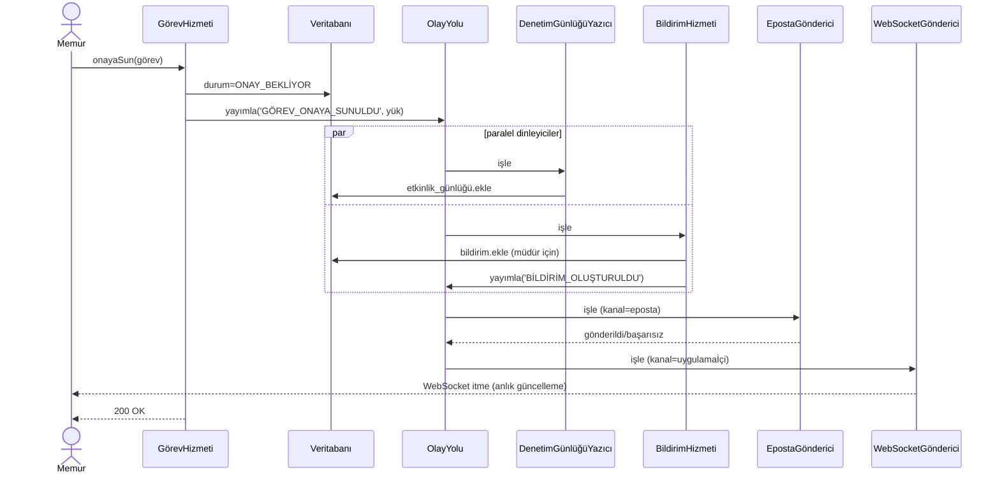

# B-Ç10 — Olay Sözlüğü

> **Çıktı No:** B-Ç10
> **Sahip:** Mimar
> **Öncelik:** YÜKSEK
> **Bağlı Kararlar:** K-010 (Olay Güdümlü), B-Ç1 §6.2, K-011 (Denetim)
> **Tarih:** 2026-05-01

---

## 1. AMACI

PUSULA olay yolunda dolaşan tüm iç olayların **adı, yükü, dinleyicileri, etkileri** bu belgede tek noktada tanımlıdır. Tip güvenliği için TypeScript / Zod karşılıkları belirtilmiştir.

## 2. TASARIM İLKELERİ

1. **Olay = Geçmiş zamanda fiil:** `GÖREV_OLUŞTURULDU` (oluşturuluyor değil).
2. **Olay yükü değiştirilemez:** Yayımlandıktan sonra dinleyici yükü değiştirmez.
3. **Olay etki taşımaz:** Olay yalnızca **bilgi**dir; "ne oldu"yu söyler. Eylemi dinleyici karar verir.
4. **Tip güvenli:** Her olay Zod şeması ile tanımlı.
5. **Dinleyici sırasız:** Birden fazla dinleyici varsa sıraya bağımlılık yok.
6. **En az bir kez teslim (asgari uygulanabilir üründe):** Süreç içi yol; ileride mesaj kuyruğu ile yeniden deneme + çift teslim koruması.

---

## 3. OLAY YÜKÜNÜN ORTAK ALANLARI

Tüm olaylar bu temel alanları içerir:

```typescript
TemelOlay = z.object({
  olayKimliği: z.string().cuid(),       // tekil tanımlayıcı
  olayTipi: z.string(),                  // örn. 'GÖREV_OLUŞTURULDU'
  zamanDamgası: z.string().datetime(),
  eyleyenKimliği: z.string().cuid(),     // eylemi yapan kullanıcı
  adınaKimliği: z.string().cuid().optional(),  // vekâleten ise asıl yetki sahibi
  korelasyonKimliği: z.string().cuid().optional(),  // istek korelasyonu
  topluİşlemKimliği: z.string().cuid().optional(),
})
```

---

## 4. OLAY KATALOĞU

### 4.1. Görev Olayları

#### `GÖREV_OLUŞTURULDU`

```typescript
{
  ...TemelOlay,
  yük: {
    görevKimliği: cuid,
    projeKimliği: cuid | null,
    üstKimliği: cuid | null,
    birimKimliği: cuid,
    atananKimliği: cuid | null,
    görünürlük: 'ÖZEL' | 'BİRİM',
    öncelik: enum,
    bitimTarihi: datetime | null,
    kalıpKimliği: cuid | null,
  }
}
```

**Dinleyiciler:**
- `DenetimGünlüğüYazıcı` — denetim kaydı
- `BildirimHizmeti` — atananaya "Yeni görev" bildirimi (varsa)
- `İzleyiciTetikleyici` — proje izleyicilerine bildirim
- `GöstergePaneliÖnbellek` — birim ve atanan panellerini geçersizleştir

#### `GÖREV_GÜNCELLENDİ`

```typescript
{
  ...TemelOlay,
  yük: {
    görevKimliği: cuid,
    eskiAlanlar: Record<string, any>,
    yeniAlanlar: Record<string, any>,
  }
}
```

**Dinleyiciler:** DenetimGünlüğüYazıcı, GöstergePaneliÖnbellek, İzleyiciBildirim (kritik alanlar değiştiyse).

#### `GÖREV_ATANDI`

```typescript
{
  ...TemelOlay,
  yük: {
    görevKimliği: cuid,
    eskiAtananKimliği: cuid | null,
    yeniAtananKimliği: cuid,
  }
}
```

**Dinleyiciler:**
- `BildirimHizmeti` — yeni atanana
- `İşYüküSayacıGüncelleyici` — eski + yeni atananın iş yükü
- `DenetimGünlüğüYazıcı`

#### `GÖREV_DURUMU_DEĞİŞTİ`

```typescript
{
  ...TemelOlay,
  yük: {
    görevKimliği: cuid,
    eskiDurum: GörevDurumu,
    yeniDurum: GörevDurumu,
  }
}
```

**Dinleyiciler:**
- `DenetimGünlüğüYazıcı`
- `BildirimHizmeti` (atanan + izleyiciler)
- `İlerlemeYenidenHesaplayıcı` (parent + proje)
- `GöstergePaneliÖnbellek`

#### `GÖREV_ONAYA_SUNULDU`

```typescript
{
  ...TemelOlay,
  yük: {
    görevKimliği: cuid,
    onaylayacakMüdürKimliği: cuid,
  }
}
```

**Dinleyiciler:**
- `BildirimHizmeti` — müdüre "Onay bekliyor" bildirimi (uygulama içi + opsiyonel eposta + opsiyonel anlık)
- `DenetimGünlüğüYazıcı`

#### `GÖREV_ONAYLANDI`

```typescript
{
  ...TemelOlay,
  yük: {
    görevKimliği: cuid,
  }
}
```

**Dinleyiciler:**
- `BildirimHizmeti` — atanana "Onaylandı" + izleyicilere
- `İlerlemeYenidenHesaplayıcı` — parent + proje
- `ProjeKapatılabilirDenetleyici` — proje tüm uç görevleri tamamladıysa kapatma talebi
- `DenetimGünlüğüYazıcı`

#### `GÖREV_REDDEDİLDİ`

```typescript
{
  ...TemelOlay,
  yük: {
    görevKimliği: cuid,
    gerekçe: string,
    derkenarKimliği: cuid | null,  // otomatik UYARI derkenarı
  }
}
```

**Dinleyiciler:**
- `BildirimHizmeti` — atanana gerekçeli bildirim
- `DenetimGünlüğüYazıcı`

#### `GÖREV_İPTAL`

```typescript
{
  ...TemelOlay,
  yük: {
    görevKimliği: cuid,
    gerekçe: string | null,
  }
}
```

**Dinleyiciler:** DenetimGünlüğüYazıcı, BildirimHizmeti, İlerlemeYenidenHesaplayıcı.

#### `GÖREV_SİLİNDİ`

```typescript
{
  ...TemelOlay,
  yük: { görevKimliği: cuid }
}
```

**Dinleyiciler:** İlerlemeYenidenHesaplayıcı (silinen görev hesaba katılmaz).

#### `GÖREV_GECİKTİ`

```typescript
{
  ...TemelOlay,         // eyleyenKimliği = SİSTEM
  yük: {
    görevKimliği: cuid,
    bitimTarihi: datetime,
    gecikmeSüresiDk: number,
    atananKimliği: cuid,
    birimMüdürKimliği: cuid,
  }
}
```

**Dinleyiciler:**
- `BildirimHizmeti` — atanan + müdür + (eşik aşıldıysa) Kaymakam
- `DenetimGünlüğüYazıcı`
- `GöstergePaneliÖnbellek` — gecikenler bileşeni

#### `GÖREV_ERKEN_UYARI`

```typescript
{
  ...TemelOlay,
  yük: {
    görevKimliği: cuid,
    kalanSüreYüzde: number,  // örn. 25
    bitimTarihi: datetime,
  }
}
```

**Dinleyiciler:** BildirimHizmeti.

### 4.2. Bağlılık Olayları

#### `BAĞLILIK_EKLENDİ`

```typescript
{
  ...TemelOlay,
  yük: {
    görevKimliği: cuid,
    bağlıOlduğuGörevKimliği: cuid,
    tip: 'ENGELLER',
  }
}
```

**Dinleyiciler:** DenetimGünlüğüYazıcı, GöstergePaneliÖnbellek.

#### `BAĞLILIK_SİLİNDİ`

```typescript
{
  ...TemelOlay,
  yük: {
    görevKimliği: cuid,
    bağlıOlduğuGörevKimliği: cuid,
  }
}
```

### 4.3. Proje Olayları

#### `PROJE_OLUŞTURULDU`, `PROJE_GÜNCELLENDİ`, `PROJE_DURUMU_DEĞİŞTİ`, `PROJE_KAPATMA_TALEBİ`, `PROJE_KAPATILDI`, `PROJE_ARŞİVLENDİ`, `PROJE_SİLİNDİ`

```typescript
{
  ...TemelOlay,
  yük: {
    projeKimliği: cuid,
    [olaya özel ek alanlar]
  }
}
```

**Dinleyiciler (tipik):**
- DenetimGünlüğüYazıcı
- BildirimHizmeti (üyelere)
- GöstergePaneliÖnbellek

#### `ÜYELİK_İSTEĞİ_OLUŞTURULDU`

```typescript
{
  ...TemelOlay,
  yük: {
    isteğKimliği: cuid,
    projeKimliği: cuid,
    davetEdilenKimliği: cuid,
    hedefBirimMüdürKimliği: cuid,
  }
}
```

**Dinleyiciler:** BildirimHizmeti — hedef birim müdürüne onay bildirimi.

#### `ÜYELİK_İSTEĞİ_KARARI`

```typescript
{
  ...TemelOlay,
  yük: {
    isteğKimliği: cuid,
    karar: 'ONAYLANDI' | 'REDDEDİLDİ',
    redGerekçesi: string | null,
  }
}
```

**Dinleyiciler:** BildirimHizmeti — davet edene + davet edilene; ONAYLANDI ise ProjeÜyesi oluştur.

### 4.4. Yorum & Derkenar Olayları

#### `YORUM_OLUŞTURULDU`, `YORUM_GÜNCELLENDİ`, `YORUM_SİLİNDİ`

```typescript
{
  ...TemelOlay,
  yük: {
    yorumKimliği: cuid,
    görevKimliği: cuid,
  }
}
```

**Dinleyiciler:** İzleyiciBildirim (özet, taşkın yapma), DenetimGünlüğüYazıcı.

#### `DERKENAR_OLUŞTURULDU`

```typescript
{
  ...TemelOlay,
  yük: {
    derkenarKimliği: cuid,
    görevKimliği: cuid,
    tip: DerkenarTipi,
    sabitlendi: boolean,
    durumOtomatikAyarla: boolean,  // S4 kararı
  }
}
```

**Dinleyiciler:**
- `İzleyiciBildirim` — izleyicilere
- `DenetimGünlüğüYazıcı`
- **`GörevDurumOtomatik`** — `tip === 'ENGEL' && durumOtomatikAyarla` ise görev → `ENGELLENDİ`

#### `DERKENAR_GÜNCELLENDİ`

```typescript
{
  ...TemelOlay,
  yük: {
    derkenarKimliği: cuid,
    sürümKimliği: cuid,  // yeni snapshot
    eskiAlanlar: Record<string, any>,
    yeniAlanlar: Record<string, any>,
  }
}
```

#### `DERKENAR_SABİTLENDİ` / `DERKENAR_SABİT_KALDIRILDI`

```typescript
{
  ...TemelOlay,
  yük: {
    derkenarKimliği: cuid,
    görevKimliği: cuid,
    tip: DerkenarTipi,
  }
}
```

#### `DERKENAR_ÇÖZÜLDÜ`

```typescript
{
  ...TemelOlay,
  yük: {
    derkenarKimliği: cuid,
    görevKimliği: cuid,
    tip: 'ENGEL',  // yalnızca ENGEL çözülür
  }
}
```

**Dinleyiciler:** `GörevDurumOtomatik` — eğer görev `ENGELLENDİ` ise → `SÜRÜYOR`.

### 4.5. İzleyici Olayları

#### `İZLEYİCİ_EKLENDİ` / `İZLEYİCİ_KALDIRILDI`

```typescript
{
  ...TemelOlay,
  yük: {
    görevKimliği: cuid,
    izleyenKullanıcıKimliği: cuid,
  }
}
```

### 4.6. Vekâlet Olayları

#### `VEKÂLET_OLUŞTURULDU`

```typescript
{
  ...TemelOlay,
  yük: {
    vekâletKimliği: cuid,
    devredenKimliği: cuid,
    alanKimliği: cuid,
    başlangıçTarihi: datetime,
    bitişTarihi: datetime,
    kapsam: string[] | null,
  }
}
```

**Dinleyiciler:** BildirimHizmeti — devreden + alan + ilgili birim müdürlerine; DenetimGünlüğüYazıcı.

#### `VEKÂLET_GERİ_ALINDI`

```typescript
{
  ...TemelOlay,
  yük: { vekâletKimliği: cuid, gerekçe: string | null }
}
```

#### `VEKÂLET_SÜRESİ_DOLDU`

```typescript
{
  ...TemelOlay,         // eyleyenKimliği = SİSTEM
  yük: { vekâletKimliği: cuid, devredenKimliği: cuid, alanKimliği: cuid }
}
```

**Dinleyiciler:** BildirimHizmeti — devreden + alan; DenetimGünlüğüYazıcı.

### 4.7. Bildirim & Eposta Olayları

#### `BİLDİRİM_OLUŞTURULDU` (iç)

```typescript
{
  ...TemelOlay,
  yük: {
    bildirimKimliği: cuid,
    alıcıKullanıcıKimliği: cuid,
    tip: BildirimTipi,
    kanallar: ('uygulamaİçi' | 'anlık' | 'eposta')[],
  }
}
```

**Dinleyiciler:**
- `EpostaGönderici` (kanal 'eposta' içinde varsa)
- `AnlıkBildirimGönderici` (kanal 'anlık')
- `WebSocketGönderici` (uygulamaİçi gerçek zamanlı, opsiyonel)

#### `EPOSTA_GÖNDERİLDİ` / `EPOSTA_BAŞARISIZ`

Yan kanal: gözlemleme.

### 4.8. Dosya Olayları

#### `DOSYA_YÜKLENDİ`

```typescript
{
  ...TemelOlay,
  yük: {
    dosyaKimliği: cuid,
    görevKimliği: cuid | null,
    projeKimliği: cuid | null,
    boyut: number,
    içerikTipi: string,
  }
}
```

**Dinleyiciler:** DenetimGünlüğüYazıcı, İzleyiciBildirim.

#### `DOSYA_SİLİNDİ`

```typescript
{
  ...TemelOlay,
  yük: { dosyaKimliği: cuid }
}
```

### 4.9. Kullanıcı & Sistem Olayları

#### `KULLANICI_OLUŞTURULDU`, `KULLANICI_DEVRE_DIŞI`, `ROL_DEĞİŞTİRİLDİ`

```typescript
{
  ...TemelOlay,
  yük: {
    hedefKullanıcıKimliği: cuid,
    [olaya özel]
  }
}
```

#### `OTURUM_AÇILDI`, `OTURUM_KAPANDI`, `BAŞARISIZ_GİRİŞ`

```typescript
{
  ...TemelOlay,
  yük: {
    kullanıcıKimliği: cuid | null,  // başarısız girişte null olabilir
    ip: string,
    tarayıcıİmi: string,
  }
}
```

**Dinleyiciler:** DenetimGünlüğüYazıcı, AnomaliTespiti (opsiyonel).

#### `İZİN_REDDEDİLDİ` (güvenlik)

```typescript
{
  ...TemelOlay,
  yük: {
    izinAnahtarı: string,
    bağlam: Record<string, any>,
    neden: string,
  }
}
```

**Dinleyiciler:** DenetimGünlüğüYazıcı, GüvenlikGözlem.

### 4.10. Kalıp & Yinelenen Olayları

#### `YİNELENEN_KURAL_TETİKLENDİ`

```typescript
{
  ...TemelOlay,         // eyleyenKimliği = SİSTEM
  yük: {
    kuralKimliği: cuid,
    üretilenGörevKimliği: cuid,
  }
}
```

#### `KALIP_OLUŞTURULDU`, `KALIP_GÜNCELLENDİ`, `KALIP_DEVRE_DIŞI_BIRAKILDI`

Standart yapı.

### 4.11. Atama Kuralı Olayları

#### `ATAMA_KURALI_TETİKLENDİ`

```typescript
{
  ...TemelOlay,
  yük: {
    kuralKimliği: cuid,
    görevKimliği: cuid,
    önerilenAtanan: cuid,
    uygulandı: boolean,
  }
}
```

---

## 5. DİNLEYİCİ KATALOĞU

| Dinleyici | Sorumluluk | Dinlediği Olaylar |
|---|---|---|
| **DenetimGünlüğüYazıcı** | `etkinlik_günlüğü` çizelgesine yazma | TÜM olaylar |
| **BildirimHizmeti** | `bildirim` kaydı + kanal yönlendirme | atama, onay, red, gecikme, vekâlet, izleyici, sistem |
| **İlerlemeYenidenHesaplayıcı** | parent task + proje progress recompute | GÖREV_DURUMU_DEĞİŞTİ, GÖREV_ONAYLANDI, GÖREV_SİLİNDİ |
| **ProjeKapatılabilirDenetleyici** | tüm uç görevler bitti mi? | GÖREV_ONAYLANDI |
| **GöstergePaneliÖnbellek** | TanStack Query / Redis önbellek geçersizleştirme | yazma olayları |
| **İzleyiciBildirim** | İzleyicilere özet bildirim | derkenar, dosya, statü, gecikme |
| **GörevDurumOtomatik** | ENGEL derkenar → ENGELLENDİ; çözüldü → SÜRÜYOR | DERKENAR_OLUŞTURULDU, DERKENAR_ÇÖZÜLDÜ |
| **İşYüküSayacıGüncelleyici** | atanan kullanıcı iş yükü | GÖREV_ATANDI, GÖREV_DURUMU_DEĞİŞTİ, GÖREV_ONAYLANDI |
| **EpostaGönderici** | SMTP/Mailgun/SES çağrısı | BİLDİRİM_OLUŞTURULDU (kanal=eposta) |
| **AnlıkBildirimGönderici** | Web Push API | BİLDİRİM_OLUŞTURULDU (kanal=anlık) |
| **GüvenlikGözlem** | Anomali ipuçları | BAŞARISIZ_GİRİŞ, İZİN_REDDEDİLDİ (yığın eşiği) |
| **YinelenenÜretici** (zamanlayıcı tarafı) | YinelenenKural'dan görev üretir | (zamanlanmış) |

---

## 6. OLAY YOLU UYGULAMASI

### 6.1. Asgari Uygulanabilir Üründe

```typescript
// Süreç içi yol — bellekte
sınıf OlayYolu {
  private dinleyiciler: Map<string, Dinleyici[]> = new Map()

  async yayımla<T>(olay: T): Promise<void> {
    const dinleyiciler = this.dinleyiciler.get(olay.olayTipi) ?? []
    await Promise.all(dinleyiciler.map(d => d.işle(olay).catch(e => bildirimHata(e))))
  }

  abone(olayTipi: string, dinleyici: Dinleyici): void {
    const liste = this.dinleyiciler.get(olayTipi) ?? []
    liste.push(dinleyici)
    this.dinleyiciler.set(olayTipi, liste)
  }
}
```

**Sınırlamalar:**
- Sunucu yeniden başlatılırsa kaybolan olaylar (bellekte sıraya alınmıyor).
- Tek örnek varsayımı (yatay ölçeklemede dinleyici çoğaltma sorunu).

### 6.2. Üretim İçin (Evre 4+)

- **BullMQ + Redis** ile kalıcı kuyruk.
- Yeniden deneme (en çok 3 deneme + üstel geri çekilme).
- Ölü mektup kuyruğu (3 başarısız → manuel inceleme).
- Çift teslim koruması (`olayKimliği` benzersiz kontrolü).

### 6.3. Dinleyici Hata Yönetimi

| Senaryo | Davranış |
|---|---|
| Dinleyici hata fırlatır | Diğer dinleyiciler etkilenmez. Hata Sentry'ye iletilir. |
| Dinleyici ağ zaman aşımı | Kalıcı kuyrukta yeniden denenir. |
| Üst üste 3 başarısız | Ölü mektup kuyruğu + manuel inceleme bildirimi (yöneticiye). |

---

## 7. ÖRNEK OLAY AKIŞI (Gerçek Senaryo)



---

## 8. SCHEMALARIN KOD KARŞILIĞI (Tek Yer)

`packages/shared/şemalar/olaylar.ts` dosyasında **tek tanım**:

```typescript
import { z } from 'zod'

export const TemelOlay = z.object({
  olayKimliği: z.string().cuid(),
  olayTipi: z.string(),
  zamanDamgası: z.string().datetime(),
  eyleyenKimliği: z.string().cuid(),
  adınaKimliği: z.string().cuid().optional(),
  korelasyonKimliği: z.string().cuid().optional(),
  topluİşlemKimliği: z.string().cuid().optional(),
})

export const GörevOluşturulduOlayı = TemelOlay.extend({
  olayTipi: z.literal('GÖREV_OLUŞTURULDU'),
  yük: z.object({
    görevKimliği: z.string().cuid(),
    projeKimliği: z.string().cuid().nullable(),
    üstKimliği: z.string().cuid().nullable(),
    birimKimliği: z.string().cuid(),
    atananKimliği: z.string().cuid().nullable(),
    görünürlük: z.enum(['ÖZEL', 'BİRİM']),
    öncelik: z.enum(['DÜŞÜK', 'OLAĞAN', 'YÜKSEK', 'KRİTİK']),
    bitimTarihi: z.string().datetime().nullable(),
    kalıpKimliği: z.string().cuid().nullable(),
  }),
})

// ... diğer olaylar

export const Olay = z.discriminatedUnion('olayTipi', [
  GörevOluşturulduOlayı,
  GörevAtandıOlayı,
  GörevOnayaSunulduOlayı,
  // ...
])

export type Olay = z.infer<typeof Olay>
```

Hizmetler ve dinleyiciler bu paketten import eder; tip güvenliği uçtan uca.

---

## 9. SIRADAKİ ÇIKTIYA GEÇİŞ

Olay sözlüğü, **B-Ç3..B-Ç8** yerleşim çizimleri için "kullanıcı eylemi → yan etki" zincirinin temelini sağlar (örn. "Onaya Sun" tıklandığında ekranda nelerin değişeceği, hangi bildirimlerin geleceği).

**Bir sonraki çıktı: B-Ç3 — Gösterge Paneli yerleşim çizimi (3 rol için).**
