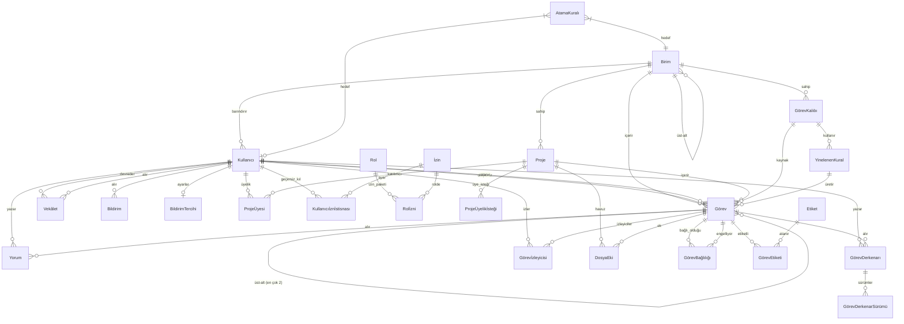
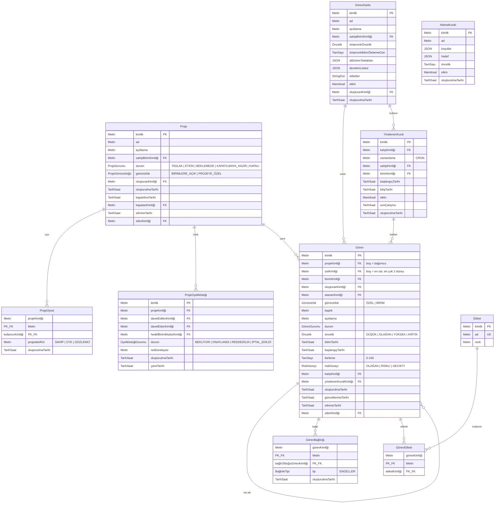
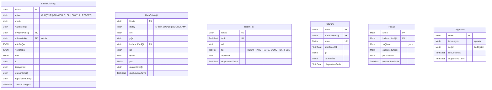
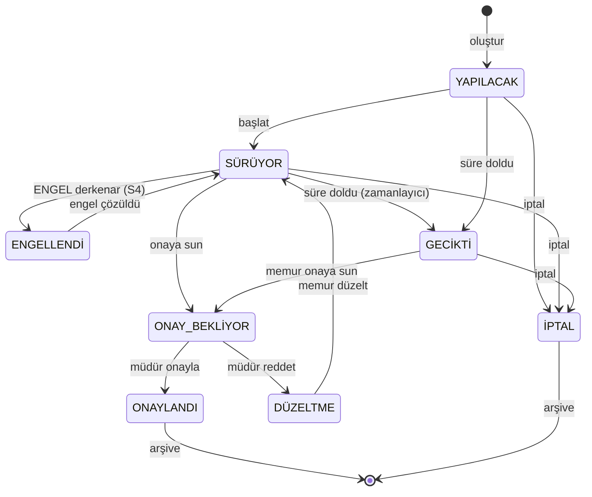
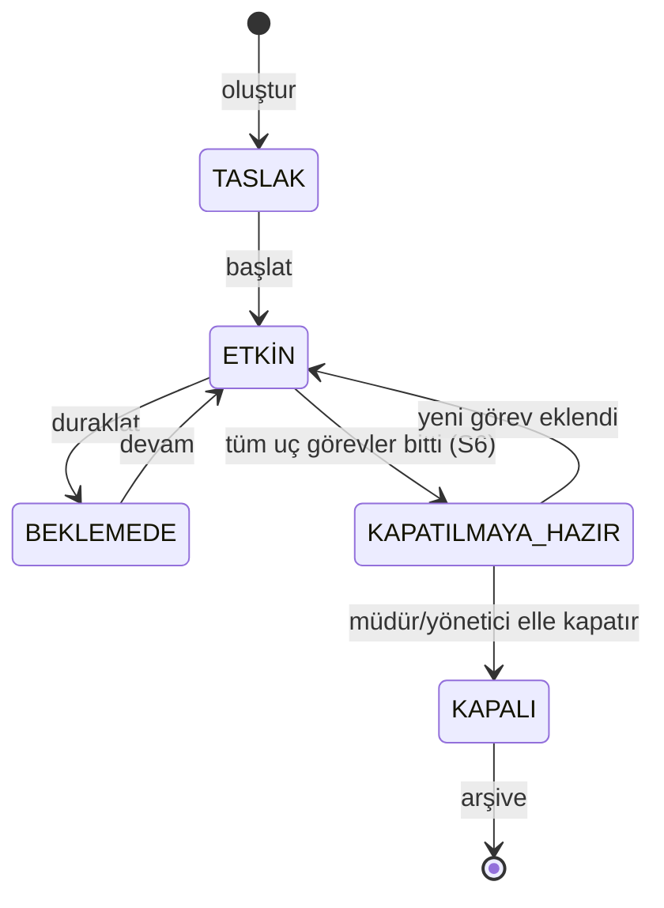
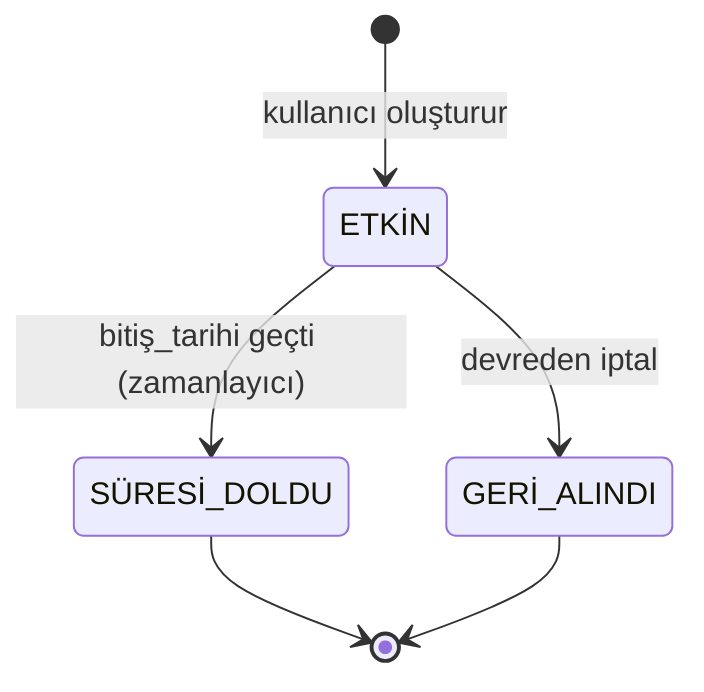
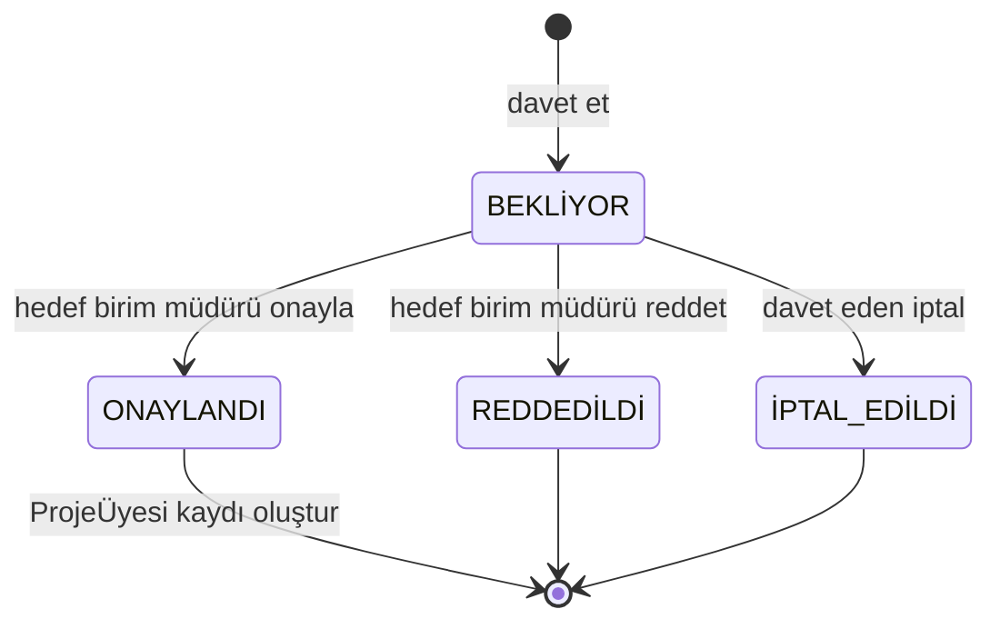
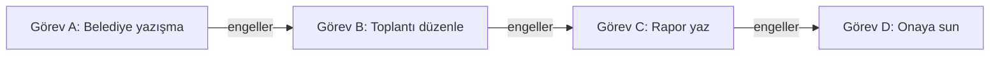

# B-Ç2 — Varlık-İlişki Çizgesi

> **Çıktı No:** B-Ç2
> **Sahip:** Mimar + Veritabanı Uzmanı
> **Öncelik:** YÜKSEK
> **Bağlı Kararlar:** S2, S3, S7 kararları → yeni modeller; K-008 (Yorum vs Derkenar), K-011 (Değiştirilemez Denetim), K-012 (Yumuşak Silme)
> **Tarih:** 2026-05-01

---

## 1. AMACI

PUSULA veri modelinin **görsel ve yapısal tam halini** sunar. Bütün etki alanı modellerinin ilişkilerini, çoklukları, kısıtlarını gösterir. Prisma şeması üretiminde temel başvuru olacak.

## 2. MODELLER ÖZETİ (32 Model)

### 2.1. Etki Alanı Öbekleri

| Öbek | Modeller |
|---|---|
| **Kuruluş** | Birim, Kullanıcı, Rolİzni, İzin, Kullanıcıİznİstisnası |
| **Proje & Görev** | Proje, ProjeÜyesi, ProjeÜyelikİsteği, Görev, GörevBağlılığı, GörevEtiketi, Etiket |
| **Kurumsal Hafıza** | Yorum, GörevDerkenarı, GörevDerkenarSürümü |
| **Kalıp & Kendiliğinden Çalışma** | GörevKalıbı, YinelenenKural, AtamaKuralı |
| **Bildirim & İzleyici** | Bildirim, BildirimTercihi, Görevİzleyicisi |
| **Vekâlet** | Vekâlet |
| **Dosya** | DosyaEki |
| **Denetim & Hata** | EtkinlikGünlüğü, HataGünlüğü |
| **Takvim** | ResmiTatil |
| **Kimlik (better-auth)** | Oturum, Hesap, Doğrulama |

---

## 3. ÜST DÜZEY VARLIK-İLİŞKİ ÇİZGESİ



---

## 4. AYRINTILI VARLIK-İLİŞKİ (4 Aşama)

> Mermaid'de 30+ varlık tek çizgede karmaşıklaşır. Aşağıda **4 mantıksal aşamada** bölündü.

### 4.1. Aşama A — Kuruluş & Yetki

```mermaid
erDiagram
    Birim {
        Metin kimlik PK
        Metin ad UK
        Metin kod UK
        Metin üstBirimKimliği FK "kendine başvurulu"
        Mantıksal etkin
        TarihSaat oluşturulmaTarihi
    }

    Kullanıcı {
        Metin kimlik PK
        Metin eposta UK
        Metin ad
        Metin birimKimliği FK
        Rol rol "YÖNETİCİ | BİRİM_MÜDÜRÜ | PERSONEL"
        Mantıksal etkin
        TarihSaat oluşturulmaTarihi
        TarihSaat silinmeTarihi
        Metin silenKimliği FK
    }

    İzin {
        Metin kimlik PK
        Metin anahtar UK "örn. görev.onayla"
        Metin açıklama
    }

    Rolİzni {
        Rol rol PK
        Metin izinKimliği PK_FK
    }

    Kullanıcıİznİstisnası {
        Metin kullanıcıKimliği PK_FK
        Metin izinKimliği PK_FK
        Mantıksal verildi "true=ekstra ver, false=geri al"
    }

    Birim ||--o{ Kullanıcı : "üye"
    Birim ||--o{ Birim : "üst-alt"
    Kullanıcı ||--o{ Kullanıcıİznİstisnası : "geçersiz_kılar"
    İzin ||--o{ Rolİzni : "paket"
    İzin ||--o{ Kullanıcıİznİstisnası : "anahtar"
```

**Notlar:**
- `Rol` enum: `YÖNETİCİ`, `BİRİM_MÜDÜRÜ`, `PERSONEL`.
- `Birim.üstBirimKimliği` aşamalı yapı için (örn. Kaymakamlık → Yazı İşleri → Evrak Şefliği).
- `Kullanıcıİznİstisnası` rolden ek izin verme veya rolden izin geri alma için.

### 4.2. Aşama B — Proje, Görev, Kalıp



**Notlar:**
- `Görev.üstKimliği` ile **en çok 2 düzey** kuralı **uygulama düzeyinde** zorlanır (veritabanı kısıtı bu sınırı doğrudan ifade etmez; tetikleyici veya hizmet katmanı denetler).
- `GörevBağlılığı`'nda döngü önleme: ekleme öncesi yönlü döngüsüz çizge taraması (uygulama düzeyi).
- `Görünürlük` enum: `ÖZEL`, `BİRİM`.
- `ProjeGörünürlüğü` enum: `BİRİMLERE_AÇIK`, `PROJEYE_ÖZEL` (S2 kararı sonucu).
- `ÜyelikİsteğiDurumu` enum: `BEKLİYOR`, `ONAYLANDI`, `REDDEDİLDİ`, `İPTAL_EDİLDİ` (S3 kararı sonucu).

### 4.3. Aşama C — Yorum, Derkenar, Bildirim, Vekâlet, Dosya

```mermaid
erDiagram
    Yorum {
        Metin kimlik PK
        Metin görevKimliği FK
        Metin yazarKimliği FK
        Metin içerik
        TarihSaat oluşturulmaTarihi
        TarihSaat silinmeTarihi
    }

    GörevDerkenarı {
        Metin kimlik PK
        Metin görevKimliği FK
        Metin yazarKimliği FK
        Metin başlık
        Metin içerik "Zengin metin"
        DerkenarTipi tip "KARAR | UYARI | ENGEL | BİLGİ | NOT"
        Mantıksal sabitlendi
        Mantıksal durumOtomatikAyarla "ENGEL ise otomatik ENGELLENDİ"
        TarihSaat çözüldüTarihi "ENGEL için"
        TarihSaat oluşturulmaTarihi
        TarihSaat güncellenmeTarihi
    }

    GörevDerkenarSürümü {
        Metin kimlik PK
        Metin derkenarKimliği FK
        JSON anlıkGörüntü
        Metin düzenleyenKimliği FK
        TarihSaat düzenlemeTarihi
    }

    Görevİzleyicisi {
        Metin görevKimliği PK_FK
        Metin kullanıcıKimliği PK_FK
        TarihSaat oluşturulmaTarihi
    }

    Bildirim {
        Metin kimlik PK
        Metin kullanıcıKimliği FK
        Metin tip
        Metin başlık
        Metin gövde
        Metin bağlantı
        JSON yük
        TarihSaat okunmaTarihi
        TarihSaat oluşturulmaTarihi
    }

    BildirimTercihi {
        Metin kullanıcıKimliği PK_FK
        Mantıksal uygulamaİçi
        Mantıksal anlık
        Mantıksal eposta
    }

    Vekâlet {
        Metin kimlik PK
        Metin devredenKimliği FK
        Metin alanKimliği FK
        TarihSaat başlangıçTarihi
        TarihSaat bitişTarihi
        JSON kapsam "izin/birim sınırları"
        Metin gerekçe
        VekâletDurumu durum "ETKİN | SÜRESİ_DOLDU | GERİ_ALINDI"
        TarihSaat oluşturulmaTarihi
        TarihSaat geriAlınmaTarihi
        Metin geriAlanKimliği FK
    }

    DosyaEki {
        Metin kimlik PK
        Metin görevKimliği FK "boş olabilir"
        Metin projeKimliği FK "boş olabilir"
        Metin yükleyenKimliği FK
        Metin dosyaAdı
        Metin depolamaAnahtarı UK
        TamSayı boyut
        Metin içerikTipi
        TarihSaat oluşturulmaTarihi
        TarihSaat silinmeTarihi
        Metin silenKimliği FK
    }

    GörevDerkenarı ||--o{ GörevDerkenarSürümü : "sürümler"
```

**Notlar:**
- `Yorum` üzerinde sürümleme YOK (geçici akış); silme sadece yumuşak.
- `GörevDerkenarı.durumOtomatikAyarla` (S4 kararı): `tip = ENGEL` ve bu kutu işaretliyse görev `durum = ENGELLENDİ` olur. Çözüldüğünde `durum = SÜRÜYOR`'a döner.
- `DosyaEki.depolamaAnahtarı` benzersiz: aynı anahtar iki kayıt olamaz.
- Vekâlette aynı `devredenKimliği` için **etkin durumda en fazla bir** vekâlet (kısmi benzersiz dizin).

### 4.4. Aşama D — Denetim, Hata, Takvim, Kimlik



**Notlar:**
- `EtkinlikGünlüğü` ve `HataGünlüğü` **yumuşak silmesiz** (zaten append-only).
- `EtkinlikGünlüğü` için DB kullanıcısına yalnızca `INSERT` yetkisi verilecek; `UPDATE`/`DELETE` reddedilecek (PostgreSQL `REVOKE`).
- `Oturum`, `Hesap`, `Doğrulama` better-auth tarafından yönetilir; şema better-auth'un öntanımlı modelini izler.
- `ResmiTatil.tip = HAFTA_SONU` yığın olarak doldurulmayabilir; iş günü hesabı yardımcısı haftanın günlerini de denetler.

---

## 5. ENUM KATALOĞU

| Enum | Değerler |
|---|---|
| `Rol` | YÖNETİCİ, BİRİM_MÜDÜRÜ, PERSONEL |
| `ProjeDurumu` | TASLAK, ETKİN, BEKLEMEDE, KAPATILMAYA_HAZIR, KAPALI |
| `ProjeGörünürlüğü` | BİRİMLERE_AÇIK, PROJEYE_ÖZEL |
| `ÜyelikİsteğiDurumu` | BEKLİYOR, ONAYLANDI, REDDEDİLDİ, İPTAL_EDİLDİ |
| `Görünürlük` | ÖZEL, BİRİM |
| `GörevDurumu` | YAPILACAK, SÜRÜYOR, ENGELLENDİ, ONAY_BEKLİYOR, ONAYLANDI, DÜZELTME, GECİKTİ, İPTAL |
| `Öncelik` | DÜŞÜK, OLAĞAN, YÜKSEK, KRİTİK |
| `RiskDüzeyi` | OLAĞAN, RİSKLİ, GECİKTİ |
| `BağlılıkTipi` | ENGELLER (ileride: KAYNAK_PAYLAŞIMI vs.) |
| `DerkenarTipi` | KARAR, UYARI, ENGEL, BİLGİ, NOT |
| `VekâletDurumu` | ETKİN, SÜRESİ_DOLDU, GERİ_ALINDI |
| `TatilTipi` | RESMİ_TATİL, HAFTA_SONU, İDARİ_İZİN |
| `BildirimTipi` | ATAMA, ONAY, RED, ÜST_MAKAMA_TAŞIMA, VEKÂLET, İZLEYİCİ, DİZGE |

---

## 6. KISITLAR & DİZİNLER

### 6.1. Birincil Anahtar Stratejisi

- Tüm modeller `cuid()` (Prisma `@default(cuid())`) — yatay ölçek + tahmin edilemezlik.
- Çoktan-çoğa çizelgelerde **bileşik birincil anahtar** (`@@id`).

### 6.2. Yabancı Anahtarlar

- Tüm `xxxKimliği` alanları yabancı anahtar.
- Silme davranışı: **yumuşak silmeyle uyumlu** olduğu için `onDelete: NoAction` öntanımlı; gerekli yerlerde `onDelete: SetNull`.

### 6.3. Benzersiz Kısıtlar

| Çizelge | Alan | Açıklama |
|---|---|---|
| Birim | `ad`, `kod` | Aynı ad/kod tekil |
| Kullanıcı | `eposta` | Tekil giriş |
| İzin | `anahtar` | Tek tanım |
| Etiket | `ad` | Tek etiket adı |
| ResmiTatil | `tarih` | Aynı gün iki tatil olamaz |
| DosyaEki | `depolamaAnahtarı` | Çakışma önleme |
| Oturum | `jeton` | Tekil oturum |

### 6.4. Önerilen Dizinler

| Çizelge | Dizin | Gerekçe |
|---|---|---|
| Görev | `(birimKimliği, durum)` | Birim panosu sorgusu |
| Görev | `(atananKimliği, durum)` | "Bana atananlar" |
| Görev | `(projeKimliği, durum)` | Proje panosu |
| Görev | `(bitimTarihi)` | Hizmet süresi denetimi |
| Görev | `(görünürlük, oluşturanKimliği)` | ÖZEL erişim denetimi |
| Görev | `to_tsvector(başlık + açıklama)` | Tam metin arama (GIN) |
| GörevDerkenarı | `(görevKimliği, sabitlendi)` | Sabit derkenarları öne al |
| GörevDerkenarı | `to_tsvector(başlık + içerik)` | Tam metin arama (GIN) |
| Yorum | `(görevKimliği, oluşturulmaTarihi)` | Zaman dizinli akış |
| EtkinlikGünlüğü | `(model, varlıkKimliği, zamanDamgası)` | Varlık geçmişi sorgusu |
| EtkinlikGünlüğü | `(zamanDamgası)` | Aylık bölümleme |
| EtkinlikGünlüğü | `(eyleyenKimliği)` | Kullanıcı geçmişi |
| Bildirim | `(kullanıcıKimliği, okunmaTarihi)` | Okunmamış sorgusu |
| Vekâlet | `(devredenKimliği, durum)` kısmi `WHERE durum='ETKİN'` | Etkin vekâlet sorgusu |
| Vekâlet | `(alanKimliği, durum)` | "Vekâlet aldığım kullanıcılar" |
| ProjeÜyesi | `(kullanıcıKimliği)` | Kullanıcının projeleri |

### 6.5. Bölümleme (Üretim Önerisi)

| Çizelge | Strateji |
|---|---|
| EtkinlikGünlüğü | `RANGE` bölümleme — aylık. 1 yıldan eski bölümler soğuk depoya. |
| HataGünlüğü | `RANGE` bölümleme — aylık. 90 günden eski bölümler arşiv. |
| Bildirim | `RANGE` bölümleme — aylık. Okunmuş + 90 gün eski silinebilir (politika). |

---

## 7. SİLME DAVRANIŞI

### 7.1. Yumuşak Silme Olan Modeller

| Model | `silinmeTarihi` | `silenKimliği` |
|---|---|---|
| Kullanıcı | ✓ | ✓ |
| Proje | ✓ | ✓ |
| Görev | ✓ | ✓ |
| Yorum | ✓ | — |
| GörevDerkenarı | (önerilen değil — sürümle değiştirilir) | — |
| DosyaEki | ✓ | ✓ |

### 7.2. Yumuşak Silme Olmayan Modeller

| Model | Sebep |
|---|---|
| EtkinlikGünlüğü | Yalnızca ekleme. |
| HataGünlüğü | Saklama politikasıyla yönetilir. |
| GörevDerkenarSürümü | Anlık görüntü değiştirilemez. |
| ProjeÜyesi (çoktan-çoğa) | Doğrudan silinir; ilişki kaydı denetim günlüğüyle izlenir. |
| Görevİzleyicisi | Doğrudan silinir. |
| GörevEtiketi | Doğrudan silinir. |
| Rolİzni | Doğrudan silinir. |
| Bildirim | Saklama politikası (90 gün). |

---

## 8. VERİ YAŞAM DÖNGÜLERİ

### 8.1. Görev Yaşam Döngüsü



### 8.2. Proje Yaşam Döngüsü



### 8.3. Vekâlet Yaşam Döngüsü



### 8.4. ProjeÜyelikİsteği Yaşam Döngüsü (S3)



---

## 9. KRİTİK İŞ KURALLARI (Veritabanı Düzeyinde Zorlanan)

| Kural | Yaklaşım |
|---|---|
| **En çok 2 düzey ast-üst** | Uygulama düzeyi (Görev oluşturma hizmetinde denetim). Veritabanı tetikleyicisi alternatif. |
| **Bağlılıkta döngü yok** | Uygulama düzeyi (eklemeden önce yönlü döngüsüz çizge taraması). |
| **Aynı `devredenKimliği` için tek etkin vekâlet** | Kısmi benzersiz dizin: `UNIQUE (devredenKimliği) WHERE durum='ETKİN'`. |
| **EtkinlikGünlüğü değiştirilemez** | DB kullanıcısı yetki: yalnızca `INSERT`. `UPDATE`/`DELETE` reddedilir. |
| **Yumuşak silme süzgeci kendiliğinden** | Prisma ara katmanı: tüm `findMany`/`findUnique` çağrılarında `silinme_tarihi NULL` ekle. |
| **Görünürlük denetimi** | Hizmet katmanı: ÖZEL ise yalnızca oluşturan + atanan görür. |
| **Maker-Checker** | Hizmet katmanı: `görev.atananKimliği == kullanıcı.kimlik` ise `onayla` reddedilir. |

---

## 10. PRISMA ŞEMA İSKELETİ (Kısa Önizleme)

> Tam şema [B-Ç2-prisma-şeması.prisma](B-Ç2-prisma-şeması.prisma) dosyasında yer alacak. Aşağıdaki yalnızca yapısal önizleme.

```prisma
// schema.prisma — yapısal önizleme

generator client {
  provider = "prisma-client-js"
}

datasource db {
  provider = "postgresql"
  url      = env("VERİTABANI_URL")
}

// =========================
// ENUMLAR
// =========================
enum Rol { YÖNETİCİ BİRİM_MÜDÜRÜ PERSONEL }
enum ProjeDurumu { TASLAK ETKİN BEKLEMEDE KAPATILMAYA_HAZIR KAPALI }
enum ProjeGörünürlüğü { BİRİMLERE_AÇIK PROJEYE_ÖZEL }
enum ÜyelikİsteğiDurumu { BEKLİYOR ONAYLANDI REDDEDİLDİ İPTAL_EDİLDİ }
enum Görünürlük { ÖZEL BİRİM }
enum GörevDurumu { YAPILACAK SÜRÜYOR ENGELLENDİ ONAY_BEKLİYOR ONAYLANDI DÜZELTME GECİKTİ İPTAL }
enum Öncelik { DÜŞÜK OLAĞAN YÜKSEK KRİTİK }
enum RiskDüzeyi { OLAĞAN RİSKLİ GECİKTİ }
enum BağlılıkTipi { ENGELLER }
enum DerkenarTipi { KARAR UYARI ENGEL BİLGİ NOT }
enum VekâletDurumu { ETKİN SÜRESİ_DOLDU GERİ_ALINDI }
enum TatilTipi { RESMİ_TATİL HAFTA_SONU İDARİ_İZİN }

// =========================
// MODELLER (özet)
// =========================
// → Birim, Kullanıcı, İzin, Rolİzni, Kullanıcıİznİstisnası
// → Proje, ProjeÜyesi, ProjeÜyelikİsteği
// → Görev, GörevBağlılığı, Etiket, GörevEtiketi
// → GörevKalıbı, YinelenenKural, AtamaKuralı
// → Yorum, GörevDerkenarı, GörevDerkenarSürümü
// → Görevİzleyicisi, Bildirim, BildirimTercihi
// → Vekâlet
// → DosyaEki
// → EtkinlikGünlüğü, HataGünlüğü
// → ResmiTatil
// → Oturum, Hesap, Doğrulama (better-auth)
```

---

## 11. SORGULAR İÇİN GÖREV BAĞLILIĞI ÖRNEK ÇİZGESİ



**Sorgu örneği (sözde):**
```sql
-- D görevine başlamak için bağlı oldukları
SELECT g.*
FROM görev g
JOIN görev_bağlılığı b ON g.kimlik = b.bağlı_olduğu_görev_kimliği
WHERE b.görev_kimliği = 'D'
  AND g.durum NOT IN ('ONAYLANDI', 'İPTAL');
-- Sonuç boşsa D başlatılabilir.
```

---

## 12. ÖNERİLEN GEÇİŞ STRATEJİSİ

1. **İlk geçiş:** Çekirdek modeller (Birim, Kullanıcı, İzin, Rolİzni).
2. **İkinci geçiş:** Proje, Görev, GörevBağlılığı, Etiket, GörevEtiketi.
3. **Üçüncü geçiş:** Yorum, GörevDerkenarı, GörevDerkenarSürümü.
4. **Dördüncü geçiş:** Bildirim, BildirimTercihi, Görevİzleyicisi.
5. **Beşinci geçiş:** Vekâlet, ProjeÜyelikİsteği, ResmiTatil.
6. **Altıncı geçiş:** GörevKalıbı, YinelenenKural, AtamaKuralı.
7. **Yedinci geçiş:** DosyaEki + depolama tümleşimi.
8. **Sekizinci geçiş:** EtkinlikGünlüğü, HataGünlüğü + Prisma ara katmanı + DB yetki kısıtı.
9. **Dokuzuncu geçiş:** better-auth tabloları (Oturum, Hesap, Doğrulama).
10. **Onuncu geçiş:** Dizin + bölümleme + tetikleyiciler (üretim).

Her geçiş `prisma migrate dev --name X` ile yapılır; üretimde `prisma migrate deploy`.

---

## 13. SIRADAKİ ÇIKTIYA GEÇİŞ

Bu varlık-ilişki çizgesi, **B-Ç12 Yetki/İzin Matrisi** için aşağıdaki bağlamı verir:

- `Rol`, `İzin`, `Rolİzni`, `Kullanıcıİznİstisnası` modelleri tanımlandı.
- `Görev.görünürlük` (ÖZEL/BİRİM) ve `Proje.görünürlük` (BİRİMLERE_AÇIK/PROJEYE_ÖZEL) izin denetiminin girdileri.
- Vekâlet aktif olduğunda etkili izin hesaplaması yapılacak.

**Bir sonraki çıktı: B-Ç12 — Yetki / İzin Matrisi (Rol × İzin × Bağlam).**
