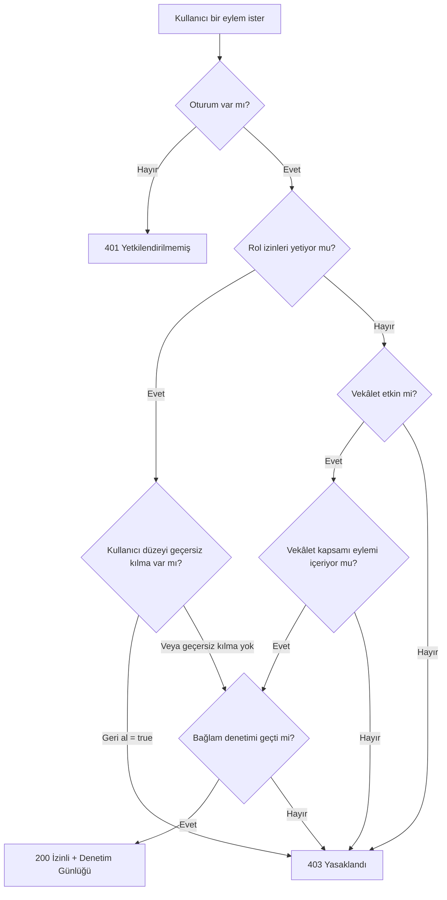

# B-Ç12 — Yetki / İzin Matrisi

> **Çıktı No:** B-Ç12
> **Sahip:** Mimar + Güvenlik
> **Öncelik:** YÜKSEK
> **Bağlı Kararlar:** K-002 (Rol Tabanlı + İzinler), K-013 (Vekâlet), K-007 (Görünürlük), S2 (Proje görünürlüğü), P-006, P-010
> **Tarih:** 2026-05-01

---

## 1. AMACI

PUSULA'nın **rol tabanlı erişim + ince taneli izin** modelini tek belgede ortaya koyar. Hangi rolün hangi eylemi hangi bağlamda yapabileceği, vekâlet ile nasıl genişlediği, geçersiz kılma kuralları burada tanımlıdır.

## 2. YETKİ KARAR ZİNCİRİ



**Bağlam denetimi:** ek koşullar (örn. ÖZEL görevde yalnızca oluşturan/atanan; Maker-Checker'da `atanan != onaylayan`; aynı birim olmalı; vb.).

---

## 3. İZİN ANAHTARLARI KATALOĞU

İzinler **`konu.eylem.kapsam`** biçiminde adlandırılır. Kapsam belirtilmezse "genel" kabul edilir.

### 3.1. Sistem & Yönetim

| İzin Anahtarı | Açıklama |
|---|---|
| `dizge.ayarlar` | Dizge ayarlarına erişim, yapılandırma. |
| `dizge.denetim` | Denetim günlüklerine erişim. |
| `dizge.izin_yönet` | Rolİzni kayıtlarını düzenleme. |
| `dizge.istisna_yönet` | Kullanıcı izin geçersiz kılma. |
| `dizge.tatil_yönet` | Resmi tatil takvimini düzenleme. |
| `dizge.kalıp_yönet` | Görev kalıbı oluşturma/düzenleme. |
| `dizge.atama_kuralı_yönet` | Atama kuralı oluşturma/düzenleme. |
| `rapor.oku.tümü` | Tüm birimlere ait raporları okuma. |
| `rapor.oku.birim` | Yalnızca kendi birim raporlarını okuma. |

### 3.2. Birim & Kullanıcı

| İzin Anahtarı | Açıklama |
|---|---|
| `birim.oluştur` | Yeni birim oluştur. |
| `birim.düzenle` | Birim bilgilerini düzenle. |
| `birim.sil` | Birim sil (yumuşak). |
| `birim.üye.oku` | Birim üyelerini görüntüle. |
| `kullanıcı.oluştur` | Kullanıcı çağrı/oluşturma. |
| `kullanıcı.düzenle` | Kullanıcı bilgisi düzenleme (kendi veya başkası). |
| `kullanıcı.devre_dışı_bırak` | Kullanıcı pasifleştirme. |

### 3.3. Proje

| İzin Anahtarı | Açıklama |
|---|---|
| `proje.oluştur` | Yeni proje aç. |
| `proje.düzenle` | Proje bilgilerini düzenle. |
| `proje.üye_ekle` | Üye ekleme isteği başlat. |
| `proje.üye_onayla` | Birim aşan üye isteklerini onayla (S3). |
| `proje.kapatma_iste` | Tüm uç görevler bittiğinde kapatma talebi başlat. |
| `proje.kapat` | Manuel proje kapatma (üst amir). |
| `proje.arşivle` | Kapalı projeyi arşive taşıma. |
| `proje.oku.tümü` | Tüm projeleri görüntüle. |
| `proje.oku.üye_olduğu` | Yalnızca üyesi olduğu projeleri görüntüle. |

### 3.4. Görev

| İzin Anahtarı | Açıklama |
|---|---|
| `görev.oluştur` | Görev oluşturma. |
| `görev.oluştur.özel` | ÖZEL görev oluşturma (S1: PERSONEL evet). |
| `görev.düzenle.kendi` | Atanmış olduğu görevi düzenleme. |
| `görev.düzenle.tümü` | Birim içindeki tüm görevleri düzenleme. |
| `görev.ata` | Görev havalesi (memura atama). |
| `görev.yeniden_ata` | Atananı değiştirme. |
| `görev.iptal` | Görev iptali. |
| `görev.sil` | Görev silme (yumuşak). |
| `görev.onaya_sun` | Memur onaya sunma. |
| `görev.onayla` | Müdür onayla. |
| `görev.reddet` | Müdür reddet (gerekçeli). |
| `görev.altgörev.oluştur` | Alt görev açma. |
| `görev.bağlılık.düzenle` | Görev bağlılığı ekleme/silme. |
| `görev.izle` | Görev izleyiciye eklenme. |
| `görev.toplu.işlem` | Toplu işlem yapma yetkisi. |

### 3.5. Yorum & Derkenar

| İzin Anahtarı | Açıklama |
|---|---|
| `yorum.oluştur` | Yorum yazma. |
| `yorum.düzenle.kendi` | Kendi yorumunu düzenleme. |
| `yorum.sil.kendi` | Kendi yorumunu yumuşak silme. |
| `yorum.sil.tümü` | Başkasının yorumunu silme (yönetici). |
| `derkenar.oluştur` | Derkenar oluşturma. |
| `derkenar.düzenle.kendi` | Kendi derkenarını düzenleme. |
| `derkenar.düzenle.tümü` | Tüm derkenarları düzenleme (yönetici). |
| `derkenar.sabitle` | Derkenar sabitleme. |
| `derkenar.sürüm.oku` | Derkenar geçmişine erişim. |

### 3.6. Vekâlet

| İzin Anahtarı | Açıklama |
|---|---|
| `vekâlet.oluştur` | Kendi yetkisini başkasına devretme. |
| `vekâlet.geri_al.kendi` | Kendi devrettiği vekâleti iptal. |
| `vekâlet.geri_al.tümü` | Herhangi bir vekâleti iptal (yönetici). |
| `vekâlet.oku.tümü` | Tüm vekâletleri görüntüleme. |

### 3.7. Bildirim & İzleyici

| İzin Anahtarı | Açıklama |
|---|---|
| `bildirim.tercih.düzenle` | Kendi bildirim tercihlerini güncelleme. |
| `bildirim.oku.kendi` | Kendi bildirimlerini görüntüleme. |

### 3.8. Dosya

| İzin Anahtarı | Açıklama |
|---|---|
| `dosya.yükle` | Dosya yükleme. |
| `dosya.indir` | Dosya indirme (görüntü için imzalı bağlantı alma). |
| `dosya.sil.kendi` | Kendi yüklediği dosyayı silme. |
| `dosya.sil.tümü` | Herhangi bir dosyayı silme. |

### 3.9. Arama

| İzin Anahtarı | Açıklama |
|---|---|
| `arama.kullan` | Genel aramayı kullanma. (Tüm rollere açık varsayılır; yetki süzgeci sonuçları sınırlar.) |

---

## 4. ROL × İZİN MATRİSİ

Aşağıdaki çizelgede:
- ✅ = İzin paketinde var.
- ⚪ = İzin paketinde yok.
- 🔶 = Kapsam kısıtlı (yalnızca kendi birimi / kendi kaydı).

| İzin | YÖNETİCİ | BİRİM_MÜDÜRÜ | PERSONEL |
|---|:---:|:---:|:---:|
| **— Sistem & Yönetim —** | | | |
| `dizge.ayarlar` | ✅ | ⚪ | ⚪ |
| `dizge.denetim` | ✅ | 🔶 (kendi birim) | ⚪ |
| `dizge.izin_yönet` | ✅ | ⚪ | ⚪ |
| `dizge.istisna_yönet` | ✅ | ⚪ | ⚪ |
| `dizge.tatil_yönet` | ✅ | ⚪ | ⚪ |
| `dizge.kalıp_yönet` | ✅ | 🔶 (kendi birim) | ⚪ |
| `dizge.atama_kuralı_yönet` | ✅ | 🔶 (kendi birim) | ⚪ |
| `rapor.oku.tümü` | ✅ | ⚪ | ⚪ |
| `rapor.oku.birim` | ✅ | ✅ | ⚪ |
| **— Birim & Kullanıcı —** | | | |
| `birim.oluştur` | ✅ | ⚪ | ⚪ |
| `birim.düzenle` | ✅ | 🔶 (kendi) | ⚪ |
| `birim.sil` | ✅ | ⚪ | ⚪ |
| `birim.üye.oku` | ✅ | ✅ | 🔶 (kendi birim) |
| `kullanıcı.oluştur` | ✅ | ⚪ | ⚪ |
| `kullanıcı.düzenle` | ✅ | 🔶 (kendi birim) | 🔶 (yalnızca kendi profili) |
| `kullanıcı.devre_dışı_bırak` | ✅ | ⚪ | ⚪ |
| **— Proje —** | | | |
| `proje.oluştur` | ✅ | ✅ | ⚪ |
| `proje.düzenle` | ✅ | 🔶 (kendi birim) | ⚪ |
| `proje.üye_ekle` | ✅ | ✅ | ⚪ |
| `proje.üye_onayla` | ✅ | ✅ | ⚪ |
| `proje.kapatma_iste` | ✅ | ✅ | ⚪ |
| `proje.kapat` | ✅ | 🔶 (kendi birim) | ⚪ |
| `proje.arşivle` | ✅ | 🔶 (kendi birim) | ⚪ |
| `proje.oku.tümü` | ✅ | ⚪ | ⚪ |
| `proje.oku.üye_olduğu` | ✅ | ✅ | ✅ |
| **— Görev —** | | | |
| `görev.oluştur` | ✅ | ✅ | ✅ |
| `görev.oluştur.özel` | ✅ | ✅ | ✅ |
| `görev.düzenle.kendi` | ✅ | ✅ | ✅ |
| `görev.düzenle.tümü` | ✅ | 🔶 (kendi birim) | ⚪ |
| `görev.ata` | ✅ | ✅ | ⚪ |
| `görev.yeniden_ata` | ✅ | ✅ | ⚪ |
| `görev.iptal` | ✅ | 🔶 (kendi birim) | 🔶 (kendi oluşturduğu) |
| `görev.sil` | ✅ | 🔶 (kendi birim) | ⚪ |
| `görev.onaya_sun` | ✅ | ✅ | ✅ |
| `görev.onayla` | ✅ | ✅ | ⚪ |
| `görev.reddet` | ✅ | ✅ | ⚪ |
| `görev.altgörev.oluştur` | ✅ | ✅ | ✅ |
| `görev.bağlılık.düzenle` | ✅ | ✅ | 🔶 (kendi atandığı) |
| `görev.izle` | ✅ | ✅ | ✅ |
| `görev.toplu.işlem` | ✅ | ✅ | ⚪ |
| **— Yorum & Derkenar —** | | | |
| `yorum.oluştur` | ✅ | ✅ | ✅ |
| `yorum.düzenle.kendi` | ✅ | ✅ | ✅ |
| `yorum.sil.kendi` | ✅ | ✅ | ✅ |
| `yorum.sil.tümü` | ✅ | ⚪ | ⚪ |
| `derkenar.oluştur` | ✅ | ✅ | ✅ |
| `derkenar.düzenle.kendi` | ✅ | ✅ | ✅ |
| `derkenar.düzenle.tümü` | ✅ | ⚪ | ⚪ |
| `derkenar.sabitle` | ✅ | ✅ | ⚪ |
| `derkenar.sürüm.oku` | ✅ | ✅ | ✅ |
| **— Vekâlet —** | | | |
| `vekâlet.oluştur` | ✅ | ✅ | ⚪ |
| `vekâlet.geri_al.kendi` | ✅ | ✅ | ⚪ |
| `vekâlet.geri_al.tümü` | ✅ | ⚪ | ⚪ |
| `vekâlet.oku.tümü` | ✅ | 🔶 (kendi birim) | ⚪ |
| **— Bildirim —** | | | |
| `bildirim.tercih.düzenle` | ✅ | ✅ | ✅ |
| `bildirim.oku.kendi` | ✅ | ✅ | ✅ |
| **— Dosya —** | | | |
| `dosya.yükle` | ✅ | ✅ | ✅ |
| `dosya.indir` | ✅ | ✅ | ✅ |
| `dosya.sil.kendi` | ✅ | ✅ | ✅ |
| `dosya.sil.tümü` | ✅ | 🔶 (kendi birim) | ⚪ |
| **— Arama —** | | | |
| `arama.kullan` | ✅ | ✅ | ✅ |

---

## 5. BAĞLAM DENETİMLERİ

Rol izni vermek **yeterli değildir**; her hizmet metodu ek bağlam denetimi yapar.

### 5.1. Görev Düzeyinde Bağlam

| Eylem | Bağlam Kuralı |
|---|---|
| Görevi okuma | `görünürlük=ÖZEL` ise yalnızca `oluşturanKimliği` veya `atananKimliği`; `görünürlük=BİRİM` ise birim üyeleri ve müdür. |
| `görev.düzenle.kendi` | `kullanıcı.kimlik == görev.atananKimliği`. |
| `görev.düzenle.tümü` | `görev.birimKimliği == kullanıcı.birimKimliği`. |
| `görev.onayla` | (1) `kullanıcı.kimlik != görev.atananKimliği` (Yapan-Doğrulayan, P-010), (2) müdür birimi görevin birimi olmalı. |
| `görev.sil` | Aktif olmayan veya iptal edilen görevler silinebilir. ONAYLANDI'lar yalnızca YÖNETİCİ tarafından. |
| `görev.bağlılık.düzenle` | Eklemede yönlü döngüsüz çizge taraması; döngü oluşturuyorsa reddet. |
| `görev.altgörev.oluştur` | `görev.üstKimliği == NULL` (yalnızca en üst görevde alt açılabilir, en çok 2 düzey). |

### 5.2. Proje Düzeyinde Bağlam

| Eylem | Bağlam Kuralı |
|---|---|
| `proje.oku` | `görünürlük=BİRİMLERE_AÇIK` → kullanıcı birim üyeleri görür; `görünürlük=PROJEYE_ÖZEL` → yalnızca `ProjeÜyesi`'nde olan kullanıcılar. |
| `proje.üye_ekle` | Davet edilen kullanıcı dış birimden ise `ProjeÜyelikİsteği` oluşturulur ve onay beklenir (S3). |
| `proje.üye_onayla` | Yalnızca `hedefBirimMüdürKimliği == kullanıcı.kimlik` olan istekler. |
| `proje.kapat` | Tüm uç görevler `ONAYLANDI` durumunda olmalı. |

### 5.3. Yorum & Derkenar Düzeyinde Bağlam

| Eylem | Bağlam Kuralı |
|---|---|
| `yorum.oluştur` | Kullanıcı görevi görme yetkisine sahip olmalı (ÖZEL ise atanan/oluşturan). |
| `derkenar.düzenle.kendi` | Yazar olmalı; düzenleme bir `GörevDerkenarSürümü` oluşturur. |
| `derkenar.sabitle` | Müdür veya yönetici. PERSONEL kendi derkenarını sabitleyemez. |

### 5.4. Vekâlet Düzeyinde Bağlam

| Eylem | Bağlam Kuralı |
|---|---|
| `vekâlet.oluştur` | Aynı `devredenKimliği` için etkin başka bir vekâlet **olmamalıdır**. |
| Vekâleten alan `vekâlet.oluştur` | Reddedilir (alt-vekâlet yasak, P-005). |
| Vekâlet kapsamında eylem | Denetim günlüğüne `eyleyen=Y, adına=X` olarak yazılır (K-013). |

---

## 6. VEKÂLET ETKİLİ İZİN HESABI

```
etkin_vekâletler(Y) = SELECT * FROM Vekâlet
  WHERE alanKimliği = Y
    AND durum = 'ETKİN'
    AND başlangıçTarihi <= NOW()
    AND bitişTarihi >= NOW()

efektif_izin(Y) = (rol_izni(Y.rol)
                ∪ {istisna ki ist.kullanıcıKimliği=Y AND ist.verildi=true})
                \ {istisna ki ist.kullanıcıKimliği=Y AND ist.verildi=false}

için her v ∈ etkin_vekâletler(Y):
   eğer v.kapsam = NULL veya eylem ∈ v.kapsam:
      efektif_izin(Y) ∪= rol_izni(v.devreden.rol)

izin_var_mı(Y, eylem, bağlam) = eylem ∈ efektif_izin(Y) AND bağlam_denetim(Y, eylem, bağlam)
```

**Önemli:**
- Vekâlet kapsamı `NULL` ise tüm izinler devredilir.
- Vekâlet kapsamı `["görev.onayla", "görev.reddet"]` gibi bir dizi ise yalnızca bu izinler devredilir (önerilen kapsam ölçünü).

---

## 7. ÖRNEK İZİN SENARYOLARI

### 7.1. Senaryo A — Memur kendi görevini onaylamaya çalışır

```
Kullanıcı M (PERSONEL), Görev G (atananKimliği=M)
Eylem: görev.onayla
→ Rol izni denetimi: PERSONEL → görev.onayla = ⚪ → REDDET (403)
```

### 7.2. Senaryo B — Müdür kendi atadığı görevi kendisi onaylar

```
Kullanıcı Md (BİRİM_MÜDÜRÜ), Görev G (atananKimliği=Md)
Eylem: görev.onayla
→ Rol izni denetimi: BİRİM_MÜDÜRÜ → görev.onayla = ✅
→ Bağlam denetimi: kullanıcı.kimlik == görev.atananKimliği → REDDET (Maker-Checker)
```

### 7.3. Senaryo C — Vekâleten onay

```
Kaymakam K, izinli. Müdür Md1'e vekâlet vermiş, kapsam=NULL.
Md1 başka bir müdürün (Md2) görevini onaylar.
→ Rol izni: BİRİM_MÜDÜRÜ → görev.onayla = ✅
→ Bağlam: Md1, Md2'nin biriminin müdürü değil. Normalde REDDET.
→ Vekâlet kapsamına bak: K (YÖNETİCİ) yetkisinde "rapor.oku.tümü" var, dolayısıyla tüm birimlerde onay.
→ Md1, K adına onaylar. Denetim günlüğü: eyleyen=Md1, adına=K.
```

### 7.4. Senaryo D — Birim aşan üye davet

```
Müdür M1 (Birim A), Müdür M2 (Birim B), Personel P2 (Birim B)
M1 P2'yi M1'in projesine davet eder.
→ proje.üye_ekle: M1 ✅
→ Sistem: ProjeÜyelikİsteği oluşturur (durum=BEKLİYOR, hedefBirimMüdürKimliği=M2)
→ M2 onaylayana kadar P2 projeye katılmaz.
→ M2 onaylar veya reddeder.
```

### 7.5. Senaryo E — ÖZEL görev erişimi

```
Personel P1 ÖZEL bir görev oluşturur (atananKimliği=P1).
Müdür M1 birim panosunu açar.
→ Sorgu: SELECT * FROM görev WHERE birimKimliği=M1.birim AND görünürlük='BİRİM'
→ ÖZEL görev sonuçta GELMEZ (P-006).
P1 görevi görür.
M1 görmez. (Kaymakam dahi görmez — yalnızca oluşturan/atanan.)
```

---

## 8. UYGULAMA YAKLAŞIMI

### 8.1. İzin Denetleyici Arayüzü

```typescript
// kavramsal
arayüz İzinDenetleyici {
  izinVarMı(
    kullanıcı: Kullanıcı,
    eylemAnahtarı: Metin,
    bağlam?: Kayıt<Metin, herhangi>
  ): Söz<Mantıksal>

  gerekli(
    kullanıcı: Kullanıcı,
    eylemAnahtarı: Metin,
    bağlam?: Kayıt<Metin, herhangi>
  ): Söz<boş>  // başarısızsa İzinHatası fırlat
}
```

### 8.2. Hizmet Katmanında Kullanım

```typescript
// kavramsal — GörevHizmeti.onayaSun
async onayaSun(görevKimliği: Metin, kullanıcı: Kullanıcı) {
  await izinDenetleyici.gerekli(kullanıcı, 'görev.onaya_sun', { görevKimliği })
  görev = await prisma.görev.findUnique({ where: { kimlik: görevKimliği } })
  // bağlam denetimi
  if (görev.atananKimliği !== kullanıcı.kimlik) {
    fırlat new İzinHatası('Yalnızca atanan onaya sunabilir.')
  }
  // ... durum güncelle, olay yayımla
}
```

### 8.3. Ön Yüzde Kullanım

```typescript
// kavramsal — useİzin kancası
fonk useİzin(eylemAnahtarı: Metin, bağlam?: Kayıt<Metin, herhangi>) {
  return useQuery(['izin', eylemAnahtarı, bağlam], () =>
    fetcher('/api/izin-denet', { eylemAnahtarı, bağlam })
  )
}

// Bileşen
fonk OnayDüğmesi({ görev }) {
  const { data: izinli } = useİzin('görev.onayla', { görevKimliği: görev.kimlik })
  if (!izinli) return null
  return <Düğme onClick={onayla}>Onayla</Düğme>
}
```

### 8.4. Ön Yüz vs Arka Yüz Denetimi

> **Altın Kural:** Ön yüz denetimi yalnızca **kullanıcı deneyimi** içindir (düğmeleri gizleme). **Asıl güvenlik denetimi her zaman arka yüzdedir.**

---

## 9. SATIR DÜZEYİ GÜVENLİĞİ (Opsiyonel — Üretim Sertleştirme)

PostgreSQL Satır Düzeyi Güvenliği (RLS) ek bir savunma katmanı sunar:

```sql
-- ÖZEL görevler için RLS
ALTER TABLE görev ENABLE ROW LEVEL SECURITY;

CREATE POLICY görev_görünürlük ON görev
  FOR SELECT
  USING (
    görünürlük = 'BİRİM' AND birim_kimliği = current_setting('pusula.birim_kimliği')::text
    OR
    (görünürlük = 'ÖZEL' AND
     (oluşturan_kimliği = current_setting('pusula.kullanıcı_kimliği')::text
      OR atanan_kimliği = current_setting('pusula.kullanıcı_kimliği')::text))
  );
```

Uygulama her bağlantıda `SET pusula.kullanıcı_kimliği = '...'` çalıştırır. Hizmet katmanı bunu Prisma `$executeRaw` ile yapar.

> Asgari uygulanabilir üründe RLS opsiyonel; **Evre 5 (Üretim Sertleştirme)** evresinde önerilir.

---

## 10. DENETİM GÜNLÜĞÜ ENTEGRASYONU

Her başarılı izin denetimi sonrası eylem yapıldığında:

```json
{
  "eylem": "GÖREV_ONAYLANDI",
  "model": "Görev",
  "varlıkKimliği": "...",
  "eyleyenKimliği": "Y",
  "adınaKimliği": "X",        // vekâlet aktifse
  "izinAnahtarı": "görev.onayla",
  "bağlam": { "görevKimliği": "..." },
  "zamanDamgası": "2026-05-01T..."
}
```

Reddedilen denetimler de kayıt altına alınabilir (güvenlik gözlemlemesi için):

```json
{
  "eylem": "İZİN_REDDEDİLDİ",
  "izinAnahtarı": "görev.onayla",
  "kullanıcıKimliği": "Y",
  "neden": "MAKER_CHECKER_İHLALİ",
  "ip": "...",
  "zamanDamgası": "..."
}
```

---

## 11. SORUNLU SENARYOLAR & ÖNLEMLER

| Sorun | Önlem |
|---|---|
| **Yetki yükseltme (privilege escalation)** | İzin geçersiz kılma yalnızca YÖNETİCİ. |
| **Vekâlet kötüye kullanım** | Kapsam zorunlu (asgari uygulanabilir üründe `NULL` izinli, sonra kısıtlanır). Süre üst sınırı (örn. 30 gün) önerilir. |
| **ÖZEL görev sızıntısı** | Hizmet + opsiyonel RLS + denetim. Aramada filtre. |
| **Maker-Checker bypass** | Bağlam denetimi `atanan != onaylayan` zorunlu. |
| **Toplu işlem yetki atlatma** | Her satır ayrı izin denetiminden geçer (toplu işlem **toplu izin denetimi değil**). |

---

## 12. ROL DEĞİŞİKLİĞİ AKIŞI

Bir kullanıcının rolü değiştiğinde:

1. `Kullanıcı.rol` güncellenir.
2. `Kullanıcıİznİstisnası` kayıtları **silinmez** (rol bağımsız geçersiz kılma).
3. Etkin oturumlar: better-auth jeton yenilemesinde yeni rol yansır.
4. `EtkinlikGünlüğü`'ne `ROL_DEĞİŞTİRİLDİ` kaydı.

---

## 13. SIRADAKİ ÇIKTIYA GEÇİŞ

Bu izin matrisi, **B-Ç9 Açık Uç Nokta Sözleşmesi** için her uç noktanın hangi izni gerektireceğinin temelini sağlar.

**Bir sonraki çıktı: B-Ç9 — Açık Uç Nokta Sözleşmesi (OpenAPI 3.0).**
