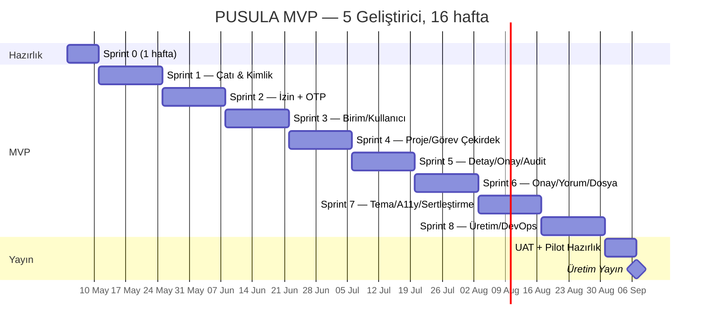
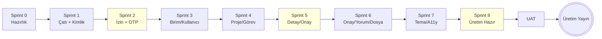

# C Evresi — Asgari Uygulanabilir Ürün (MVP) Ayrıntı Plan

> **Çıktı:** Kullanıcı Öyküleri + Kabul Ölçütleri + Sprint Dağılımı + İş Kırılımı + Tahminler + Risk
> **Sahip:** Proje Yöneticisi + Mimar + Tüm Ekip
> **Bağlı Kararlar:** A bölümü 10 karar, B bölümü 10 karar, F-1 (eposta OTP), F-2 (TR yerel sunucu)
> **Tarih:** 2026-05-01

---

## 1. KAPSAM

C Evresi **MVP'yi (Evre 1)** ayrıntılı olarak planlar. Evre 0 (Hazırlık) + Evre 1 (MVP) toplam ~6-8 hafta hedeflenir.

### 1.1. MVP "BU FAZDA YAPILIR" (Asgari Uygulanabilir Ürün)

| # | Yetenek |
|---|---|
| 1 | Kimlik doğrulama (better-auth) + eposta OTP (yeni cihaz) |
| 2 | 3 rol (YÖNETİCİ, BİRİM_MÜDÜRÜ, PERSONEL) + ince taneli izinler |
| 3 | Birim ekle/düzenle/sil |
| 4 | Kullanıcı ekle/devre dışı bırak |
| 5 | Proje ekle/düzenle/sil + üyelik (aynı birim, **birim aşan ileri evre**) |
| 6 | Görev ekle/düzenle/sil + atama + alt görev (en çok 2 düzey) |
| 7 | Görev durum yaşam döngüsü (YAPILACAK → SÜRÜYOR → ONAY_BEKLİYOR → ONAYLANDI/DÜZELTME) |
| 8 | Onay-Red-Düzeltme akışı (Yapan-Doğrulayan, gerekçeli) |
| 9 | Yorum (görev içi) |
| 10 | Audit günlüğü (Prisma ara katmanı, değiştirilemez) |
| 11 | Yumuşak silme |
| 12 | Önce mobil duyarlı arayüz (Shadcn UI) |
| 13 | Sonner toast |
| 14 | Görev listesi (TanStack Table) + sağ çekmece detay |
| 15 | Yerel depolama sağlayıcısı (geliştirme) + MinIO entegrasyonu (üretim hazır) |
| 16 | Karanlık tema (next-themes) |

### 1.2. MVP "BU FAZDA YAPILMAZ" (Sonraki Evrelere)

- Vekâlet (Evre 2)
- Üst makama taşıma + zamanlayıcı (Evre 2)
- Hizmet süresi renkleri (Evre 2)
- Genel arama (Evre 2)
- Görünürlük ÖZEL/BİRİM (Evre 2)
- Görev bağlılıkları (Evre 2)
- Bildirim Inbox + push (Evre 2)
- Derkenar sistemi (Evre 3)
- Görev kalıpları + yinelenen (Evre 3)
- Atama kuralları (Evre 3)
- Toplu işlemler (Evre 3)
- İzleyici (Evre 3)
- İş yükü uyarısı (Evre 4)
- Manuel proje kapatma akışı (Evre 4)
- Proje dosya havuzu + S3 (Evre 4)
- Gösterge paneli bileşenleri (rol bazlı) (Evre 4)
- Çekirdek hata gözlemcisi UI'sı (Evre 4)
- İlerlemeli web uygulaması anlık bildirim (Evre 4)

---

## 2. EPİK & KULLANICI ÖYKÜLERİ HİYERARŞİSİ

```
EPİK 0  — Hazırlık (Evre 0)
EPİK 1  — Kimlik Doğrulama & Oturum
EPİK 2  — Rol & İzin
EPİK 3  — Birim & Kullanıcı Yönetimi
EPİK 4  — Proje Yönetimi (Asgari)
EPİK 5  — Görev Yaşam Döngüsü
EPİK 6  — Onay Akışı (Yapan-Doğrulayan)
EPİK 7  — Yorum
EPİK 8  — Audit & Yumuşak Silme
EPİK 9  — Arayüz Çatısı (Shadcn + TanStack)
EPİK 10 — Dosya Yönetimi (Yerel + MinIO Hazır)
EPİK 11 — Karanlık Tema & Erişilebilirlik
EPİK 12 — DevOps Altyapı (Hazırlık + Üretim İskele)
```

---

## 3. EPİK DETAYLARI

> Her öykü `KÖ-X.Y` koduyla (Kullanıcı Öyküsü, epik X, sıra Y) numaralıdır.
> Tahmin: **SP** (Story Points), Fibonacci (1, 2, 3, 5, 8, 13).

### EPİK 0 — HAZIRLIK

| # | Öykü | Tahmin |
|---|---|---|
| **KÖ-0.1** | Türkiye yerel sunucu sağlayıcı seçimi + sözleşme | 5 SP |
| **KÖ-0.2** | Tek sanal sunucu provizyon (8 vCPU / 16 GB / 320 GB NVMe) | 5 SP |
| **KÖ-0.3** | Etki alanı (pusula.gov.tr) + TLS sertifika (Let's Encrypt) | 3 SP |
| **KÖ-0.4** | GitHub deposu + ana dal koruması + Renovate | 2 SP |
| **KÖ-0.5** | **Tek Next.js projesi iskeleti** + B-Ç18 klasör yapısı (app/(auth), app/(dashboard), app/api, components/, lib/, hooks/, types/, prisma/) | 3 SP |
| **KÖ-0.5b** | **ESLint + Prettier + B-Ç18 kuralları** (max-lines, no-restricted-imports çapraz özellik yasak, no-explicit-any) | 3 SP |
| **KÖ-0.5c** | tsconfig path alias (`@/*`) + import order yapılandırması | 1 SP |
| **KÖ-0.6** | Dockerfile + docker-compose (geliştirme + üretim) | 5 SP |
| **KÖ-0.7** | GitHub Actions iş akışları (pr.yml, deploy-staging.yml temel) | 8 SP |
| **KÖ-0.8** | PostgreSQL kurulumu + ilk geçiş + tohum verisi | 5 SP |
| **KÖ-0.9** | nginx ters proxy + güvenlik öbekleri | 3 SP |
| **KÖ-0.10** | Sentry hesabı + DSN entegrasyonu | 2 SP |
| **EPİK 0 TOPLAM** | | **40 SP** (B-Ç18'e göre yeniden boyutlandı) |

### EPİK 1 — KİMLİK DOĞRULAMA & OTURUM

| # | Öykü | Tahmin |
|---|---|---|
| **KÖ-1.1** | better-auth kurulum + PostgreSQL adaptörü | 5 SP |
| **KÖ-1.2** | Eposta + parola giriş ekranı (Shadcn `Form` + `Input`) | 3 SP |
| **KÖ-1.3** | Oturum yönetimi (HttpOnly + Secure + SameSite=Strict) | 3 SP |
| **KÖ-1.4** | Çıkış akışı | 1 SP |
| **KÖ-1.5** | Parola politikası (min 12, karmaşıklık) + Zod doğrulama | 3 SP |
| **KÖ-1.6** | Parola sıfırlama (eposta jeton) | 5 SP |
| **KÖ-1.7** | Hız sınırlama (5 hatalı / 15 dk) | 3 SP |
| **KÖ-1.8** | F-1 Eposta OTP — yeni cihaz tespiti + kod gönderimi | 8 SP |
| **KÖ-1.9** | F-1 Eposta OTP — Shadcn `InputOTP` doğrulama ekranı | 3 SP |
| **KÖ-1.10** | F-1 Güvenilir cihaz çerez yönetimi (90 gün) | 5 SP |
| **KÖ-1.11** | Profilde güvenilir cihazlar listesi + iptal | 3 SP |
| **KÖ-1.12** | CSRF jeton + üst başlık denetimi | 3 SP |
| **EPİK 1 TOPLAM** | | **45 SP** |

### EPİK 2 — ROL & İZİN

| # | Öykü | Tahmin |
|---|---|---|
| **KÖ-2.1** | `Rol`, `İzin`, `Rolİzni`, `Kullanıcıİznİstisnası` Prisma modelleri + geçiş | 3 SP |
| **KÖ-2.2** | Rol-izin tohum verisi (B-Ç12 matrisi) | 3 SP |
| **KÖ-2.3** | İzinDenetleyici hizmeti (`izinVarMı`, `gerekli`) | 8 SP |
| **KÖ-2.4** | Bağlam denetimleri (Maker-Checker, görünürlük, birim eşitliği) | 5 SP |
| **KÖ-2.5** | Next.js ara katmanda yol koruma + oturum okuma | 5 SP |
| **KÖ-2.6** | İzin denetim uç noktası `POST /api/v1/izin-denet` (toplu) | 3 SP |
| **KÖ-2.7** | `useİzin` React kancası (TanStack Query) | 3 SP |
| **KÖ-2.8** | Birim sınamaları — izin matrisinin tüm satırları | 8 SP |
| **EPİK 2 TOPLAM** | | **38 SP** |

### EPİK 3 — BİRİM & KULLANICI YÖNETİMİ

| # | Öykü | Tahmin |
|---|---|---|
| **KÖ-3.1** | `Birim` modeli + CRUD uç noktaları | 3 SP |
| **KÖ-3.2** | Birim listesi sayfası (TanStack Table) | 3 SP |
| **KÖ-3.3** | Yeni birim oluştur formu (RHF + Zod) | 3 SP |
| **KÖ-3.4** | Birim düzenleme + silme (yumuşak) | 3 SP |
| **KÖ-3.5** | `Kullanıcı` modeli + better-auth tümleşim | 3 SP |
| **KÖ-3.6** | Kullanıcı listesi sayfası (birim filtresi) | 3 SP |
| **KÖ-3.7** | Kullanıcı oluşturma (yönetici tarafından, davet eposta) | 5 SP |
| **KÖ-3.8** | Kullanıcı devre dışı bırakma | 2 SP |
| **KÖ-3.9** | Kullanıcı profil sayfası (kendi bilgileri) | 3 SP |
| **KÖ-3.10** | Birim hiyerarşi gösterimi (üstBirim) | 2 SP |
| **EPİK 3 TOPLAM** | | **30 SP** |

### EPİK 4 — PROJE YÖNETİMİ (ASGARİ)

| # | Öykü | Tahmin |
|---|---|---|
| **KÖ-4.1** | `Proje` modeli + CRUD uç noktaları | 5 SP |
| **KÖ-4.2** | Proje listesi sayfası (filtreli) | 3 SP |
| **KÖ-4.3** | Yeni proje oluşturma formu | 3 SP |
| **KÖ-4.4** | Proje detay sayfası (üyeler, görevler özeti) | 5 SP |
| **KÖ-4.5** | Aynı birimden üye ekleme (S3 birim aşan ileri evre) | 3 SP |
| **KÖ-4.6** | Proje düzenleme + yumuşak silme | 3 SP |
| **KÖ-4.7** | Proje durum yaşam döngüsü (TASLAK → ETKİN → BEKLEMEDE) | 3 SP |
| **EPİK 4 TOPLAM** | | **25 SP** |

### EPİK 5 — GÖREV YAŞAM DÖNGÜSÜ

| # | Öykü | Tahmin |
|---|---|---|
| **KÖ-5.1** | `Görev` modeli + CRUD uç noktaları | 8 SP |
| **KÖ-5.2** | Görev oluşturma formu (proje, atanan, öncelik, bitim) | 5 SP |
| **KÖ-5.3** | Görev listesi sayfası (TanStack Table, ilerleme çubuğu) | 5 SP |
| **KÖ-5.4** | Görev sağ çekmece detay görünümü (B-Ç4) | 8 SP |
| **KÖ-5.5** | Görev düzenleme (alanları güncelle) | 3 SP |
| **KÖ-5.6** | Atama / yeniden atama eylemi | 3 SP |
| **KÖ-5.7** | Alt görev oluşturma (en çok 2 düzey kuralı) | 5 SP |
| **KÖ-5.8** | Durum geçişleri (YAPILACAK → SÜRÜYOR) | 3 SP |
| **KÖ-5.9** | İlerleme yeniden hesaplayıcı dinleyici (uç düğüm odaklı) | 5 SP |
| **KÖ-5.10** | Görev iptal eylemi (gerekçeli) | 2 SP |
| **KÖ-5.11** | Yumuşak silme | 2 SP |
| **EPİK 5 TOPLAM** | | **49 SP** |

### EPİK 6 — ONAY AKIŞI (YAPAN-DOĞRULAYAN)

| # | Öykü | Tahmin |
|---|---|---|
| **KÖ-6.1** | "Onaya Sun" eylemi (status → ONAY_BEKLİYOR, doğrulama modal) | 5 SP |
| **KÖ-6.2** | Onaya sunma sonrası bildirim (yalnızca uygulama içi MVP'de) | 3 SP |
| **KÖ-6.3** | Onay Bekleyenler sayfası (BİRİM_MÜDÜRÜ için) (B-Ç7) | 5 SP |
| **KÖ-6.4** | Onayla eylemi + Maker-Checker bağlam denetimi | 5 SP |
| **KÖ-6.5** | Reddet eylemi + gerekçe modalı (B-Ç7.3) | 5 SP |
| **KÖ-6.6** | Reddet sonrası status → DÜZELTME + memura bildirim | 3 SP |
| **KÖ-6.7** | Müdür kendi atadığı görevde uyarı UI (B-Ç7.5) | 3 SP |
| **KÖ-6.8** | Onay sonrası proje ilerleme yeniden hesaplama olayı | 3 SP |
| **EPİK 6 TOPLAM** | | **32 SP** |

### EPİK 7 — YORUM

| # | Öykü | Tahmin |
|---|---|---|
| **KÖ-7.1** | `Yorum` modeli + CRUD uç noktaları | 3 SP |
| **KÖ-7.2** | Görev sağ çekmece "Yorumlar" sekmesi (kronolojik akış) | 5 SP |
| **KÖ-7.3** | Yorum oluşturma formu (kısa metin) | 2 SP |
| **KÖ-7.4** | Kendi yorumunu düzenleme (5 dk pencere) | 3 SP |
| **KÖ-7.5** | Yumuşak silme | 1 SP |
| **EPİK 7 TOPLAM** | | **14 SP** |

### EPİK 8 — AUDIT & YUMUŞAK SİLME

| # | Öykü | Tahmin |
|---|---|---|
| **KÖ-8.1** | `EtkinlikGünlüğü` modeli + geçiş | 2 SP |
| **KÖ-8.2** | Prisma ara katman — denetim yazıcı (CREATE/UPDATE/DELETE yakalama) | 8 SP |
| **KÖ-8.3** | Olay yolu süreç içi uygulaması | 5 SP |
| **KÖ-8.4** | Olay → denetim günlüğü dinleyicisi | 3 SP |
| **KÖ-8.5** | Yumuşak silme ara katmanı (silinme_tarihi NULL süzgeci) | 5 SP |
| **KÖ-8.6** | DB kullanıcısı yetki kısıtı (denetim çizelgesinde yalnızca INSERT) | 3 SP |
| **KÖ-8.7** | Denetim günlüğü görüntüleme sayfası (yönetici) | 5 SP |
| **KÖ-8.8** | Görev geçmişi (sağ çekmece "Kayıt" sekmesi) | 5 SP |
| **EPİK 8 TOPLAM** | | **36 SP** |

### EPİK 9 — ARAYÜZ ÇATISI

| # | Öykü | Tahmin |
|---|---|---|
| **KÖ-9.1** | Shadcn UI kurulum + temel bileşenler (Button, Card, Input, Form) | 3 SP |
| **KÖ-9.2** | Yerleşim çatısı (Üst Çubuk + Kenar Çubuğu + Ana) (B-Ç3 yerleşim) | 8 SP |
| **KÖ-9.3** | Kenar çubuğu navigasyon menüsü (rol bazlı görünürlük) | 5 SP |
| **KÖ-9.4** | Üst çubuk (logo + bildirim simgesi + kullanıcı menüsü) | 3 SP |
| **KÖ-9.5** | Sağ Çekmece (Sheet, side="right", off-canvas) | 5 SP |
| **KÖ-9.6** | Sonner Toaster kurulumu + ortak hata/başarı çağrıları | 3 SP |
| **KÖ-9.7** | TanStack Query kurulum + sağlayıcı | 3 SP |
| **KÖ-9.8** | TanStack Table — görev listesi entegrasyonu | 5 SP |
| **KÖ-9.9** | RHF + Zod — paylaşılan form yardımcıları | 3 SP |
| **KÖ-9.10** | Mobil duyarlı kırılma noktası testleri (640/1024 px) | 5 SP |
| **EPİK 9 TOPLAM** | | **43 SP** |

### EPİK 10 — DOSYA YÖNETİMİ

| # | Öykü | Tahmin |
|---|---|---|
| **KÖ-10.1** | `IDepolamaSağlayıcı` arayüzü + Yerel sağlayıcı | 5 SP |
| **KÖ-10.2** | MinIO sağlayıcı (üretim için) | 5 SP |
| **KÖ-10.3** | `DosyaEki` modeli + CRUD uç noktaları | 3 SP |
| **KÖ-10.4** | Yükleme isteği uç noktası (imzalı bağlantı) | 5 SP |
| **KÖ-10.5** | İndirme bağlantısı uç noktası (imzalı, kısa ömür) | 3 SP |
| **KÖ-10.6** | Görev sağ çekmece "Dosyalar" sekmesi | 3 SP |
| **KÖ-10.7** | Sürükle-bırak yükleme bileşeni | 5 SP |
| **KÖ-10.8** | Dosya tipi + boyut (50 MB) doğrulama | 2 SP |
| **EPİK 10 TOPLAM** | | **31 SP** |

### EPİK 11 — KARANLIK TEMA & ERİŞİLEBİLİRLİK

| # | Öykü | Tahmin |
|---|---|---|
| **KÖ-11.1** | next-themes kurulum + tema seçici | 2 SP |
| **KÖ-11.2** | Tasarım imleri CSS değişkenleri (B-Ç11) | 3 SP |
| **KÖ-11.3** | Karanlık tema renk eşleştirmeleri | 3 SP |
| **KÖ-11.4** | Klavye dolaşım denetimleri (modaller, çekmece) | 5 SP |
| **KÖ-11.5** | ARIA etiketler + ekran okuyucu testi | 5 SP |
| **KÖ-11.6** | WCAG 2.2 AA kontrast denetimi | 3 SP |
| **KÖ-11.7** | axe-core uçtan uca testlere entegre | 3 SP |
| **EPİK 11 TOPLAM** | | **24 SP** |

### EPİK 12 — DEVOPS ALTYAPI

| # | Öykü | Tahmin |
|---|---|---|
| **KÖ-12.1** | pr.yml — lint + tip + birim + tümleşim | 5 SP |
| **KÖ-12.2** | e2e.yml — kritik Playwright sınamaları | 8 SP |
| **KÖ-12.3** | deploy-staging.yml — main itme sonrası dağıtım | 5 SP |
| **KÖ-12.4** | deploy-production.yml — yayın etiketi + elle onay | 5 SP |
| **KÖ-12.5** | Hazırlık ortamı (staging.pusula.gov.tr) | 5 SP |
| **KÖ-12.6** | Üretim ortamı iskeleti (pusula.gov.tr, henüz public değil) — **TEK SUNUCU** Docker Compose | 8 SP |
| **KÖ-12.7** | Yerel yedekleme betikleri — günlük pg_dump + MinIO snapshot, /yedek dizini, 7 gün saklama | 3 SP |
| **KÖ-12.7b** | Dış hedef yedekleme — haftalık şifreli (gpg+AES-256) Cloudflare R2 / Backblaze B2 yükleme | 3 SP |
| **KÖ-12.7c** | Yedekleme dosyalarının saklama politikası — 7 gün yerel + 12 ay dış hedef + log | 2 SP |
| **KÖ-12.8** | Geri yükleme tatbikatı — yerel yedek + dış hedef yedek, sınama veritabanına geri yükleme, RTO doğrulama | 5 SP |
| **KÖ-12.9** | Sentry yapılandırması (hata izleme) | 3 SP |
| **KÖ-12.10** | Prometheus + Loki + Grafana — TEK SUNUCU içinde Docker, hafif yapılandırma | 5 SP |
| **KÖ-12.11** | Eposta sağlayıcı yapılandırması (DKIM/SPF/DMARC, AWS SES sandbox çıkışı veya Mailgun) | 5 SP |
| **KÖ-12.12** | Cloudflare proxy yapılandırması — DNS, DDoS, CDN, WAF kuralları, Rate Limit | 3 SP |
| **KÖ-12.13** | nginx yapılandırması — TLS (Let's Encrypt), HTTP/2, gzip, ters proxy, MinIO yolu | 3 SP |
| **KÖ-12.14** | Tek sunucu izleme — disk doluluk, RAM baskısı, CPU sıcaklığı, uyarı eşikleri | 3 SP |
| **EPİK 12 TOPLAM** | | **71 SP** (tek sunucu modeli + ek öyküler) |

---

## 4. TOPLAM TAHMİN

| Epik | SP |
|---|---|
| Epik 0 — Hazırlık | 40 |
| Epik 1 — Kimlik | 45 |
| Epik 2 — İzin | 38 |
| Epik 3 — Birim & Kullanıcı | 30 |
| Epik 4 — Proje | 25 |
| Epik 5 — Görev | 49 |
| Epik 6 — Onay | 32 |
| Epik 7 — Yorum | 14 |
| Epik 8 — Denetim & Yumuşak Silme | 36 |
| Epik 9 — Arayüz | 43 |
| Epik 10 — Dosya | 31 |
| Epik 11 — Tema & Erişilebilirlik | 24 |
| Epik 12 — DevOps | 71 |
| **TOPLAM** | **478 SP** |

### Hız Varsayımı

| Senaryo | Hız (SP/sprint, 2 hafta) | Sprint Sayısı | Süre |
|---|---|---|---|
| **3 geliştirici** (uygun) | 60-70 SP | 7-8 sprint | 14-16 hafta |
| **5 geliştirici** | 100-120 SP | 4-5 sprint | 8-10 hafta |
| **7 geliştirici** | 140-160 SP | 3-4 sprint | 6-8 hafta |

> **MVP hedef süresi (B kararlarındaki "Evre 0+1: 6-8 hafta")** için **5-7 kişilik ekip** önerilir.

---

## 5. SPRINT DAĞILIMI (5 Geliştirici Varsayımı, 2 Haftalık Sprintler)

### Sprint 0 — Hazırlık (1 hafta, kapsam dışı sayım)

**Amaç:** Geliştirme ortamı + sunucu hazır.

- KÖ-0.1 (sağlayıcı seçimi)
- KÖ-0.2 (sunucu provizyon)
- KÖ-0.3 (etki alanı + TLS)
- KÖ-0.4 (GitHub depo)
- KÖ-0.5 (monorepo iskelet)

### Sprint 1 — Çatı & Kimlik

| Öykü | SP |
|---|---|
| KÖ-0.6, 0.7, 0.8, 0.9, 0.10 | 23 |
| KÖ-1.1, 1.2, 1.3, 1.4 | 12 |
| KÖ-2.1, 2.2 | 6 |
| KÖ-9.1, 9.2 | 11 |
| KÖ-12.1 | 5 |
| KÖ-12.5 | 5 |
| **Sprint 1 Toplam** | **62 SP** |

**Demo:** Yerel sunucuda PUSULA çalışıyor; kullanıcı eposta + parola ile giriş yapabiliyor.

### Sprint 2 — İzin & Birim/Kullanıcı

| Öykü | SP |
|---|---|
| KÖ-1.5, 1.6, 1.7, 1.12 | 12 |
| KÖ-1.8, 1.9, 1.10, 1.11 (eposta OTP) | 19 |
| KÖ-2.3, 2.4, 2.5, 2.6, 2.7 | 24 |
| KÖ-3.1 | 3 |
| KÖ-9.3, 9.4 | 8 |
| **Sprint 2 Toplam** | **66 SP** |

**Demo:** OTP destekli kimlik doğrulama; rol bazlı menü görünürlüğü; izin denetimi çalışıyor.

### Sprint 3 — Kullanıcı/Birim CRUD + Proje Çatı

| Öykü | SP |
|---|---|
| KÖ-2.8 | 8 |
| KÖ-3.2, 3.3, 3.4, 3.5, 3.6, 3.7, 3.8, 3.9, 3.10 | 27 |
| KÖ-9.5, 9.6, 9.7 | 11 |
| KÖ-4.1, 4.2 | 8 |
| **Sprint 3 Toplam** | **54 SP** |

**Demo:** Yöneticiler birim+kullanıcı ekleyip yönetebiliyor; proje listesi açılıyor.

### Sprint 4 — Proje + Görev (Çekirdek)

| Öykü | SP |
|---|---|
| KÖ-4.3, 4.4, 4.5, 4.6, 4.7 | 17 |
| KÖ-5.1, 5.2, 5.3 | 18 |
| KÖ-9.8, 9.9 | 8 |
| KÖ-8.1, 8.5 | 7 |
| **Sprint 4 Toplam** | **50 SP** |

**Demo:** Proje + görev oluşturma + listeleme + temel düzenleme çalışıyor.

### Sprint 5 — Görev Detay + Onay + Audit

| Öykü | SP |
|---|---|
| KÖ-5.4, 5.5, 5.6, 5.7, 5.8 | 24 |
| KÖ-6.1, 6.2, 6.3, 6.4 | 18 |
| KÖ-8.2, 8.3, 8.4 | 16 |
| **Sprint 5 Toplam** | **58 SP** |

**Demo:** Görev sağ çekmece, alt görev (2 düzey kuralı), onay akışı, audit kaydı.

### Sprint 6 — Onay Tamamlama + Yorum + Dosya

| Öykü | SP |
|---|---|
| KÖ-5.9, 5.10, 5.11 | 9 |
| KÖ-6.5, 6.6, 6.7, 6.8 | 14 |
| KÖ-7.1, 7.2, 7.3, 7.4, 7.5 | 14 |
| KÖ-10.1, 10.3, 10.4, 10.5 | 16 |
| **Sprint 6 Toplam** | **53 SP** |

**Demo:** Tam onay-red-düzeltme döngüsü; yorum akışı; dosya yükle/indir.

### Sprint 7 — Tema + Erişilebilirlik + Sertleştirme

| Öykü | SP |
|---|---|
| KÖ-10.2, 10.6, 10.7, 10.8 | 15 |
| KÖ-11.1..11.7 | 24 |
| KÖ-9.10 | 5 |
| KÖ-8.6, 8.7, 8.8 | 13 |
| **Sprint 7 Toplam** | **57 SP** |

**Demo:** MinIO bağlı; karanlık tema; erişilebilirlik testleri yeşil.

### Sprint 8 — Üretim Hazırlık + DevOps Tamamlama

| Öykü | SP |
|---|---|
| KÖ-12.2, 12.3, 12.4 | 18 |
| KÖ-12.6, 12.7, 12.8, 12.9, 12.10 | 26 |
| Genel hata düzeltme + UAT geri bildirim | 15 |
| **Sprint 8 Toplam** | **59 SP** |

**Demo:** Üretim ortamı (yayın yok ama hazır); yedekleme tatbikatı; izleme yeşil.

### TOPLAM PLAN

| | |
|---|---|
| Toplam SP (Epik 0-12) | 459 SP |
| Sprint sayısı (1-8) | 8 sprint × 2 hafta |
| **Süre** | **16 hafta + 1 hafta hazırlık = ~17 hafta** |

> **Not:** B kararlarındaki "MVP 6-8 hafta" hedefi 5 geliştiriciyle gerçekçi değildir. Gerçekçi hedef:
> - **5 geliştirici → 16 hafta** (4 ay)
> - **7 geliştirici → 12 hafta** (3 ay)
> - **3 geliştirici → 26 hafta** (6 ay)

---

## 6. SPRINT BAĞIMLILIK ÇİZGESİ



**Tahmini Yayın Tarihi:** ~30 Ağustos 2026 (5 geliştirici, 17 hafta + 1 hafta UAT).

---

## 7. KRİTİK YOL & BAĞIMLILIKLAR



**Kritik yol:** Sprint 2 (İzin) → Sprint 5 (Onay/Audit) → Sprint 8 (DevOps).

---

## 8. ÖRNEK KULLANICI ÖYKÜSÜ FORMATI

> Aşağıda **3 önemli öykü** için tam format örneği. Diğer öyküler aynı şablonu izler (Backlog'da yer alacak).

### KÖ-6.4 — Görev Onaylama (Maker-Checker İlkesi)

**Aktör:** BİRİM_MÜDÜRÜ (Mehmet Y. — Yazı İşleri Müdürü)
**Hedef:** Memurun onaya sunduğu görevi onaylamak

**Story:**
> *Birim Müdürü olarak, memurumun onaya sunduğu görevi inceleyip onaylayabilmek istiyorum. Böylece görev tamamlanmış sayılır ve arşive alınır.*

**Kabul Ölçütleri (Given-When-Then):**

```
Senaryo 1: Olağan onay
GIVEN: Görev #142 durumu = ONAY_BEKLİYOR, atanan = Ayşe K., ben Mehmet Y. (Yazı İşleri Md.)
WHEN: Görev sağ çekmecesinde "Onayla" düğmesini tıklarım
AND: Doğrulama modalında "Onayla" derim
THEN: Görev durumu ONAYLANDI olur
AND: "Görev onaylandı" Sonner toast görünür
AND: Görev arşive alınır (etkin listeden çıkar)
AND: Audit günlüğünde {eylem: ONAYLA, eyleyen: Mehmet Y., zaman: ...} kaydı oluşur
AND: Memura bildirim düşer
AND: Proje ilerlemesi yeniden hesaplanır

Senaryo 2: Maker-Checker ihlali (kendi görevi)
GIVEN: Görev #200 durumu = ONAY_BEKLİYOR, atanan = Mehmet Y. (ben)
WHEN: "Onayla" tıklarım
THEN: B-Ç7.5 ekranı görünür: "Bu görev size atandı. Yapan-Doğrulayan kuralı gereği kendi görevinizi onaylayamazsınız."
AND: Onay düğmesi etkin değil
AND: Yeniden Ata / Kaymakam'a Yönlendir seçenekleri sunulur

Senaryo 3: Yetki yokluğu
GIVEN: Burak D. (PERSONEL) Mehmet Y.'nin görevini görüntülemiyor
WHEN: PERSONEL kullanıcısı API ile doğrudan POST /görevler/{kimlik}/onayla çağrısı yapar
THEN: 403 İZİN_REDDEDİLDİ döner
AND: Audit günlüğünde {eylem: İZİN_REDDEDİLDİ, izin: görev.onayla, ...} kaydı oluşur

Senaryo 4: Yanlış durum
GIVEN: Görev #150 durumu = SÜRÜYOR (henüz onaya sunulmamış)
WHEN: Mehmet Y. "Onayla" çağrır
THEN: 422 DURUM_GEÇİŞSİZ döner
AND: UI hata mesajı: "Görev henüz onaya sunulmamış."
```

**Tahmin:** 5 SP

**Bağımlılıklar:** KÖ-2.3 (İzinDenetleyici), KÖ-2.4 (Bağlam), KÖ-5.4 (Sağ çekmece), KÖ-6.1 (Onaya Sun), KÖ-8.2 (Denetim ara katmanı)

**Tasarım Bağlantısı:** B-Ç7.4 onay modali

**Tanım Tamamlandı:**
- [ ] Birim sınamaları yazılı (her senaryo)
- [ ] Tümleşim sınaması yazılı
- [ ] Playwright e2e sınaması yazılı (Senaryo 1)
- [ ] B-Ç12 izin matrisi referansı kontrollu
- [ ] Audit günlüğü kaydı doğrulandı
- [ ] Bildirim olayı `GÖREV_ONAYLANDI` yayımlandı
- [ ] Karanlık temada görsel kontrol
- [ ] Erişilebilirlik (klavye + ekran okuyucu) kontrol
- [ ] Code-reviewer onayı
- [ ] Security-reviewer onayı

---

### KÖ-1.8 — Eposta OTP — Yeni Cihaz Tespiti

**Aktör:** Tüm kullanıcılar
**Hedef:** Yeni cihazdan giriş yaparken OTP ile ek doğrulama

**Story:**
> *Kullanıcı olarak, hesabıma yeni bir cihazdan giriş yapıldığında eposta ile gelen kodu girmek istiyorum. Böylece parolam ele geçirilse de hesabım güvende kalır.*

**Kabul Ölçütleri:**

```
Senaryo 1: Tanınmamış cihazdan giriş
GIVEN: Mehmet Y. yeni bir tarayıcıdan / IP'den giriş yapıyor
AND: GüvenilirCihaz çerezi yok veya geçersiz
WHEN: Eposta + parola doğru girer
THEN: API yanıtı { otpGerekli: true, otpKimliği: "..." }
AND: Eposta'sına 6 haneli kod gider (5 dk geçerli)
AND: UI Shadcn InputOTP doğrulama ekranını gösterir
AND: Henüz oturum açılmamış

Senaryo 2: Doğru OTP girişi
GIVEN: Senaryo 1 sonrası
WHEN: Doğru kodu 5 dk içinde girer
AND: "Bu cihazı 90 gün güvenilir say" işaretler
THEN: Oturum açılır
AND: GüvenilirCihaz kaydı oluşur (90 gün son geçerlilik)
AND: HttpOnly çerez 'cihaz_imzası' yazılır
AND: Kullanıcı Ana Sayfa'ya yönlendirilir

Senaryo 3: Yanlış OTP
GIVEN: Senaryo 1 sonrası
WHEN: Yanlış kod girer
THEN: 401 OTP_HATALI döner
AND: 3 yanlış denemeden sonra OTP iptal edilir, yeni kod gerekir

Senaryo 4: Süresi dolmuş OTP
GIVEN: 5 dakika geçti
WHEN: Kod girer
THEN: 401 OTP_SÜRE_DOLDU
AND: "Yeniden gönder" düğmesi etkin

Senaryo 5: Tanınan cihazdan giriş (atlama)
GIVEN: Mehmet Y. son 90 gün içinde aynı cihazdan giriş yapmış
WHEN: Eposta + parola doğru girer
THEN: Doğrudan oturum açılır (OTP gerekmez)
```

**Tahmin:** 8 SP

**Bağımlılıklar:** KÖ-1.1, KÖ-1.2, eposta sağlayıcı (SMTP)

---

### KÖ-8.2 — Prisma Ara Katman Audit Yazıcı

**Aktör:** Sistem (otomatik)
**Hedef:** Her veritabanı yazma işlemini denetim günlüğüne kaydetmek

**Kabul Ölçütleri:**

```
Senaryo 1: CREATE yakalama
GIVEN: Kullanıcı yeni Görev oluşturur
WHEN: prisma.görev.create({ veri: {...} }) çağrılır
THEN: Ara katman önce kullanıcıyı saptar (oturum bağlamından)
AND: Görev kaydedilir
AND: aynı işlemde EtkinlikGünlüğü.create({
  eylem: 'OLUŞTUR',
  model: 'Görev',
  varlıkKimliği: yeniGörev.kimlik,
  eyleyenKimliği: kullanıcı.kimlik,
  yeniDeğer: { ... } (tüm alanlar),
  zamanDamgası: now()
}) çalışır

Senaryo 2: UPDATE yakalama (eski + yeni değer)
GIVEN: Görev durum değişiyor
WHEN: prisma.görev.update({ veri: { durum: 'ONAYLANDI' }, where: {...} })
THEN: Ara katman önce mevcut görevi okur (eski değerler için)
AND: Güncelleme yapılır
AND: EtkinlikGünlüğü.create({
  eylem: 'GÜNCELLE',
  eskiDeğer: { durum: 'ONAY_BEKLİYOR', ... },
  yeniDeğer: { durum: 'ONAYLANDI', ... },
  fark: { durum: { eski: 'ONAY_BEKLİYOR', yeni: 'ONAYLANDI' } }
})

Senaryo 3: Vekâleten işlem
GIVEN: Hayri B. Mehmet Y. adına işlem yapıyor
WHEN: Görev onaylanır
THEN: EtkinlikGünlüğü.eyleyenKimliği = Hayri B.
AND: EtkinlikGünlüğü.adınaKimliği = Mehmet Y.

Senaryo 4: Toplu işlem
GIVEN: 10 görev toplu güncellenir
WHEN: Her güncelleme yapılır
THEN: Her biri için ayrı EtkinlikGünlüğü kaydı oluşur
AND: Hepsinde aynı topluİşlemKimliği bulunur

Senaryo 5: Denetim çizelgesinde değiştirme denemesi
GIVEN: Bir kötü niyetli kod denetim kaydını UPDATE etmeye çalışır
WHEN: prisma.etkinlikGünlüğü.update(...)
THEN: PostgreSQL kullanıcı yetkisi sebebiyle hata: 'permission denied'
AND: Sentry'ye kritik hata düşer
```

**Tahmin:** 8 SP

---

## 9. RİSK & MİTİGASYON

| # | Risk | Olasılık | Etki | Mitigasyon |
|---|---|---|---|---|
| **R-1** | Türk yerel sağlayıcı seçim gecikmesi | YÜKSEK | YÜKSEK | Sprint 0 başında alternatif 3 sağlayıcı + sözleşme şablonu hazırla. |
| **R-2** | better-auth eposta OTP eklentisi olgunluğu | ORTA | ORTA | Asgari uygulanabilir üründe better-auth `Doğrulama` çizelgesini elle kullan; kütüphane sürümü yetersizse özel uygulama. |
| **R-3** | Prisma ara katman performansı (denetim her sorguda) | ORTA | ORTA | Birim sınama + gerçek veri başarım sınaması Sprint 5'te. Gerekiyorsa toplu kayıt veya ayrı kuyruk. |
| **R-4** | TanStack Table büyük listede başarım | ORTA | ORTA | Sanallaştırma + sunucu sayfalama Sprint 4'te zorunlu. |
| **R-5** | Eposta gönderiminin yerel sağlayıcıya bağımlılığı | YÜKSEK | YÜKSEK | SMTP arayüz soyutlu; Mailgun/SES yedek sağlayıcı yapılandırması hazır. |
| **R-6** | Geliştirici sayısı 5'in altına düşer | ORTA | YÜKSEK | Sprint dağılımı yeniden hesaplanır; kapsam Evre 2'ye kayar (vekâlet ileri evre olsun). |
| **R-7** | KVKK gereksinimi yeni şart getirir | DÜŞÜK | YÜKSEK | Sprint 0'da hukuk birimiyle erken danışma; F-2 (yerel sunucu) zaten önemli adım. |
| **R-8** | UAT'da kullanıcı geri bildirimi büyük UX değişikliği gerektirir | ORTA | YÜKSEK | Sprint 5'te ilk demo (kapsam dışı pilot kullanıcı), Sprint 7'de ikinci. |
| **R-9** | Yedekleme/geri yükleme tatbikatı başarısız | DÜŞÜK | YÜKSEK | Sprint 8'de tatbikat zorunlu; başarısızlıkta yayın ertelenir. |
| **R-10** | Bağımlılık zafiyeti (CVE) yayın öncesi | DÜŞÜK | ORTA | Renovate haftalık + nightly OWASP. Yayından 1 hafta önce dondurma. |

---

## 10. KALİTE KAPISI (her sprint sonu)

| Kontrol | Kabul |
|---|---|
| Tüm yeni kodlar code-reviewer onaylı | ✅ |
| Birim test kapsamı yüzde 70+ | ✅ |
| Tümleşim sınamaları yeşil | ✅ |
| Kritik uçtan uca akışlar yeşil | ✅ |
| TypeScript hata = 0 | ✅ |
| ESLint hata = 0 | ✅ |
| WCAG 2.2 AA temel kontrol | ✅ |
| security-reviewer onayı (auth/yetki kodu için) | ✅ |
| Sprint demo + paydaş onayı | ✅ |

---

## 11. PAYDAŞ İLETİŞİM PLANI

| Paydaş | Sıklık | Format |
|---|---|---|
| Ürün Sahibi (kullanıcı, sen) | Sprint sonu | Demo + sprint raporu (1 sayfa) |
| Geliştirici Ekip | Günlük | Stand-up (15 dk, sözel veya yazılı) |
| QA | Sprint içi | Sınama dağılımı + bug tracking |
| Kaymakamlık (UAT) | Sprint 5, 7, 8 | Demo oturumu + geri bildirim formu |
| BT Birimi (yerel sağlayıcı) | Sprint 0, 8 | Altyapı + yayın koordinasyon |

---

## 12. AÇIK SORULAR — KİLİTLENMİŞ KARARLAR

| # | Soru | Karar |
|---|---|---|
| **C-Q1** | Ekip büyüklüğü | **KÜÇÜK — 1 ila 2 geliştirici** |
| **C-Q2** | Yerel sağlayıcı | **HostingDünyam (https://hostingdunyam.com.tr/)** |
| **C-Q3** | Pilot kaymakamlık | **Tekman Kaymakamlığı (Erzurum)** |
| **C-Q4** | UAT (Sprint 8 sonu 1 hafta) | **EVET** |
| **C-Q5** | Kurum logosu/marka kimliği | **YOK** — sade tasarım, kendi içinde marka |
| **C-Q6** | Eposta sağlayıcı | **HARİCİ** (Mailgun / SES / SendGrid) |
| **C-Q7** | Yedekleme hedefi | **YEREL** — sağlayıcı içinde ayrı sunucu/bölge |
| **C-Q8** | İlk yayın | **PİLOT — TEK** (Tekman Kaymakamlığı, tek lokasyon) |
| **C-Q9** | Güvenilir cihaz süresi 90 gün | **EVET** |
| **C-Q10** | OTP kritik eylem listesi (F.3) | **EVET — yeterli** |

---

## 13. C-Q KARARLARI SONRASI YENİDEN BOYUTLANDIRMA

### 13.1. Ekip Büyüklüğü Yeniden Hesabı (C-Q1: 1-2 Geliştirici)

| Senaryo | Hız (SP/sprint, 2 hafta) | Sprint Sayısı | Süre |
|---|---|---|---|
| **1 geliştirici** | 20-25 SP | 19-23 sprint | 38-46 hafta (~10-11 ay) |
| **2 geliştirici** | 35-45 SP | 11-13 sprint | 22-26 hafta (~6 ay) |

**Karar etkisi:**
- 5 geliştirici → 16 hafta hedef değişti.
- **2 geliştirici varsayımıyla yeniden çizelge: 24 hafta (6 ay) MVP**.
- 1 geliştirici çalışırsa **kapsam küçültme** zorunlu (aşağıda § 13.3).

### 13.2. 2 Geliştirici Sprint Dağılımı (Yeniden)

12 sprint × 2 hafta + 1 hafta hazırlık = **25 hafta** (~5,5 ay).

| Sprint | İçerik | Toplam SP |
|---|---|---|
| Sprint 0 | Hazırlık (KÖ-0.1..0.10) | 46 (1 hafta, paralel hazırlık) |
| Sprint 1 | Çatı + Kimlik temel (KÖ-1.1..1.4, KÖ-9.1..9.2, KÖ-12.1) | 38 |
| Sprint 2 | Kimlik tamamlama + OTP (KÖ-1.5..1.12) | 42 |
| Sprint 3 | İzin altyapısı (KÖ-2.1..2.8) | 38 |
| Sprint 4 | Birim + Kullanıcı (KÖ-3.1..3.10, KÖ-9.3..9.4) | 38 |
| Sprint 5 | Proje + Görev temel (KÖ-4.1..4.7, KÖ-5.1..5.3) | 43 |
| Sprint 6 | Görev detay + alt görev (KÖ-5.4..5.11, KÖ-9.5..9.7) | 50 |
| Sprint 7 | Onay akışı + Audit (KÖ-6.1..6.8, KÖ-8.1..8.5) | 46 |
| Sprint 8 | Yorum + Audit görüntüleme + Dosya temel (KÖ-7.1..7.5, KÖ-8.6..8.8, KÖ-10.1, 10.3..10.5) | 39 |
| Sprint 9 | Dosya tamamlama + Tema + A11y (KÖ-10.2, 10.6..10.8, KÖ-11.1..11.7) | 39 |
| Sprint 10 | DevOps tamamlama (KÖ-12.2..12.10) | 49 |
| Sprint 11 | UAT + bug + sertleştirme | (rezerv) |
| Sprint 12 | Pilot dağıtım — Tekman | (yayın) |

**Tahmini yayın:** **~Kasım 2026 başı** (Sprint 0 başlangıcı: 4 Mayıs 2026 + 25 hafta).

### 13.3. 1 Geliştirici Senaryosu — Kapsam Küçültme Önerisi

Tek kişiyle 10 ay çok uzun. Tek kişi tercih edilirse **MVP-Lite** önerisi:

**MVP-Lite (Çıkarılan):**
- KÖ-1.6 Parola sıfırlama → manuel yönetici sıfırlar (2 SP tasarruf)
- KÖ-1.10..1.11 Güvenilir cihaz UI → çerez yeterli, UI yok (8 SP tasarruf)
- KÖ-3.10 Birim hiyerarşi → tek seviye birim (2 SP tasarruf)
- KÖ-5.7 Alt görev → ileri evreye (5 SP tasarruf)
- KÖ-7.4 Yorum düzenleme → silmek yeter (3 SP tasarruf)
- KÖ-8.7 Denetim görüntüleme UI → DB sorgusu yönetici tarafı (5 SP tasarruf)
- KÖ-10.7 Sürükle-bırak → standart dosya seçici (3 SP tasarruf)
- KÖ-11.4..11.7 Erişilebilirlik kontrol seti → sadece axe nightly (10 SP tasarruf)
- KÖ-12.7..12.8 Yedekleme tatbikatı → manuel betik (10 SP tasarruf)
- KÖ-12.10 Prometheus → yalnızca Sentry yeter (5 SP tasarruf)

**Tasarruf: ~53 SP → 467 → 414 SP**

**1 geliştirici × 22 SP/sprint** = ~19 sprint = **38 hafta (~9 ay)**.

Daha agresif kesintiyle (Audit görüntüleme yok, MinIO yok, sadece yerel) ek 30 SP düşer → 384 SP → ~17 sprint = **34 hafta**.

> **Tavsiye:** 2 kişi olursa daha gerçekçi. Tek kişiyse MVP-Lite ile başla.

### 13.4. C-Q2 Etkisi — HostingDünyam Altyapı Bileşenleri

[hostingdunyam.com.tr](https://hostingdunyam.com.tr/) Türkiye yerel sağlayıcı. Genelde sunduğu hizmetler:

- **Sanal sunucu** (VPS / KVM)
- **Yönetilen hosting** (paylaşımlı / VPS)
- **Tahsisli sunucu** (dedicated)
- **Bulut sunucu**
- **Etki alanı + SSL**

**B-Ç13 (AWS odaklı) → HostingDünyam karşılığı:**

| AWS Bileşeni | HostingDünyam Karşılığı | Notlar |
|---|---|---|
| Route 53 | Etki alanı paneli (DNS) | HostingDünyam DNS yönetimi |
| CloudFront | **Cloudflare (ücretsiz plan)** | HostingDünyam'a CDN olmayabilir; Cloudflare proxy önerilir |
| AWS WAF | Cloudflare WAF (ücretsiz/Pro) | |
| ALB | nginx (kendi sunucuda) | |
| ECS Fargate | **2 sanal sunucu** + Docker Compose veya k3s | 1 etkin + 1 yedek; ileri ölçek için kümele |
| RDS PostgreSQL | **1 sanal sunucu** kendi yönetilen PostgreSQL | Streaming replikasyon ile sıcak yedek |
| ElastiCache Redis | Aynı uygulama sunucusunda Docker Redis | İlk evre, ayrı sunucu sonra |
| S3 | **MinIO** kendi sunucuda (3 disk RAID veya ayrı sunucu) | |
| S3 Glacier | Yedek diski → ayrı bölge sunucu (C-Q7 yerel) | |
| EventBridge + Lambda | systemd timer + **Bun** CLI betikleri (`bun run scripts/...`) | |
| CloudWatch | **Sentry** (C-Q5 sade, C-Q6 harici) + opsiyonel Grafana | |
| Secrets Manager | `.env` dosyası (B-10) | Sunucuda `chmod 600` |
| Mail | **C-Q6: HARİCİ** — Mailgun / SES / SendGrid | TR yerel sunucudan dış API çağrısı |

### 13.5. Önerilen Asgari Sunucu Topolojisi (TEK SUNUCU — Tekman Pilot İçin Yeterli)

> **C-Q ek karar (2026-05-01):** Maliyet kısıtı sebebiyle 5 ayrı sunucu yerine **tek sunucu** üzerinde tüm bileşenler çalıştırılır. Tekman pilotunda (5-15 eşzamanlı kullanıcı) bu yeterlidir.

```
HostingDünyam — TEK SANAL SUNUCU
srv-pusula (8 vCPU, 16 GB RAM, 320 GB NVMe SSD)
│
├── nginx                  → Ters proxy + TLS sonlandırma + gzip
├── Docker Compose Yığını
│   ├── pusula-web         → Next.js (port 3000)
│   ├── pusula-db          → PostgreSQL 16 (port 5432, yerel volume)
│   ├── pusula-redis       → Redis 7 (port 6379, oturum + önbellek)
│   ├── pusula-minio       → MinIO (port 9000, dosya depolama)
│   └── pusula-monitoring  → Prometheus + Loki (opsiyonel, hafif)
├── Sentry (üçüncü taraf, dış)
└── Yedekleme (ayrı sunucu DEĞİL — yerel + dış hedef)
    ├── /yedek/ klasörü (sunucu içinde ham yedek, son 7 gün)
    └── Cloudflare R2 / Backblaze B2 / dış yedek (haftalık)
```

### 13.5.1. Sunucu Boyutu Karşılaştırması

| Sınıf | vCPU | RAM | SSD | Aylık Tahmini | Uygunluk |
|---|---|---|---|---|---|
| **Küçük** (Yetersiz) | 4 | 8 GB | 160 GB | ~600-900 TL | Risk yüksek |
| **Orta (ÖNERİLEN)** | **8** | **16 GB** | **320 GB NVMe** | **~1.200-1.800 TL** | Tekman pilot için ideal |
| Büyük | 16 | 32 GB | 640 GB | ~2.500-3.500 TL | Erken |
| Tahsisli | 8-16 | 32 GB | 1 TB | ~3.000+ TL | Çoklu kaymakamlık geldiğinde |

> **Tahmini aylık maliyet (TEK SUNUCU):** **~1.200-1.800 TL** (HostingDünyam fiyatları sözleşmede netleşir).
> 5 ayrı sunucudan **~50% tasarruf**.

### 13.5.2. RAM Tahsisi (16 GB Üzerinde)

| Bileşen | Ayrılan RAM |
|---|---|
| İşletim sistemi (Linux) | 1.5 GB |
| nginx | 200 MB |
| Next.js (Bun çalıştırıcı) | 2 GB |
| PostgreSQL | 6 GB (shared_buffers + effective_cache_size) |
| Redis | 1 GB (maxmemory) |
| MinIO | 2 GB |
| İzleme (Prometheus + Loki) | 1 GB |
| Tampon/önbellek | 2.3 GB |
| **Toplam** | **16 GB** |

### 13.5.3. Disk Düzeni

```
/dev/sda (320 GB NVMe SSD)
├── /              60 GB   → İşletim sistemi + Docker
├── /var/lib/postgresql  120 GB  → PostgreSQL veri (büyüyebilir)
├── /var/lib/minio       100 GB  → Dosya depolama
├── /yedek               30 GB   → Yerel yedekler (7 gün)
└── /var/log             10 GB   → Loglar
```

### 13.5.4. Yedekleme Yaklaşımı (TEK SUNUCU + DIŞ HEDEF)

5 ayrı sunucu yedekleme yerine:

```
1. Sunucu içinde:
   └── /yedek/ → günlük pg_dump (gzip) + MinIO snapshot
       ├── Son 7 gün sıcak (sunucuda)
       └── Cron job: 02:00 her gün

2. Dış hedef (haftalık off-site):
   └── Cloudflare R2 veya Backblaze B2 (TR yerel sınırlı)
       ├── Günlük tam yedek bir kez/hafta yükle
       ├── Saklama: 12 ay
       └── Şifreli (gpg + AES-256, anahtar `.env` dışında)
```

> **Cloudflare R2:** ~1 USD/ay (50 GB), erişim ücreti yok. KVKK için: kullanıcı verisi şifreli olduğu için sorun değil.
> **Alternatif (tamamen yerel):** Yedeği bir kullanıcının kişisel HDD'sine düzenli kopyala (manuel + LUKS şifreli).

### 13.5.5. Tek Sunucu Riskleri ve Azaltmalar

| Risk | Azaltma |
|---|---|
| **Sunucu çökerse her şey gider** | Günlük yedek + dış hedefe haftalık. Kurtarma süresi 4-8 saat. |
| **Bellek baskısı (16 GB yeterli mi?)** | Limit eklendi (`mem_limit` Docker), izleme eşiği. Pilot'ta yeterli olduğu doğrulanır. |
| **Tek bağlantı noktası (network)** | nginx ters proxy + Cloudflare proxy (DDoS + cache). |
| **Yedek geri alma denenmedi** | Sprint 8'de aylık tatbikat (KÖ-12.8). |
| **Ölçek dar** | Pilot başarılı olunca ikinci sunucu eklenir (yatay). |
| **PostgreSQL + uygulama aynı sunucuda I/O çekişmesi** | NVMe SSD seçimi + PostgreSQL config tuning. |

### 13.5.6. Tek Sunucu için Docker Compose (Genel Hat)

```yaml
# docker-compose.production.yml
version: '3.9'

services:
  nginx:
    image: nginx:1.25-alpine
    ports: ['80:80', '443:443']
    volumes:
      - ./nginx/conf:/etc/nginx/conf.d
      - ./nginx/certs:/etc/letsencrypt
    depends_on: [web]
    restart: always

  web:
    image: ghcr.io/.../pusula-web:${SÜRÜM}
    environment:
      VERİTABANI_URL: postgresql://pusula:${DB_PAROLA}@db:5432/pusula
      REDIS_URL: redis://redis:6379
      MINIO_UÇNOKTA: http://minio:9000
      # ...
    depends_on: [db, redis, minio]
    mem_limit: 2g
    restart: always

  db:
    image: postgres:16-alpine
    environment:
      POSTGRES_USER: pusula
      POSTGRES_PASSWORD: ${DB_PAROLA}
      POSTGRES_DB: pusula
    volumes:
      - /var/lib/postgresql/data:/var/lib/postgresql/data
    command: |
      postgres
      -c shared_buffers=4GB
      -c effective_cache_size=12GB
      -c work_mem=32MB
      -c max_connections=100
    mem_limit: 6g
    restart: always

  redis:
    image: redis:7-alpine
    command: redis-server --maxmemory 1gb --maxmemory-policy allkeys-lru --appendonly yes
    volumes:
      - /var/lib/redis:/data
    mem_limit: 1g
    restart: always

  minio:
    image: minio/minio:latest
    command: server /data --console-address ":9001"
    environment:
      MINIO_ROOT_USER: ${MINIO_KULLANICI}
      MINIO_ROOT_PASSWORD: ${MINIO_PAROLA}
    volumes:
      - /var/lib/minio:/data
    mem_limit: 2g
    restart: always
```

**nginx yapılandırması:** TLS (Let's Encrypt), HTTP/2, gzip, ters proxy `web:3000`'a, MinIO için `/dosyalar/` yolu.

### 13.5.7. İlerideki Ölçek Yolları

Pilot başarılı olunca ve yük artarsa:

| Adım | Eklenen | Maliyet Etkisi |
|---|---|---|
| **A** | İkinci sunucu (yalnızca PostgreSQL'i ayır) | +600-900 TL |
| **B** | Üçüncü sunucu (uygulama yedeği + yük dengeleyici) | +600-900 TL |
| **C** | MinIO ayrı sunucu | +400-600 TL |
| **D** | Çoklu bölge yedek | +500 TL |

> **Strateji:** Tek sunucuyla başla → pilot doğrulanınca ihtiyaca göre adım adım büyüt. Soyutlanmış mimari (Docker + ENV) sayesinde hizmet ayrıma kolay.

### 13.6. C-Q3 Etkisi — Tekman Kaymakamlığı Pilot

**Tekman Kaymakamlığı bilgileri (Erzurum ili, ilçe):**
- Birim sayısı: ~10-15 (tipik bir ilçe için)
- Personel sayısı: ~50-100 kişi
- Etkin kullanıcı tahmini: 30-60 kişi
- Eşzamanlı kullanıcı tahmini: 5-15 kişi

**B-5 başarım hedefleri uyumu:**
- Hedef: 200 eşzamanlı → Tekman için **fazla** (kapasite tampon yok değil).
- Asgari sunucu (4 vCPU × 2 örnek + 1 DB) **rahat yeter**, hatta küçültülebilir (3 vCPU × 1 örnek + 1 DB yeterli ilk evrede).

**Pilot için ek ihtiyaçlar:**
- Tekman BT sorumlusu / şefi ile iletişim hattı
- Yerinde eğitim oturumu (1 gün, 2-4 grup)
- Geri bildirim formu (haftalık)
- Hata bildirim kanalı (eposta + WhatsApp önerilir, sahada hızlı)

**Pilot süresi (Sprint 12):**
- 1. hafta: yerinde kurulum + eğitim
- 2. hafta: gerçek kullanım + gözlem + bug toplama
- 3-4. hafta: bug düzeltme iterasyonu

> **Karar etkisi:** Sprint 12 (Pilot) **2 sprint sürebilir** (4 hafta). Toplam süre 25 hafta + 2 hafta = **27 hafta**.

### 13.7. C-Q5 Etkisi — Marka/Logo Yok (Sade Tasarım)

B-Ç11'deki tasarım imleri yeterli:
- Logo yerine: "PUSULA" yazısı + kompas ikonu (Lucide React ücretsiz `Compass` ikonu)
- Renk: B-Ç11 lacivert/mavi paleti
- İleride kurum logosu eklenirse SVG değişikliği yeterli

**KÖ-9.4** (üst çubuk) güncelleme: kompas ikonu + "PUSULA" yazı.

### 13.8. C-Q6 Etkisi — Harici Eposta Sağlayıcı

Mailgun / SES / SendGrid arasından seçim:

| Sağlayıcı | TL/ay (5k mail) | Avantaj | Dezavantaj |
|---|---|---|---|
| **Mailgun** | ~1.000-1.200 TL ($35) | Ölçün, iyi belgeler | Tüm fiyatlar dolar |
| **AWS SES** | ~100-150 TL ($1-3) | Ucuz | Hesap doğrulama uzun |
| **SendGrid** | ~1.500 TL ($30+) | Olgun, çok özellikli | Tüm fiyatlar dolar |
| **Postmark** | ~1.500 TL ($30+) | İşlem epostalarına odak | Tüm fiyatlar dolar |

> **Öneri: AWS SES** — 5K mail için en ucuz, KVKK için us-east + eu-west arasından eu-west-1 seçilebilir. Sandbox'tan üretime geçişte **alan adı doğrulama (DKIM)** gerekir.
>
> **Alternatif: Mailgun** — eğer AWS hesabı sürtünmesi istenmiyorsa.

**Yeni öykü ekle:**
- **KÖ-12.11** Eposta sağlayıcı yapılandırması (DKIM/SPF/DMARC + SES sandbox'tan çıkış) — 5 SP

### 13.9. C-Q7 Etkisi — Yedekleme Yerel

HostingDünyam içinde **ayrı bölge** veya **ayrı sunucu** önerilir:
- Birincil veriler: srv-db (Erzurum varsayılan)
- Yedek: srv-yedekleme (İstanbul veya Ankara bölgesi — HostingDünyam çoklu lokasyon sunduysa)
- Yedek dosyaları **AES-256** ile şifrelenir, anahtar `.env` dışında bir kasada (manuel)

KÖ-12.7 ve KÖ-12.8 değişmeden devam.

### 13.10. C-Q8 Etkisi — Pilot ve Tek

İlk yayın **yalnızca Tekman Kaymakamlığı**. Bu, çok kullanıcılı/çok kurum mimarisi (multi-tenant) **şimdilik gereksiz**.

**Mimari basitleşir:**
- `Birim` çizelgesi tek kaymakamlığa ait varsayılır.
- Çoklu kaymakamlık için ileride `Kurum` (Kaymakamlık) çizelgesi eklenebilir, ama **MVP'de yok**.

> **Yeni karar (örtük):** MVP **single-tenant**. Çoklu kaymakamlık desteği Evre 6'ya bırakıldı.

### 13.11. Yeni Toplam Tahmin

| Kalem | SP |
|---|---|
| İlk taban toplam | 467 |
| KÖ-12.11 (eposta sağlayıcı) | +5 (önceden eklendi) |
| Tek sunucu öyküleri (KÖ-12.7b/c, KÖ-12.12-12.14) | +12 |
| **Yeni toplam** | **478 SP** |
| B-Ç18 (KÖ-0.5 yeniden + 0.5b/0.5c eklenmesi) | -6 + 4 = net **-2 SP** |
| **B-Ç18 sonrası nihai** | **478 SP** |

| Senaryo | Süre |
|---|---|
| **2 geliştirici** | **27 hafta** (~6 ay, pilot dahil) |
| 1 geliştirici (MVP-Lite ile) | ~38 hafta (~9 ay) |

### 13.12. Pilot Sonrası Yol Haritası

Pilot başarılı olursa:

1. **Pilot Geri Bildirim İterasyonu** (Sprint 13-14, 4 hafta) — kritik bug düzeltme + UX iyileştirme
2. **Evre 2 Başlangıcı** — Vekâlet, Üst Makama Taşıma, Hizmet Süresi, Genel Arama, Görünürlük, Bağlılık, Bildirim
3. **Çoklu Kaymakamlık Mimarisi** (Evre 6) — `Kurum` çizelgesi, multi-tenant.

---

## 14. PLAN BİTTİ — SIRADAKİ ADIM

A → B → C tamamlandı.

| Evre | Durum |
|---|---|
| A — Açık Sorular & Stratejik Kararlar | ✅ Kilitlendi |
| B — Çizim + Varlık-İlişki + Sözleşme + Tasarım + Altyapı + Güvenlik | ✅ 16 çıktı tamamlandı |
| C — MVP Ayrıntı Plan | ✅ Bu belge |

### Son Söz

Plan aşaması **bitti**. Bundan sonra:

1. **C-Q1..C-Q10 açık sorularına yanıt** ver (özellikle ekip + sağlayıcı + pilot kaymakamlık).
2. **Sprint 0'a başla** (Hazırlık, 1 hafta).
3. **İlk gerçek kod** Sprint 1'de yazılır (KÖ-0.6+).

**Plan dökümanları:**
- `docs/ana-ügb/PUSULA-Ana-ÜGB.md` (Ana ÜGB)
- `docs/mimari/B-Ç1-üst-düzey-mimari.md`
- `docs/varlık-ilişki/B-Ç2-varlık-ilişki-çizgesi.md`
- `docs/yetki/B-Ç12-yetki-izin-matrisi.md`
- `docs/açık-uç-nokta/B-Ç9-açık-uç-nokta-sözleşmesi.md`
- `docs/olay/B-Ç10-olay-sözlüğü.md`
- `docs/yerleşim/B-Ç3-Ç8-yerleşim-çizimleri.md`
- `docs/bulut/B-Ç11-Ç13-Ç14-Ç15-Ç16-altyapı-tasarım-güvenlik.md`
- `docs/ürün-planı/C-Evresi-MVP-ayrıntı-plan.md` (bu belge)

**Sıra sende:** C-Q1..C-Q10'u cevapla, Sprint 0 başlasın.
